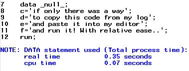
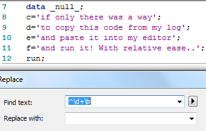

Taken from this <a href="http://support.sas.com/resources/papers/proceedings12/219-2012.pdf">excellent paper</a> by Scott Davis.  

  

 ^ = start from beginning of string d = match a digit + = match any number of digits b = match a word Boundary  The arrow to the right of the "Find text:" dialog box can be expanded to show more search options..  
