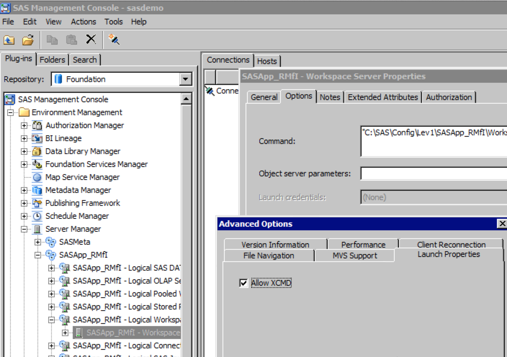

Paul Homes has an excellent <a href="https://platformadmin.com/blogs/paul/2011/06/noxcmd/">explanation</a> of this.. &nbsp;The below may be helpful as a simple quick reference guide.  

 Remember to restart your object spawner after making this change..
