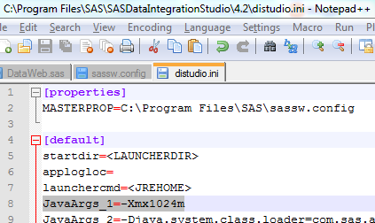

You can speed up the performance of your DI Studio client by increasing memory via the JavaArgs_1 variable in the distudio.ini file. &nbsp;A suggested approach is to increase from -Xmx512m to -Xmx1024m.  

 

This is further documented in usage note <a href="http://support.sas.com/kb/41/571.html">41571</a>. &nbsp;A similar update can be made to SMC (useful when importing / exporting large packages).
 Note that the max memory that will go in JavaArgs is typcially 1536.
