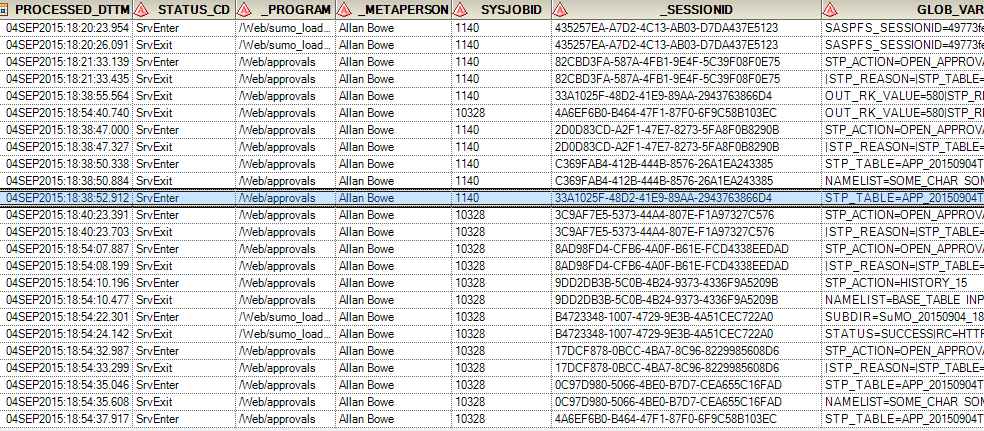

Having seemingly brought down our 9.2 Windows 2008 STP server (only in DEV!!) during development of a yet another (awesome) STP web app, it occurred to me that more information was needed about just how many requests were being batted over.

<hr />

<div style="color: red; font-family: 'trebuchet ms', arial, 'arial unicode ms', sans-serif; font-weight: bold;">Stored Process Error</div><div style="font-family: 'trebuchet ms', arial, 'arial unicode ms', sans-serif; font-size: small;">

<h2 style="font-size: medium;">Unable to execute stored process.</h2>
<h2 style="font-size: medium;">The server is not running (paused/deferred stop mode?).</h2></div>
<hr />
So, inspired by Quentin McMullen's <a href="https://bi-notes.com/2014/02/sas_stored_process_log/">excellent post</a>, I wanted to share my approach.

**Step 1** was to create a table to log the events. This was structured as follows:

```sql
CREATE TABLE [dbo].[STP_LOGGER](
 [PROCESSED_DTTM] [datetime2](3) NOT NULL,
 [STATUS_CD] [char](8) NOT NULL,
 [_PROGRAM] [char] (500) NOT NULL,
 [_METAPERSON] [char] (100) NOT NULL,
 [SYSJOBID] [char] (12) NOT NULL,
 [_SESSIONID] [char] (50) NULL,
 [GLOB_VARS] [char] (2000) NULL
```

Note that this table was not a SAS table (which could be subject to locking). If you have no other choice but to use a SAS table, please refer to the previous post for attempting SAS locks (noting that this [cannot be done via the meta engine](/get-physical-path-from-metadata-libref)).

**Step 2** was to create a [macro](https://github.com/sashub/macro/blob/master/standalone/stp_logger.sas) to update the table (to be placed somewhere in [SASAUTOS](https://support.sas.com/documentation/cdl/en/hostwin/63285/HTML/default/viewer.htm#win-sysop-sasautos.htm)). Example below:

```sas
%macro stp_logger(status_cd=);
  %local global_vars;
  proc sql noprint;
  select cats(name,'=',value)
    into: global_vars
    separated by '|'
    from dictionary.macros
    where scope = 'GLOBAL'
    and substr(name,1,3) not in('SYS', 'SQL','SAS')
    and substr(name,1,1) ne '*';

  %assign_lib(libref=web)

  proc datasets library=work;
    delete append;
  run;

  data append /view=append;
    if 0 then set web.stp_logger;
    PROCESSED_DTTM=%sysfunc(datetime());
    STATUS_CD="&status_cd";
    _PROGRAM="&_program";
    _METAPERSON="&_metaperson";
    SYSJOBID="&sysjobid";</span>
  %if not %symexist(_SESSIONID) %then %do;
    /* session id is stored in the replay variable but needs to be extracted */
    _replay=symget('_replay');
    _replay=subpad(_replay,index(_replay,'_sessionid=')+11,length(_replay));
    index=index(_replay,'&')-1;
    if index=-1 then index=length(_replay);
    _replay=substr(_replay,1,index);
    _SESSIONID=_replay;
    drop _replay index;
  %end;
  %else %do;
    /* explicitly created sessions are automatically available */
    _SESSIONID=symget('_SESSIONID');
  %end;
    GLOB_VARS=symget('global_vars');
    output;
    stop;
  run;

  proc append base=web.stp_logger data=append;run;

  proc sql;
  drop view append;

%mend stp_logger;
```

<b>Step 3</b> was to call the macro.   The quick / dirty way would be to simply include it in the SAS programs directly, but that quickly becomes unmanageable when dealing with a large number of STPs.  Another option is to include in the autoexec, but that will only deal with program ENTRY (not exit).
The best approach, as endorsed by <a href="https://bi-notes.com/2014/02/sas_stored_process_log/#comment-1955">Don Henderson</a>, is to use the STP init and term programs.  These are straightforward .sas programs that run on an STP session's entry and exit.  Configuration is simple, and explained here:  <a href="https://support.sas.com/kb/39/250.html">https://support.sas.com/kb/39/250.html</a>.

This approach is fantastic as it will ensure that ALL calls to the STP server are logged (eg via EG, AMO, WRS, every custom web app, etc etc).   Simply add the following one-liners to each file:

```sas
%stp_logger(status_cd=SrvEnter)  /* goes in the init file */
%stp_logger(status_cd=SrvExit)   /* goes in the term file */
```

Boom, we are done, and here is an extract of the new logging table:




See that highlighted row?  A hung session with my name against it...


**EDIT 13OCT2015:**
*The connection issue was finally resolved by setting the <a href="https://support.sas.com/rnd/itech/doc9/admin_oma/sasserver/iombridge/sp_sercl.html#sasRecycleActivationLimit">Recycle Activation Limit</a> to 1.  This had no noticeable effect on performance.*


