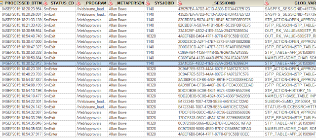

Having seemingly brought down our 9.2 Windows 2008 STP server (only in DEV!!) during development of a yet another (awesome) STP web app, it occurred to me that more information was needed about just how many requests were being batted over. 
 
&nbsp;Stored Process Error

 <h2 style="font-size: medium;">Unable to execute stored process.</h2><h2 style="font-size: medium;">The server is not running (paused/deferred stop mode?).</h2>

 So, inspired by Quentin McMullen's <a href="https://bi-notes.com/2014/02/sas_stored_process_log/">excellent post</a>, I wanted to share my approach.   <b>Step 1</b> was to create a table to log the events. &nbsp;This was structured as follows:  &nbsp; &nbsp; &nbsp;CREATE TABLE [dbo].[STP_LOGGER]( &nbsp; &nbsp; &nbsp; &nbsp; &nbsp; [PROCESSED_DTTM] [datetime2](3) NOT NULL,  &nbsp; &nbsp; &nbsp; &nbsp; &nbsp;[STATUS_CD] [char](8) NOT NULL,  &nbsp; &nbsp; &nbsp; &nbsp; &nbsp;[_PROGRAM] [char] (500) NOT NULL, &nbsp; &nbsp; &nbsp; &nbsp; &nbsp; [_METAPERSON] [char] (100) NOT NULL, &nbsp; &nbsp; &nbsp; &nbsp; &nbsp; [SYSJOBID] [char] (12) NOT NULL, &nbsp; &nbsp; &nbsp; &nbsp; &nbsp; [_SESSIONID] [char] (50) NULL, &nbsp; &nbsp; &nbsp; &nbsp; &nbsp; [GLOB_VARS] [char] (2000) NULL  Note that this table was not a SAS table (which could be subject to locking). &nbsp;If you have no other choice but to use a SAS table, please refer to the previous post for attempting SAS locks (noting that this can&nbsp;<a href="/get-physical-path-from-metadata-libref">not be done via the meta engin</a>e).   <b>Step 2</b>&nbsp;was to create a <a href="https://github.com/sashub/macro/blob/master/standalone/stp_logger.sas">macro</a> to update the table (to be placed somewhere in <a href="https://support.sas.com/documentation/cdl/en/hostwin/63285/HTML/default/viewer.htm#win-sysop-sasautos.htm">SASAUTOS</a>). &nbsp;Example below:  %macro stp*logger(status_cd=&nbsp;); &nbsp; %local global_vars; &nbsp; proc sql noprint; &nbsp; select cats(name,'=',value) &nbsp; &nbsp; into: global_vars &nbsp; &nbsp; separated by '|' &nbsp; &nbsp; from &nbsp;dictionary.macros &nbsp; &nbsp; where scope = 'GLOBAL' &nbsp; &nbsp; &nbsp; and substr(name,1,3) not in('SYS', 'SQL','SAS') &nbsp; &nbsp; &nbsp; and substr(name,1,1) ne '*';  &nbsp; %assign*lib(libref=web); &nbsp; proc datasets library=work; delete append; run; &nbsp; data append /view=append; &nbsp; &nbsp; if 0 then set web.stp_logger; &nbsp; &nbsp; PROCESSED_DTTM=%sysfunc(datetime()); &nbsp; &nbsp; STATUS_CD="&amp;status_cd"; &nbsp; &nbsp; \_PROGRAM="&amp;\_program"; &nbsp; &nbsp; \_METAPERSON="&amp;\_metaperson"; &nbsp; &nbsp; SYSJOBID="&amp;sysjobid"; &nbsp; %if not %symexist(\_SESSIONID) %then %do; &nbsp; &nbsp; /* session id is stored in the replay variable but needs to be extracted _/ &nbsp; &nbsp; \_replay=symget('\_replay'); &nbsp; &nbsp; \_replay=subpad(\_replay,index(\_replay,'\_sessionid=')+11,length(\_replay)); &nbsp; &nbsp; index=index(\_replay,'&amp;')-1; &nbsp; &nbsp; if index=-1 then index=length(\_replay); &nbsp; &nbsp; \_replay=substr(\_replay,1,index); &nbsp; &nbsp; \_SESSIONID=\_replay; &nbsp; &nbsp; drop \_replay index; &nbsp; %end; &nbsp; %else %do; &nbsp; &nbsp; /_ explicitly created sessions are automatically available _/ &nbsp; &nbsp; \_SESSIONID=symget('\_SESSIONID'); &nbsp; %end; &nbsp; &nbsp; GLOB_VARS=symget('global_vars'); &nbsp; &nbsp; output; &nbsp; &nbsp; stop; &nbsp; run;  &nbsp; proc append base=web.stp_logger data=append;run; &nbsp; proc sql; drop view append;  %mend stp_logger;  <b>Step 3</b> was to call the macro. &nbsp; The quick / dirty way would be to simply include it in the SAS programs directly, but that quickly becomes unmanageable when dealing with a large number of STPs. &nbsp;Another option is to include in the autoexec, but that will only deal with program ENTRY (not exit). The best approach, as endorsed by <a href="https://bi-notes.com/2014/02/sas_stored_process_log/#comment-1955">Don Henderson</a>, is to use the STP init and term programs. &nbsp;These are straightforward .sas programs that run on an STP session's entry and exit. &nbsp;Configuration is simple, and explained here: &nbsp;<a href="https://support.sas.com/kb/39/250.html">https://support.sas.com/kb/39/250.html</a>. &nbsp;This approach is fantastic as it will ensure that ALL calls to the STP server are logged (eg via EG, AMO, WRS, every custom web app, etc etc). &nbsp; Simply add the following one-liners to each file:  %stp_logger(status_cd=SrvEnter) &nbsp;/_ goes in the init file _/ %stp_logger(status_cd=SrvExit) &nbsp; /_ goes in the term file \_/  Boom, we are done, and here is an extract of the new logging table:  

  See that highlighted row? &nbsp;A hung session with my name against it...  

   EDIT 13OCT2015:<i> The connection issue was finally resolved by setting the <a href="https://support.sas.com/rnd/itech/doc9/admin_oma/sasserver/iombridge/sp_sercl.html#sasRecycleActivationLimit">Recycle Activation Limit</a> to 1. &nbsp;This had no noticeable effect on performance.</i>    
