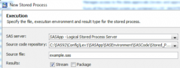

Surprisingly little attention is given to the (huge) potential of the SAS platform for building web apps.  On the assumption this is due to sheer ignorance, the aim of this post is to share some of my experience, and give budding SAS web-developers a kick start in the right direction.

But first, what kind of things can you build?  Well, anything really, by combining HTML / CSS / Javascript and using SAS as a server side language (via the Stored Process Server) you have an immensely powerful / scalable application development capability.

For instance, to reference some examples of web apps I've built over the years:

<ul>
 	<li>Drilldown Reports - <i>Click a number, see the numbers &amp; formula used to create that number, all the way back to source system.</i></li>
 	<li>Build &amp; Test harness - <i>Allowed selection of a development branch from remote GIT repo, checked out all macros / metadata, imported / deployed the jobs, ran entire solution plus tests, scanned logs for warnings / errors, worked for multiple users.</i></li>
 	<li>Release Management System -<i> To manage the entire workflow from creating a DEV package through peer review, checking in / out of SVN, interfacing via APIs to internal and external systems, moving promotion artefacts between SAS environments, reporting etc.</i></li>
 	<li>Data Editor - <i>A generic browser based tool for making auditable changes to data, moving the data through an approvals process (showing exact changes to base) with signoff resulting in immediate loading to the target table.</i></li>
</ul>

Plus a number of smaller, client specific tools.  Am sure you can think of lots of use cases where a small web app would be helpful to your customers.

The following is a quick start guide to get you talking to SAS from your favourite browser (which for me is Firefox, it has the best debugging capabilities).

<h6><b>Step 1 - Create a folder structure</b></h6>

This should go in the root of the web server, eg ROOT.war in JBOSS ( eg Jbossjboss-asserverSASServer1deployjboss-web.deployerROOT.war) on the mid-tier machine, or equivalent for a different web server.

You may choose to organise .html, .js, .css  files and images etc into separate folders or distinguish by project..  But either way the number of these files will grow so be sure to have a plan to keep things organised.  At this point you may wish to ask your admin to create a network share on this directory, so you can push files without having to log into the server.

<h6><b>Step 2 - Create your HTML file (example.html)</b></h6>

Example contents below:

&nbsp;

&lt;!DOCTYPE html&gt;
&lt;<a style="color: #000066;" href="http://december.com/html/4/element/html.html" target="_blank" rel="noopener">html</a> lang="en"&gt;
  &lt;<a style="color: #000066;" href="http://december.com/html/4/element/head.html" target="_blank" rel="noopener">head</a>&gt;
    &lt;<a style="color: #000066;" href="http://december.com/html/4/element/meta.html" target="_blank" rel="noopener">meta</a> http-equiv="X-UA-<wbr />Compatible" content="IE=edge;"<wbr /> charset="utf-8"/&gt;
    &lt;<a style="color: #000066;" href="http://december.com/html/4/element/title.html" target="_blank" rel="noopener">title</a>&gt;SAS Web App#1&lt;/<a style="color: #000066;" href="http://december.com/html/4/element/title.html" target="_blank" rel="noopener">title</a>&gt;
    &lt;<a style="color: #000066;" href="http://december.com/html/4/element/script.html" target="_blank" rel="noopener">script</a> src=../js/jquery.js&gt;<wbr />&lt;/<a style="color: #000066;" href="http://december.com/html/4/element/script.html" target="_blank" rel="noopener">script</a>&gt;
    &lt;<a style="color: #000066;" href="http://december.com/html/4/element/script.html" target="_blank" rel="noopener">script</a> src=../js/h54s.js&gt;&lt;/<a style="color: #000066;" href="http://december.com/html/4/element/script.html" target="_blank" rel="noopener"><wbr />script</a>&gt;     
    &lt;<a style="color: #000066;" href="http://december.com/html/4/element/script.html" target="_blank" rel="noopener">script</a> src=../js/example.<wbr />js&gt;&lt;/<a style="color: #000066;" href="http://december.com/html/4/element/script.html" target="_blank" rel="noopener">script</a>&gt;
  &lt;/<a style="color: #000066;" href="http://december.com/html/4/element/head.html" target="_blank" rel="noopener">head</a>&gt;
  &lt;<a style="color: #000066;" href="http://december.com/html/4/element/body.html" target="_blank" rel="noopener">body</a>&gt;
    &lt;<a style="color: #000066;" href="http://december.com/html/4/element/h1.html" target="_blank" rel="noopener">h1</a>&gt; Click submit to see a listing of SAS groups &lt;/<a style="color: #000066;" href="http://december.com/html/4/element/h1.html" target="_blank" rel="noopener">h1</a>&gt;
    &lt;<a style="color: #000066;" href="http://december.com/html/4/element/ul.html" target="_blank" rel="noopener">ul</a> id=SASgroups&gt;&lt;/<a style="color: #000066;" href="http://december.com/html/4/element/ul.html" target="_blank" rel="noopener">ul</a>&gt;
    &lt;<a style="color: #000066;" href="http://december.com/html/4/element/button.html" target="_blank" rel="noopener">button</a> id=sasSubmit&gt;Submit&lt;<wbr />/<a style="color: #000066;" href="http://december.com/html/4/element/button.html" target="_blank" rel="noopener">button</a>&gt;
  &lt;/<a style="color: #000066;" href="http://december.com/html/4/element/body.html" target="_blank" rel="noopener">body</a>&gt;
&lt;/<a style="color: #000066;" href="http://december.com/html/4/element/html.html" target="_blank" rel="noopener">html</a>&gt;

Some things to notice regarding this markup:

<ul>
 	<li>&lt;!DOCTYPE html&gt; means this is a HTML5 document</li>
 	<li>We are referencing a jQuery library (highly recommended).  The source code is <a href="https://jquery.com/download/">here</a>.</li>
 	<li>We are referencing the Boemska <a href="https://boemskats.com/h54s/">data connector</a> (highly recommended).  The source code is <a href="https://github.com/Boemska/h54s">here</a>.</li>
 	<li>We have a dedicated .js file to manage our new app (example.js)</li>
 	<li>The document is fairly loosely typed, for brevity (unquoted ids for instance).  This is all legal in HTML5.</li>
 	<li>Syntax highlighting from <a href="http://qbnz.com/highlighter/demo.php">http://qbnz.com/highlighter/demo.php</a></li>
</ul>

<h6><b>Step 3 - Create your Javascript file (example.js)</b></h6>

Example contents below:

&nbsp;

$(document).ready(function(){
  $("#sasSubmit").on('click',fun<wbr />ction(){ youClicked() });
});
 function youClicked(){
  $('#SASgroups').empty(); /* empty list before repopulating */
  var adapter = new h54s(); /* only need one instance */
  var myParams = {}; /* create empty object */
  myParams.VARNAME='Variable Value'; /* create a variable &amp; value */
  var jsTablesObject = new <wbr />h54s.Tables([myParams],'<wbr />SASControlTable'); /* make a H54s dataset */
  adapter.call('/Webapp/example'<wbr />,jsTablesObject,function(err,r<wbr />es) {
    /* we just submitted an STP request, now deal with response */
    $.each(res.fromSAS, function(i<wbr />, item) {
      /* cycle through each attribute and add to html list */
      $('#SASgroups').append('&lt;li&gt;' <wbr />+ item.GROUPNAME + '&lt;/li&gt;');
    }); 
  });
};

&nbsp;
<h6><b>Step 4 - Create your SAS Stored Process (example.sas)</b></h6>

Two parts - first create the .sas file (example contents below, save in the usual STP location), then register as an STP in Management Console (be sure it has STREAMING output).

/* get Boemska data connector macros */
%inc "SASEnvironmentSASCodeP<wbr />rogramsh54short.sas";
 /* load parameters (not actually used, just for demo) */
%hfsGetDataset(SASControlTable<wbr />, work.controlparameters);
 data groups; /* grab all metadata groups */
  attrib uriGrp uriMem GroupId GroupName Group_or_Role  length=$64;
  attrib GroupDesc          length=$256;
  attrib rcGrp rcMem rc i j length=3;
  call missing (of _all_);
  drop uriGrp uriMem rcGrp rcMem rc i j Group_or_Role;
  i=1; 
  rcGrp=metadata_getnobj("<wbr />omsobj:IdentityGroup?@id contains '.'",i,uriGrp); 
  do while (rcGrp&gt;0);
    call missing (rcMem,uriMem,<wbr />GroupId,GroupName,Group_or_<wbr />Role);
    rc = metadata_getattr(uriGrp,"Id",<wbr />GroupId);
    rc = metadata_getattr(uriGrp,"Name"<wbr />,GroupName);
    rc = metadata_getattr(uriGrp,"<wbr />PublicType",Group_or_Role);
    rc = metadata_getattr(uriGrp,"Desc"<wbr />,GroupDesc);
    if Group_or_Role = 'UserGroup' then output;
    i+1;
    rcGrp=metadata_getnobj("<wbr />omsobj:IdentityGroup?@id contains '.'",i,uriGrp); 
  end;
run;
 /* send data back */
%hfsHeader; /* sets up the json */
  %hfsOutDataset(fromSAS,WORK, groups); /* contains our desired data */
  %hfsOutDataset(justDemo,WORK, controlparameters); /* demo sending more data */
%hfsFooter;

&nbsp;

The main thing to note about the above is that we are using the (free!) Boemska data connector (<a href="https://github.com/Boemska/h54s">source code</a>).  This makes it sooo easy to send / receive datasets from the browser, as well as being incredibly efficient (will send as many records as will fit in a 32k macro variable, then further macro variables as necessary).  I do rate this piece of kit and will be doing a separate blog on it at some point.

<b>Step 5 - upload all your files</b>

Suggested locations:

<ol>
 	<li>example.html -&gt;  ROOT.war/web  (midtier)</li>
 	<li>example.js -&gt; ROOT.war/js  (midtier)</li>
 	<li>jquery.js -&gt; ROOT.war/js  (midtier)</li>
 	<li>h54s.js -&gt; ROOT.war/js  (midtier)</li>
 	<li>example.sas -&gt; SASEnvironmentSASCodeStored_Processes  (sasapp)</li>
 	<li>h54short.sas -&gt; SASEnvironmentSASCodePrograms   (sasapp)</li>
</ol>

For the STP, I'd recommend creating a new sas metadata folder (eg /Webapp/) and putting all your web apps in that (for fine grained permissions control).

<b>Step 6 - Open your latest SAS Web App!</b>

Example URL;  http://dev-sasmidtier.yourCompany.int:8080/web/example.html

And that's it!  If you've built web apps with SAS before, it's likely this approach will be unfamiliar.  I mean, where are the put statements?!  And why so many files?

Believe me, it may seem like a lot of configuration initially (although it isn't), but the benefits of this approach are HUGE.

<ul>
 	<li>Having separate CSS files (not in the demo) mean that styles can be quickly tweaked</li>
 	<li>Having dedicated HTML files means that layouts can be easily be reconfigured</li>
 	<li>Using the Boemska connector ensures that the application logic can be built with jquery / javascript, whilst the actual data management part can be cleanly separated and managed with SAS.  Apart from tidy code, this also means that web developers and SAS developers can work alongside each other - <i>without having to know each other's craft.  </i></li>
 	<li>Serving html files direct from the web server means that functionality can be provided even when the SAS server is down, or slow</li>
</ul>

Hopefully the above makes sense and is enough to get you started.  A far more detailed guide is available in my SGF paper<a href="http://support.sas.com/resources/papers/proceedings17/1091-2017.pdf"> Build Lightning Fast Web Apps with SAS</a>.  Also, check out the SPWA tag on <a href="https://sasensei.com">sasensei</a>!

