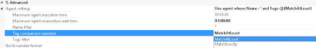

Currently working on putting our SAS deployment process into TFS and Release Management - part of which involves creating a 'build' in Visual Studio.  The below caused a build failure, and didn't come up in google: <blockquote> Exception Message: The build controller Visual Studio Controller - internal-svr-name does not contain an enabled build agent with name \* and no tags. (type SoapException)SoapException Details: &lt;soap:Detail xmlns:soap="http://www.w3.org/2003/05/soap-envelope" /&gt;</blockquote> The fix was very straightforward (presuming you are using a Default Template). &nbsp;In Visual Studio, simply open your build definition, in the 'Process' section, under '5.Advanced' expand 'Agent Settings' and set your Tag comparison operator to 'MatchAtLeast' (instead of MatchExactly):  

 
