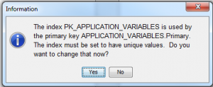

So today I dropped a column in a SQL Server table (using SSMS) and duly checked out the SAS metadata in DI Studio in order to 'Update Metadata'.

It failed with a strange message:

ERROR: Invalid use of sign notation.

Curious, I extracted the code and ran it in Enterprise Guide (the repository ID would ensure it ran against my checkout).  Same result, so following the advice in<a href="http://support.sas.com/kb/40/429.html" target="_blank" rel="noopener"> usage note 40429</a> I ran with maximum logging (for 9.3) as follows:

options sastrace=',,,d'sastraceloc=saslog nostsuffix;

<b>proc</b> <b>metalib</b> tl=<b>4095</b>; /* max is 4094 for 9.2 */

  omr (libid="B900004R" repid="A5HOSDWY");

  report(type = summary);

  update_rule = (noadd);

  select (A5GF9HGW.AD00016K);

<b>run</b>;

The last operation before my SAS error was:

(MSCMLB) getREPindices: Enter
(MSCMLB) getREPindices: Index object name is pk_rm_objects
(MSCMLB) getREPindices: Index metaid is A5GF9HGW.AI00015K
(MSCMLB) getREPindices: IndexName is pk_rm_objects
(MSCMLB) getREPindices: Exit;  Return Code is -2147475442

This indicated an issue with the index.  I tried various ways of redefining the index in SQL Server (from clustered to non-clustered, uppercase name to lowercase etc) to no avail.  In the end, the solution was simply to right click the metadata item in DI Studio, Properties, selecting the Index tab.  At this point I got a popup (similar to below) which mentioned the index needing to be marked as unique, and also about re-ordering columns.  I clicked yes, and - voila - I was then able to update the metadata!

&nbsp;
