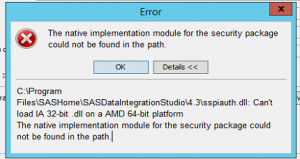
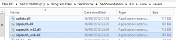

Noticed today that our UAT 9.3 environment was failing to execute the SAS ExportPackage <a href="http://support.sas.com/documentation/cdl/en/bisag/64088/HTML/default/viewer.htm#a003261084.htm" target="_blank" rel="noopener">utility</a>, with the following error returned:

<blockquote>The export process has failed.  The native implementation module for the security package could not be found in the path.</blockquote>
I'd come across this issue <a href="http://stackoverflow.com/questions/29901224/using-iwa-with-sas-exportpackage-utility" target="_blank" rel="noopener">before</a>, and this was (effectively) the same piece of code.  So what gives?  I launched a shell session locally, using the system account (sassrvuat), and reran the command.

<i>It worked.</i>

Hmm..  Must be an issue with the UAT machine (most likely since our 9.3 upgrade as it worked on 9.2).  I logged into sasapp with sassrvuat and tried to open DI Studio using IWA.  I get an interesting popup:

Seems my old colleague <a href="https://no.linkedin.com/in/stig-eide-6364622" target="_blank" rel="noopener">Stig</a> was onto something with regard to the <b>sspiauth.dll</b> file and 32 vs 64 bit compatibility.  Checking out the folder below, we can see several versions:

Comparing the file sizes it was clear that we had 32 bit DLLs (112kb) instead of 64 (107kb).  The solution therefore was simply to copy sspiauth.dll from:
<blockquote>
<ul>
 	<li>C:Program FilesSASHomeSASFoundation9.3coresasext</li>
</ul>
</blockquote>
To the following locations:
<blockquote>
<ul>
 	<li>C:Program FilesSASHomeSASDataIntegrationStudio4.3</li>
 	<li>C:Program FilesSASHomeSASPlatformObjectFramework9.3</li>
</ul>
</blockquote>
&nbsp;

&nbsp;
