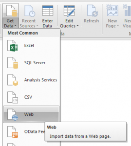

When we think about using SAS with Excel, one begins to groan at the myriad of options - DDE, SAS Addin, various Excel-ish library engines, IOM in VBA, etc etc etc.

What if there were a simple technique, quick to set up, and easy to adjust?

A technique that works on ANY version of Excel, requires no install, works cross platform and encompasses full metadata security (at point of connection)?

A technique that has been available to us for at least 15 years¹?

For those of us who work with <a href="https://rawsas.blogspot.co.uk/2015/12/building-web-apps-with-sas.html" target="_blank" rel="noopener">SAS Web Applications</a>, the idea of streaming data via a URL is not unusual.  It's a great approach as it ensures we can get the latest version of data, using the latest version of the code, with the permission set granted to that user at that point in time.

Extending this concept to Excel is as easy as 1,2,3:

<h3>1 - Set up the Stored Process</h3>
The code below should be registered as a stored process using SAS Management Console with STREAMing output:
<blockquote style="line-height: normal; margin-bottom: 0cm; mso-layout-grid-align: none; text-autospace: none;">/* STP URL Parameters */
%global type libds;
/**
 * assign metadata library from libref
 */
%let libref=%scan(&amp;libds,1,.);
<b>data</b> _null_;
  length lib_uri LibName $<b>200</b>;
  if metadata_getnobj("omsobj:SASLibrary?@Libref='&amp;libref'",<b>1</b>,lib_uri) then do;
    rc=metadata_getattr(lib_uri,"Name",LibName);
    call symputx('libname',libname);
  end;
<b>run</b>;
libname &amp;libref meta library="&amp;libname";
 /* set content type if CSV */

<b>data</b> _null_;

  if "%upcase(&amp;type)"="CSV" then

    rc=stpsrv_header("Content-type"

      ,"Content-Type: text/csv; encoding=utf-8"

    );

<b>run</b>;

 /* send data */
<b>PROC</b> <b>EXPORT</b> DATA=&amp;libds OUTFILE=_webout DBMS=&amp;type REPLACE;
<b>run</b>;</blockquote>
&nbsp;
<h3>2 - Set up the Workbook</h3>
The 'trick' here is simply to set up a web query to call the STP above.  The options vary as per the version of Excel, here is the path for Excel 2010:

Next step is to add the (appropriately formatted) URL, eg below.  Note that I called my STP "SAAS" and placed it in a metadata root folder called Web.
<blockquote>http://YOURSASMID:8080/SASStoredProcess/do?_PROGRAM=/Web/SAAS&amp;libds=sashelp.class&amp;type=tab</blockquote>
We are asking for the sashelp.class dataset, and for it to be TAB delimited.  This gets pasted into the web query box, and gives results as follows:

We now have our data in excel, but for those who wish to avoid the need to 'right click / refresh' we should:
<h3>3 - Automate</h3>
The beauty of this approach is that it is so easy to automate in VBA!

 

<h3>By the Power of Greyskull</h3>
Now that our STP is configured, it is gobsmackingly straightforward to get the power of SAS into Power BI.  Again, simply select Get Data and Web:

Enter an appropriately formatted URL, using type=CSV in the parameters:
<blockquote>http://YOURSASMID:8080/SASStoredProcess/do?_PROGRAM=/Web/SAAS&amp;libds=sashelp.class&amp;type=CSV</blockquote>
You may then need to select the appropriate credentials with which to connect (eg windows authentication for IWA, or use Basic if you normally enter passwords for SAS).

In the final screen simply mark the type of your input:

and - voila!

&nbsp;

Of course this is a very simple example, but using the above template you can start to add more parameters on the SAS side - enabling where clauses, drop statements, business logic etc.

The same approach can be used to get data into Powershell, Python, R, uncountable client applications, and of course - javascript (see <a href="http://rawsas.blogspot.co.uk/2015/12/building-web-apps-with-sas.html" target="_blank" rel="noopener">building web apps with SAS</a>).

Got any other tips?  Please share in the comments below..

<b>References:</b>
¹ Vincent DelGobbo discusses web queries with SAS/IntrNet in this SUGI27 (2002) <a href="http://www2.sas.com/proceedings/sugi27/p174-27.pdf" target="_blank" rel="noopener">paper</a> 
2 Stig Eide also discusses this approach in this <a href="http://bi-notes.com/2013/02/sas-stored-processes-querying-a-stored-process-from-excel-without-the-add-in/" target="_blank" rel="noopener">blog post </a>from 2013
