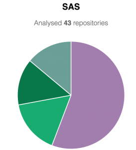

Tabs or Spaces?  Does it even matter, so long as you / your team are consistent?  For many SAS developers the standard place to write code is the Program Editor - for which the default setting is to use tabs, else 4 spaces.

Interestingly - the generated code in Enterprise Guide and DI Studio uses 3 spaces.

My preference is 2 spaces, but what do you think is the most commonly used approach out there?

<a href="https://github.com/ukupat" target="_blank" rel="noopener">Uku Pattack</a> has created a <a href="https://ukupat.github.io/tabs-or-spaces/" target="_blank" rel="noopener">github page</a>  which may settle (or inflame!) this classic Holy War.  It scans all github repos (over 1 star) for .sas files, and checks the tab vs space usage.  Here are the results:

So - which do you think was most popular?  The choices are:

<ul>
 	<li>8 spaces</li>
 	<li>4 spaces</li>
 	<li>3 spaces</li>
 	<li>2 spaces</li>
 	<li>Tabs</li>
</ul>

Head over to Uku's <a href="https://ukupat.github.io/tabs-or-spaces/" target="_blank" rel="noopener">site</a> to find out!

