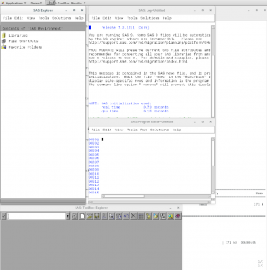

The following came up when trying to launch sas on a recent Centos 7.3 install:

ERROR:  BRIDGE FAILURE - ERROR LOADING IMAGE
        MODULE: sasmotifsasvsub h.
                                   SUBSYSTEM: 8 SLOT: 11

Traceback:  
/sas94/SASFoundation/9.4/sasexe/sas(+0x703ea) [0x7fb406fc43ea]
/sas94/SASFoundation/9.4/sasexe/sas(+0x70595) [0x7fb406fc4595]
/sas94/SASFoundation/9.4/sasexe/sasxfs(yustrt+0x265) [0x7fb3ea18c535]
/sas94/SASFoundation/9.4/sasexe/sasxfs(yuinit+0x1cb) [0x7fb3ea187a9b]
/sas94/SASFoundation/9.4/sasexe/sasxfs(yuropen+0x5ea) [0x7fb3ea18cfda]
/sas94/SASFoundation/9.4/dbcs/sasexe/saszu(xexprst+0x324) [0x7fb3e9756ea4]
/sas94/SASFoundation/9.4/sasexe/sas(vvtentr+0x13d) [0x7fb406fa06ad]
/lib64/libpthread.so.0(+0x7dc5) [0x7fb406b1ddc5]
/lib64/libc.so.6(clone+0x6d) [0x7fb40610f73d]

ERROR: Could not load /sas94/SASFoundation/9.4/dbcs/sasexe/sasmotif (38 images loaded)
ERROR: libpng12.so.0: cannot open shared object file: No such file or directory

The clue was in the log, and the following command fixed it:

sudo yum install libpng12

 

