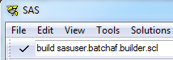
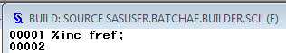

The <b>conundrum</b> - I needed to run SCL on a windows machine without Base SAS (only EG) connecting to a Linux backend.

The <b>obstacle</b> - it is not possible to programmatically create an SCL catalog entry in batch mode.

The <b>solution</b> - read on!

Thankfully I did have access to a windows machine with Base SAS.  Taking inspiration from this <a href="https://groups.google.com/forum/#!topic/comp.soft-sys.sas/6szbPqepPi4" target="_blank" rel="noopener">post</a> (thanks Robin) the steps were as below.  If you do not need to switch environments / operating systems, you can skip steps 2 and 3.

<h2>1 - Create an SCL Entry</h2>
Unfortunately, it is absolutely necessary to create an SCL file manually.  The good news is that you can do this just once, and write an entry that will simply %include any future SCL you send to it.  To create this file and corresponding catalog at the same time, use the build command:

This should open a window with the SCL entry.  Now add a single line of code (%inc fref;) and save the file.

What just happened?  We created an SCL entry in a catalog, which will run an %include statement from a fileref (fref) once compiled.
<h2>2 - Export the Catalog</h2>
The catalog we created in step one (with one SCL entry and one line of code) now needs to be 'ported' to a transferrable format.  See CPORT:

<b>PROC</b> <b>CPORT</b> LIBRARY=sasuser FILE='C:temptrans.exp' memtype=catalog;<u></u><u></u>

      select batchaf; <u></u><u></u>

<b>RUN</b>;

The above file then needs to be manually (or otherwise) transferred to a location that the new environment can read from.
<h2>3 - Import the Catalog</h2>
Can use EG for this!  In my case I also needed to remove the 'read only' attribute from the sasuser library.

libname sasuser "%sysfunc(pathname(sasuser))";<u></u><u></u>

<b>PROC</b> <b>CIMPORT</b> LIBRARY=sasuser INFILE="/your/landing/area/trans.exp"; <u></u><u></u>

<b>RUN</b>;

We now have our catalog available to use in the correct (binary) format.
<h2>4 - Run some SCL</h2>
The part we've been waiting for!  The steps here are to create our SCL (in fref), compile it and finally to run it (via proc display).

filename fref temp;<u></u><u></u>

<b>data</b> _null_;<u></u><u></u>

file fref;<u></u><u></u>

input ;<u></u><u></u>

put _infile_;<u></u><u></u>

cards4;<u></u><u></u>

INIT:

  scrn=screenname();<u></u><u></u>

  path=pathname('sashelp');<u></u><u></u>

  put "excecuted " scrn= path=;

Return;<u></u><u></u>

;;;;<u></u><u></u>

<b>run</b>;<u></u><u></u>

<b>proc</b> <b>build</b> batch c=sasuser.batchaf;<u></u><u></u>

  compile select=builder.scl;<u></u><u></u>

<b>run</b>;<u></u><u></u>

<b>proc</b> <b>display</b> c=sasuser.batchaf.builder.scl;<b><wbr />run</b>;<u></u><u></u>

Of course this whole post is only relevant to you if you have SAS/AF installed on your server (check proc setinit for a ---SAS/AF entry).

Enjoy..
