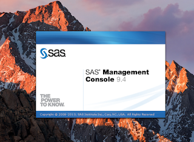

As an avid developer of SAS Stored Process Web Applications, the Macbook Pro is my development machine of choice.&nbsp; Since building a <a href="https://github.com/sasjs/core/blob/main/meta/mm_createstp.sas" target="_blank">macro to programmatically create STPs</a>, I've had few reasons to launch a VM to use client tools - but today I actually did need to use SAS Management Console (SMC).

Still - who says a client tool has to be run from a client?&nbsp; It's actually possible to launch SMC from your SAS Server, and here are the steps you need to make:

## Macbook with Latest xQuartz

1. Install xquartz:  [https://www.xquartz.org/releases/index.html](https://www.xquartz.org/releases/index.html)
2. Log out and back in
3. Open _xquartz_ terminal and run: `ssh -Y yourSSHuser@yourSASserver`
4. Execute the following file: `./opt/sas/sas9/SASHome/SASManagementConsole/9.4/sasmc`

The process is FAR easier (and SMC over x11 is much faster) since the latest release of xquartz.  There is NO need to update the ssh_config file and change `ForwardAgent` or `ForwardX11` settings.

If building web applications with SAS is something you'd like to try, then check out [SASjs](https://sasjs.io) and the SASjs [cli](https://cli.sasjs.io).

Alternatively, if you're just the type of person who loves to learn about all things SAS, then come visit <a href="https://sasensei.com/">sasensei.com</a>!

Chat soon..

/Allan
