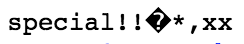

I recently had a challenge - how to delimit an array of character data, when the delimiter itself may be in the data?  Furthermore, when that array has to fit in a SAS macro variable?

I was aware of nonprintables (hidden gremlins that can sometimes lurk in SAS program files), and attempted to use one as a delimiter.  To my surprise this didn't work, and it turned out that SAS does not<a href="http://morgan.dartmouth.edu/Docs/sas92/support.sas.com/documentation/cdl/en/mcrolref/61885/HTML/default/getstart.htm"> fully support</a> nonprintables in Macro.  So, I turned to <a href="https://www.rawsas.com/2017/05/sas-l-is-still-alive/">SAS-L </a>for help.
<h3>heLp!</h3>
There were two interesting things that came of that conversation, both from <a href="https://communities.sas.com/t5/user/viewprofilepage/user-id/19924">FriedEgg</a>.  Firstly, the nonprintables ARE stored in the symbol table - they just fail to resolve.  However, they can be viewed by reading directly from sashelp.vmacro.

Secondly - a defined range of 6400 unicode characters already exist for 'private use' such as this!  They are known as "Private Use Characters" (or "User Defined Characters") and exist in the range U+E000 -&gt; U+F8FF.  The full spec is available <a href="http://www.unicode.org/versions/Unicode10.0.0/ch23.pdf#G19184">here</a>.  To implement something like this in SAS, one uses hexadecimal notation - a quoted string with an even number of hex characters, followed by the letter x.
<h3>Here be dragons..</h3>
Watch out!!  As pointed out by <a href="https://www.linkedin.com/in/xlr82sas/">Roger DeAngelis</a> on the same thread, when dealing with hex data in datastep one has to watch out for a common binary delimeter - '00'x.  This can cause unexpected results when delimiting missing values.  So - you should basically avoid any hex value that has a double 0 (such as 'E000'x).  Use delimiters such as 'E042'x or 'E999'x instead.  So - here is how one might go about the delimiting task:
<pre>data _null_;
  dlm='E042'x;
  call symputx('macarray','special!!'!!dlm!!'*,xx');
run;
%put &amp;macarray;
filename tmp temp;
data _null_;
  file tmp;
  length myvar $32767;
  myvar=symget('macarray');
  put myvar;
run;
data _null_;
 infile tmp;
 input;
 put _infile_;
run;

</pre>
Which printed (in both instances):

Job done!

<em>One of the great things about the vastness of SAS is the never ending supply of problems to solve!  How do you think you compare?   Find out - at <a href="https://sasensei.com">sasensei.com</a></em>