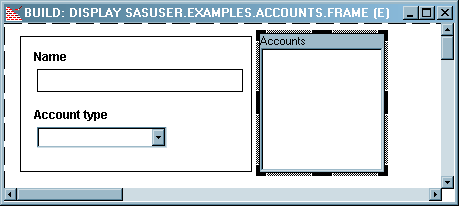
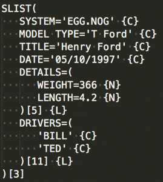

<!-- wp:heading -->
<h2>What is SCL?</h2>
<!-- /wp:heading -->

<!-- wp:paragraph -->

Mention AF or SCL to someone who has been in the SAS game for more than a decade or so, and you can be sure there will be a story to tell.&nbsp; The technology, built by pioneers such as <a href="https://www.linkedin.com/in/kdevakumar/">Deva Kumaraswamy</a>, was used to build many of the original SAS client products.&nbsp; And a significant number of SAS customers still have production SCL solutions in operation today.&nbsp; It is an object orientated framework that can write and execute base code (like SAS Macro), store object methods (like java) and be linked to Frames (like VBA).

<!-- /wp:paragraph -->

<!-- wp:image {"id":452,"align":"center"} -->

<figure class="aligncenter"><figcaption>SAS AF Frame</figcaption></figure>

<!-- /wp:image -->

<!-- wp:heading -->
<h2>What is an SCL List (SLIST) ?</h2>
<!-- /wp:heading -->

<!-- wp:paragraph -->

When building complex applications in any language, there will be a need to dynamically store and share unstructured data.&nbsp; These days it will typically be XML or JSON, but with SCL it was - the SLIST.

<!-- /wp:paragraph -->

<!-- wp:paragraph -->

The SLIST is more concise than XML (no tags) and similar to JSON (which didn't come out until 2001).&nbsp; It is incredibly fast as it lives in memory - like a format or hash table.&nbsp; Item names can be 255 characters, and character values can be up to 32,766 in length.&nbsp; They can be stored in SAS Catalogs, and - when exported - look like this:

<!-- /wp:paragraph -->

<!-- wp:image {"id":287,"align":"center"} -->

<figure class="aligncenter"><figcaption>SAS SLIST</figcaption></figure>

<!-- /wp:image -->

<!-- wp:paragraph -->

Some things to note:

<!-- /wp:paragraph -->

<!-- wp:list -->
<ul><li>the slist name (in this case, SLIST)</li><li>Name / value pairs, along with a type (can be C, N, L or O)</li><li>An slist can contain sublists (in this case, two)</li><li>Each slist finishes with a list identifier.&nbsp; This is a temporary, unique id - analogous to the dataset identifier returned in the regular base SAS <code>open()</code> function.</li></ul>
<!-- /wp:list -->

<!-- wp:heading -->
<h2>Working With Slists</h2>
<!-- /wp:heading -->

<!-- wp:paragraph -->

Slists can be created in many ways (<code>declare</code> statement, in a class file, using <code>copylist</code>).&nbsp; Our example will use the <code>makelist()</code> function.&nbsp; This function will create a new list, and return the identifier for that list.

<!-- /wp:paragraph -->

<!-- wp:paragraph -->

The functions which populate an slist vary in name depending on how the list item is updated (eg by <em>name</em> or index <em>position</em>) and by the <em>type</em> of item being updated (eg List / Object / Character / Numeric).&nbsp; The three main function groups are below:

<!-- /wp:paragraph -->

<!-- wp:list -->
<ul><li>INSERTX (<code>insertl / inserto / insertc / insertn</code>).&nbsp; These functions add new items to an SCL list.</li><li>SETITEMX (<code>setiteml / setitemo / setitemc / seitemn</code>).&nbsp; These functions update list items by position.</li><li>SETNITEMX (<code>setniteml / setnitemo / setnitemc / setnitemn</code>).&nbsp; These functions update list items by name.</li></ul>
<!-- /wp:list -->

<!-- wp:paragraph -->

To view the contents of an slist you can save to a catalog (eg with <code>savelist</code>) or just print to the log with <code>call putlist()</code>.

<!-- /wp:paragraph -->

<!-- wp:paragraph -->

Here's an example of this in action.

<!-- /wp:paragraph -->

<!-- wp:shortcode -->

<video width="100%" height="100%" src="../resources/Dec-3-2017-8_29-PM.webm" controls>
  Your browser does not support the video tag.
</video>

<!-- /wp:shortcode -->

<!-- wp:paragraph -->

Hopefully this has helped to make sense of the mysterious slist!

<!-- /wp:paragraph -->

<!-- wp:heading -->
<h2>Cool Story Bro.</h2>
<!-- /wp:heading -->

<!-- wp:paragraph -->

The chances are, if you're reading this, you've either developed or managed a legacy SAS/AF solution in the past.&nbsp; As powerful and robust as this technology is, it has inherent challenges with regard to security, scalability, and supportability.&nbsp; It can also be a major blocker if you're looking to modernise your SAS environment and move away from using a desktop SAS thick client.

<!-- /wp:paragraph -->

<!-- wp:paragraph -->

We specialise in helping clients migrate full client legacy AF into thin-client Stored Process Web Applications using our SCL Transcoding Kit and the <a href="https://sasjs.io">SASjs</a> framework.  Your existing, trusted SCL logic can be reused, called as SAS services from a modern HTML5 web application served by the SAS mid-tier.   Adding / removing new users is a piece of cake (no need for desktop access or changing configs on network drives).  As a web app, the solution is not only secure, scalable and fully supportable - it looks great!

<!-- /wp:paragraph -->

<!-- wp:paragraph -->

For more info, do reach out on <a href="https://www.linkedin.com/feed/">Linkedin</a>.

<!-- /wp:paragraph -->

* AF [slides](https://slides.sasjs.io/af-scl)
* LinkedIn [Article](https://www.linkedin.com/pulse/easy-af-scl-modernisation-html5-sas-allan-bowe)
* UK Forum [slides](https://drive.google.com/file/d/1RMLxFccaXYh35IGnbcFjISFmZUIdetUO/view)

