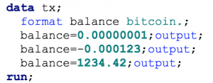
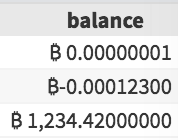
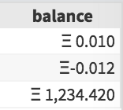

<!-- For Bitcoin denominated reports, a Bitcoin SAS Format will align the decimal place and display the appropriate currency symbol.  Unicode <a href="http://www.unicode.org/versions/Unicode10.0.0/">released</a> the dedicated Bitcoin symbol ( <strong>&#8383;</strong> - u20BF) in June 2017. -->

For Bitcoin denominated reports, a Bitcoin SAS Format will align the decimal place and display the appropriate currency symbol.  Unicode <a href="http://www.unicode.org/versions/Unicode10.0.0/">released</a> the dedicated Bitcoin symbol ( <strong>&#8383;</strong> - u20BF) in June 2017.

<!-- For Bitcoin denominated reports, a Bitcoin SAS Format will align the decimal place and display the appropriate currency symbol.  Unicode <a href="http://www.unicode.org/versions/Unicode10.0.0/">released</a> the dedicated Bitcoin symbol ( <strong>&#8383;</strong> - u20BF) in June 2017. -->

But how many decimal places should be shown? Well, the smallest unit of Bitcoin is a <strong>Satoshi</strong> (one hundred millionth of a Bitcoin) - which is 8 places to the right of the decimal point. Interestingly, the fact that Bitcoin supply is limited (to 21 million bitcoins) means we also know the maximum size! And so the following format can be applied:

<code>%let xbt=%sysfunc(unicode(\u20BF));
proc format;
picture bitcoin
low - &lt;0 = "00,000,001.11111111" (prefix="&amp;xbt-")
0 - high = "00,000,001.11111111" (prefix="&amp;xbt ")
;
run;</code>

Applying this to some raw data:

displays:

Of course, using this approach, we can quickly adjust to other cryptocurrencies.  So what about an Ethereum SAS format?  The smallest unit of Ether is a <strong>Wei</strong>.  1000000000000000000 Wei = 1 Ether.  This is a very large, small number!  Vitalik Buterin  (founder of Ethereum) <a href="https://ethereum.stackexchange.com/a/2611">suggests</a> a more appropriate measure (eg for micropayments) would be the "Finney" (1000th of an ETH).  We'll show balances down to the Finney, but denominated in ETH.

The <a href="https://ethereumsymbol.com/#why">agreed upon</a> unicode symbol for ETH is  <strong>&#926;</strong>(u039E).  With a small tweak we can now have an Ethereum SAS Format:

<code>%let eth=%sysfunc(unicode(\u039E));
proc format;
picture ethereum
low - &lt;0 = '000,001.111' (prefix="&amp;eth-")
0 - high = '000,001.111' (prefix="&amp;eth ")
;
run;</code>

Our new <code>ethereum.</code> format will display SAS output as follows:

Of course, this format can easily be extended to any currency (such as Rupees, in the<a href="https://stackoverflow.com/questions/49346969/indian-currency-symbol-in-sas"> SO question</a> that inspired this post).

Have fun with SAS formats. If you think you know your stuff - you can test your skills in the <strong>formats</strong> tag on <a href="https://sasensei.com/questions/filter?tags_any=[18]">Sasensei!</a>
