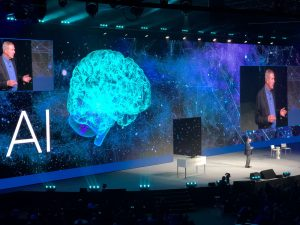
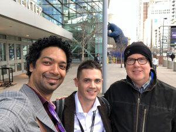
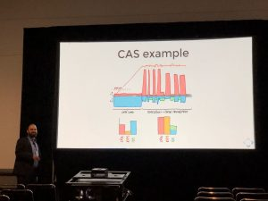
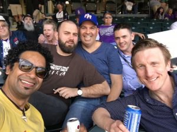

The 42nd annual SAS Global Forum took place this year in mile "high" Denver! This pilgrimage is a firm part of the calendar for SAS professionals around the world.

Kicking off with the partner event on Sunday 8th March, we learned about SAS's continued commitment to supporting alliances, as part of their forward strategy.

Monday began in style with a fantastic presentation on AI and a live demo with the man himself - Dr Jim Goodnight!

One thing I love about SGF are the random encounters - for instance, bumping into the legend that is <a href="https://www.linkedin.com/in/brian-bowman-a791b5111/" target="_blank" rel="noopener">Brian Bowman</a>, involved in the very (very) early days of metadata and is now spearheading the tech behind CAS.

<a href="https://www.linkedin.com/in/nikmarkovic/" target="_blank" rel="noopener">Nik Markovic</a> (CTO of Boemska) gave advice on how to use "measurement-based workload prediction to dynamically provision your Cloud" (see <a href="https://www.sas.com/content/dam/SAS/support/en/sas-global-forum-proceedings/2018/2057-2018.pdf" target="_blank" rel="noopener">paper</a>). The sketches on CAS performance were well received.

<a href="https://www.linkedin.com/in/hadley-christoffels-a623864/" target="_blank" rel="noopener">Hadley Christoffels</a> (Boemska CEO) gave an excellent talk on "Loading Data via the Cloud", and it was picked for the SAS livestream! You can watch it below:

<iframe class="aligncenter" src="//players.brightcove.net/1872491364001/9829d1d0-bfdd-4b86-8efa-43bb454fc746_default/index.html?videoId=5766305652001" width="400"  frameborder="0" allowfullscreen="allowfullscreen"></iframe>

My presentation was entitled "Find Your SAS Sensei" and I was fortunate enough to have several celebrity speakers - <a href="https://www.linkedin.com/in/christopher-blake-1a377424/" target="_blank" rel="noopener">Chris Blake</a>, <a href="https://www.linkedin.com/in/howellandrew/" target="_blank" rel="noopener">Andrew Howell</a>, <a href="https://stackoverflow.com/users/1623007/joe" target="_blank" rel="noopener">Joe Matise</a> and <a href="https://communities.sas.com/t5/user/viewprofilepage/user-id/4" target="_blank" rel="noopener">Chris Hemedinger</a>! My slides are below, and the paper is <a href="../resources/SGF2018_Find_Your_SAS_Sensei.pdf" target="_blank">here</a>.

<iframe class="aligncenter" src="//slides.com/allanbowe/find-your-sas-sensei/embed" width="400" height="300" frameborder="0" scrolling="no" allowfullscreen="allowfullscreen"></iframe>

The kickback party was an awesome event, lots of VR, fun things to do, and great displays in the mile high stadium!

To wrap things up, the Boemska team got together and went to watch the superbowl! Was good to relax and get to know our new COO (<a href="https://www.linkedin.com/in/fernandezalain/" target="_blank" rel="noopener">Alain Fernandez</a>) and Sales Director (<a href="https://www.linkedin.com/in/jamie-hayton-902733/" target="_blank" rel="noopener">Jamie Hayton</a>) a little better.

See you next year in Dallas?

<iframe class="aligncenter" src="https://www.linkedin.com/embed/feed/update/urn:li:activity:6390208213920280578" width="400" height="500" frameborder="0" allowfullscreen="allowfullscreen"></iframe>
