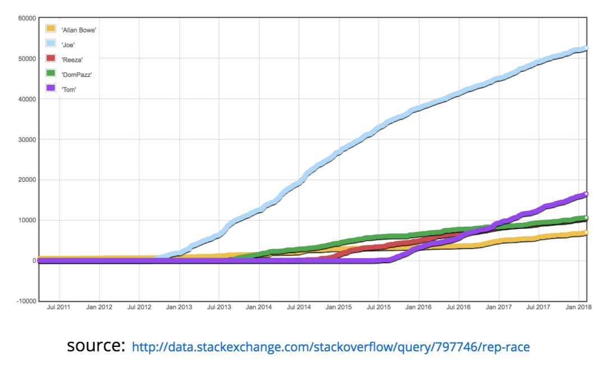

If you have a question about SAS - one that fits the definition of a <a href="https://stackoverflow.com/help/how-to-ask">good question</a> - stackoverflow (SO) is a fantastic place to ask!  There is an active community, that cares about giving the best answers to your programming questions, often within minutes.   The <a href="https://stackoverflow.com/questions/107414/whats-your-best-trick-to-break-out-of-an-unbalanced-quote-condition-in-base-sas">first SAS post</a> was made by <a href="https://stackoverflow.com/users/18968/martin-b%C3%B8gelund">Martin Bøgelund</a> back in 2008 - and the 10,000th post was made just yesterday (19Jul2018).Users on SO gain reputation by asking great questions, but also by providing great answers.  This reputation score translates into a <a href="https://stackoverflow.com/tags/sas/topusers">leaderboard</a>, and the top contributors are currently:

As you can see, the leaderboard is currently dominated by <a href="https://stackoverflow.com/users/1623007/joe">Joe</a>, however - <a href="https://stackoverflow.com/users/4965549/tom">Tom</a> is rapidly catching up!  Check out this chart:

Of course, SAS is not the only SAS related tag on SO.  There are also tags for <a href="https://stackoverflow.com/questions/tagged/sas-metadata">sas-metadata</a>, <a href="https://stackoverflow.com/questions/tagged/sas-macro">sas-macro</a>, <a href="https://stackoverflow.com/questions/tagged/enterprise-guide">enterprise-guide</a>, <a href="https://stackoverflow.com/questions/tagged/proc-report">proc-report</a>, <a href="https://stackoverflow.com/questions/tagged/proc-sql">proc-sql</a>, <a href="https://stackoverflow.com/questions/tagged/sas-ods">sas-ods,</a> <a href="https://stackoverflow.com/questions/tagged/sas-af">sas-af</a>, <a href="https://stackoverflow.com/questions/tagged/sas-stored-process">sas-stored-process</a>,<a href="https://stackoverflow.com/questions/tagged/saspy"> saspy</a>, and more!

Whilst SO is a great resource for finding answers to your SAS programming questions, not all questions are appropriate for this kind of site.  If you have more of a discussion / opinion type question, or your question is more administration / solution / business orientated, you may be better off visiting <a href="http://communities.sas.com/">SAS Communities</a> (by far the biggest site in terms of SAS questions).  If you think you know the answers, and you'd like to find some challenging questions to pit yourself against, there is also <a href="https://sasensei.com">Sasensei</a> - a 'quiz game' where you can test your SAS knowledge and unlock new levels (like multiplayer).

Other avenues of support are [SAS-L](/sas-l-is-still-alive) and SAS Support.  A review of the various SAS communities over the years can be found in this <a href="https://www.sas.com/content/dam/SAS/support/en/sas-global-forum-proceedings/2018/1792-2018.pdf" rel="attachment wp-att-388">paper</a> or in the slides below!

<iframe src="//slides.com/allanbowe/find-your-sas-sensei/embed" width="576" height="420" frameborder="0" scrolling="no" allowfullscreen="allowfullscreen"></iframe>
