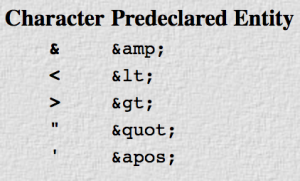

I received the following today when uploading a large XML file via proc metadata:

<pre>ERROR: The referenced entity has not been defined.</pre>

All my entities had been appropriately escaped (or so I thought):

<pre>select (instr);
  when (';') put '&amp;semi;';
  when ('&amp;') put '&amp;amp;';
  when ('&lt;') put '&amp;lt;';
  when ('&gt;') put '&amp;gt;';
  when ("'") put '&amp;apos;';
  when ('"') put '&amp;quot;';
  when ('0A'x) put '&amp;#x0a;';
  when ('0D'x) put '&amp;#x0d;';
  when ('</pre>

Eventually I narrowed it down to this:

<pre>&lt;UpdateMetadata&gt;
  &lt;Reposid&gt;$METAREPOSITORY&lt;/Reposid&gt;
  &lt;Metadata&gt;
    &lt;TextStore id='A5RIITO4.AG000INH' StoredText='&amp;semi;'&gt;
    &lt;/TextStore&gt;
  &lt;/Metadata&gt;
  &lt;NS&gt;SAS&lt;/NS&gt;
  &lt;Flags&gt;268435456&lt;/Flags&gt;
&lt;/UpdateMetadata&gt;
</pre>

It seems that the metadata XML parser doesn't like the HTML <code>&amp;semi</code> entity reference.  On further investigation it <a href="https://stackoverflow.com/a/40942504/66696">appears</a> that XML does not really support HTML-like named references (like the understandable <code>&amp;semi</code>) in favour of hex type codes (such as <code>&amp;#x3b;</code>).  The exception are the following '<a href="http://xmlnews.org/docs/xml-basics.html#references">main five</a>':

The authoritative discussion of named entities for XML is available here, but in summary - if you are looking to escape the content loaded into metadata XML, the following SAS code is preferred:

<pre>select (instr);
  when (';') put '&amp;#x3b;';
  when ('&amp;') put '&amp;amp;';
  when ('&lt;') put '&amp;lt;';
  when ('&gt;') put '&amp;gt;';
  when ("'") put '&amp;apos;';
  when ('"') put '&amp;quot;';
  when ('0A'x) put '&amp;#x0a;';
  when ('0D'x) put '&amp;#x0d;';
  when ('</pre>

If you need to update your metadata, you can find a range of useful macros in the SASjs<a href="https://github.com/sasjs/core">Core</a> library.

<pre></pre>
