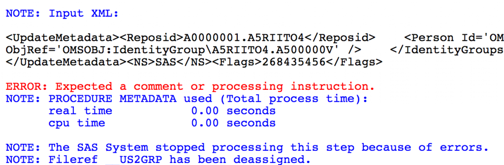

<!-- wp:paragraph -->

Whilst creating a new macro for the macrocore library (<a href="https://github.com/sasjs/core/blob/main/meta/mm_adduser2group.sas">mm_adduser2group</a>) I received in my log:  ERROR: Expected a comment or processing instruction.  

<!-- /wp:paragraph -->

<!-- wp:image {"id":442} -->
<figure class="wp-block-image"></figure>
<!-- /wp:image -->

<!-- wp:paragraph -->

The issue?  Malformed XML (of course).  I'd forgotten to add the <code>&lt;Metadata&gt;</code> tags.  The correct code block would have been:

<!-- /wp:paragraph -->

<!-- wp:paragraph -->

<code><code><code>&lt;UpdateMetadata&gt;&lt;Reposid&gt;$METAREPOSITORY&lt;/Reposid&gt;&lt;Metadata&gt;&lt;Person Id='&amp;uuri'&gt;&lt;IdentityGroups&gt;&lt;IdentityGroup ObjRef='&amp;guri' /&gt;&lt;/IdentityGroups&gt;&lt;/Person&gt;&lt;/Metadata&gt;&lt;NS&gt;SAS&lt;/NS&gt;&lt;Flags&gt;268435456&lt;/Flags&gt;&lt;/UpdateMetadata&gt;</code></code></code>

<!-- /wp:paragraph -->

<!-- wp:paragraph -->

Code now fixed, and the SAS community has a new way to add users to groups metadata:

<!-- /wp:paragraph -->

`vimeo: https://vimeo.com/334175929`
