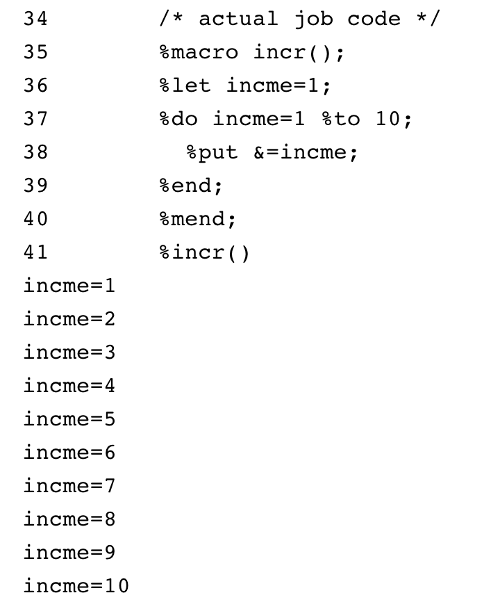
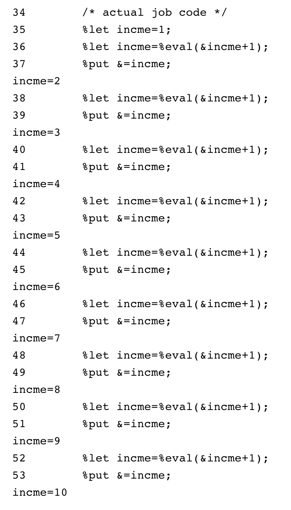
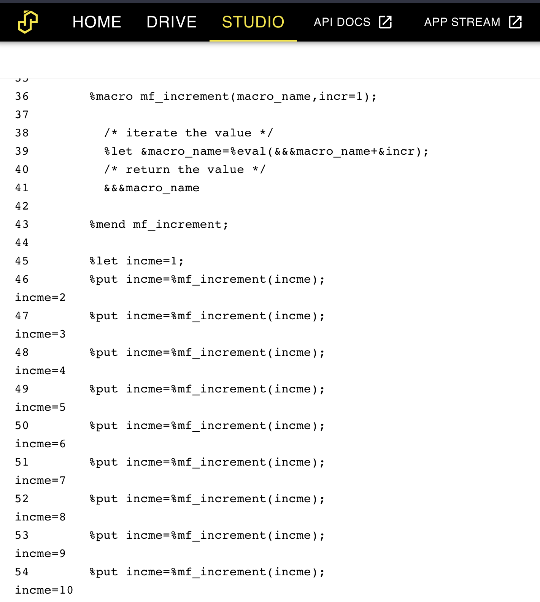

# Incrementing a Macro Variable

Incrementing a macro variable is fairly straightforward and can be done in several ways, for instance - a do-loop:

```sas
%macro incr();
%let incme=1;
%do incme=1 %to 10;
  %put &=incme;
%end;
%mend;
%incr()
```

Which gives:



What about incrementing _outside_ a macro?  There's the option of `%eval(x+1)`.  For instance:

```sas
%let incme=1;
%let incme=%eval(&incme+1);
%put &=incme;
%let incme=%eval(&incme+1);
%put &=incme;
%let incme=%eval(&incme+1);
%put &=incme;
%let incme=%eval(&incme+1);
%put &=incme;
%let incme=%eval(&incme+1);
%put &=incme;
%let incme=%eval(&incme+1);
%put &=incme;
%let incme=%eval(&incme+1);
%put &=incme;
%let incme=%eval(&incme+1);
%put &=incme;
%let incme=%eval(&incme+1);
%put &=incme;
```

This works fine, although it is quite verbose as we need to re-assign the variable each time:


An alternative approach would be a simple macro to update the variable each time AND return the incremented value.  This is the purpose of the [mf_increment()](https://core.sasjs.io/mf__increment_8sas.html) macro, which works in a very similar way to the SAS monotonic() function.  The definition is basic enough:

```sas
%macro mf_increment(macro_name,incr=1);

  /* iterate the value */
  %let &macro_name=%eval(&&&macro_name+&incr);
  /* return the value */
  &&&macro_name

%mend mf_increment;
```

And the usage:

```
%let incme=1;
%put incme=%mf_increment(incme);
%put incme=%mf_increment(incme);
%put incme=%mf_increment(incme);
%put incme=%mf_increment(incme);
%put incme=%mf_increment(incme);
%put incme=%mf_increment(incme);
%put incme=%mf_increment(incme);
%put incme=%mf_increment(incme);
%put incme=%mf_increment(incme);
```



For more information, check out the [documentation](https://core.sasjs.io/mf__increment_8sas.html) and [tests](https://core.sasjs.io/mf__increment_8test_8sas.html).

