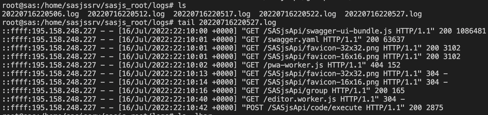

# LOG_LOCATION in SASjs Server

Version 0.11 of [SASjs Server](https://server.sasjs.io) now has a configurable LOGS location.

Logs rotate daily, and are named according to the start time - so every time you restart the server, a new log file is generated.

Log content is configurable according to the [LOG_FORMAT_MORGAN](https://server.sasjs.io/settings/#log_format_morgan) setting - here showing the source IP address, timestamp, endpoint queried, and the response code.

Docs: [https://server.sasjs.io/settings/#log_location](https://server.sasjs.io/settings/#log_location)

SASjs Server provides MIT open-source middleware for SAS, which can be useful as a (very) low cost option for:

* Migrating legacy SAS/Intrnet or AF/SCL
* SAS App Development
* 3rd Party Integrations

If you're in the market for a vendor to deliver on the above, contact the SAS Apps team: https://sasapps.io

