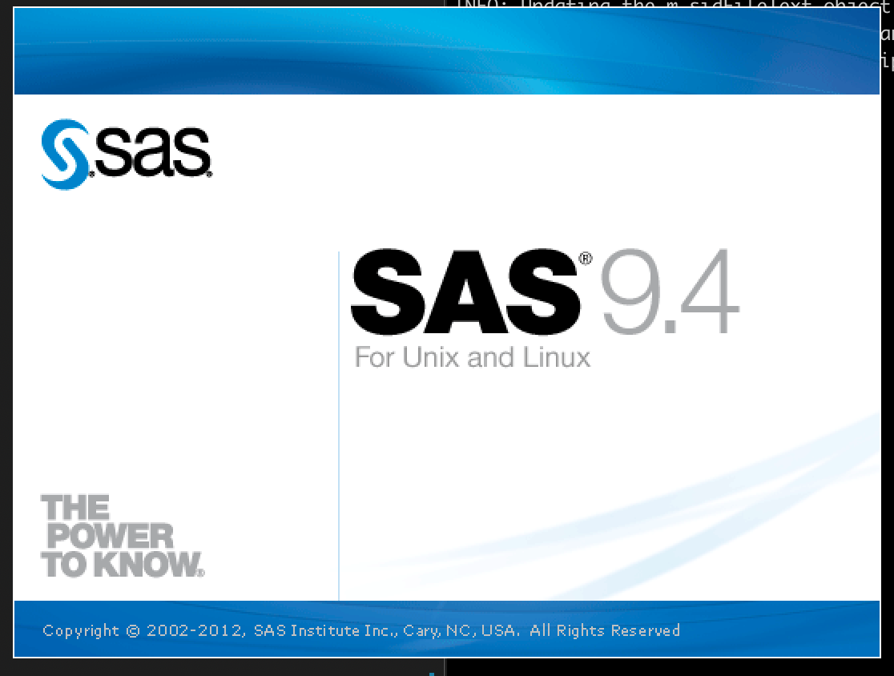

# SAS on Centos 7.9

Whilst CentOS is not an [officially supported](https://support.sas.com/supportos/list?requestAction=summary&outputView=sasrelease&sasrelease=9.4&platformGroup=UNIX&platformName=all) (by SAS) flavour of Linux, it's built from the same source code as RHEL (Red Hat Enterprise Linux), which IS supported.  This means:

* The upstream packages are the same
* The libraries are the same
* The kernels are the same
* Both systems are binary compatible with each other

The biggest difference is - CentOS is free.  RHEL is not!

This guide is for anyone looking to deploy SAS 9.4 M7 on CentOS 7.9.  Do not attempt CentOS Stream (8) - I tried that, couldn't get it to work! (Received `Error: The application cannot be run on this platform: lax.` on setup).  Your mileage may vary.

It is assumed you have already installed the SAS Depot, and configured the [firewall](https://www.digitalocean.com/community/tutorials/how-to-set-up-a-firewall-using-firewalld-on-centos-7).


## X11 Setup

Good news - there is no need for X11 - just use the `-console` option in `setup.sh`!

## Server Setup

Instructions then, once you connect, are as follows:

```
# create a group for installation use (will have write access to system files)
groupadd sasinst

# create a general SAS group (will have read access to system files)
groupadd sas

# create install user as system user (no home dir) and add to SAS group
useradd sasinstaller -G sasinst

# give sudo rights to enable smooth setup.sh
usermod -aG wheel sasinstaller

# create parent folder
mkdir /opt/sas9
chown -R sasinstaller:sasinst /opt/sas9

# set the permissions on the install folder
chmod -R 0755 /opt/install

# become the sasinstaller
su sasinstaller

# move to the install directory (wherever this is)
cd /opt/install

# trigger the `setup.sh`
./setup.sh -console

```

If you experience issues, you can check the logs in the `/home/sasinstaller/.SASAppData/SASDeploymentWizard` directory.

If you see `WARNING: The specified SID is invalid:` then try putting `/the/full/path/to/the.sid`.  Also, open the SID file in VS Codium, or another editor, to remove trailing spaces etc.  The file should have a new line at the end.


Note - if you try launching SAS (without a windowing session) you will get the following error:

```
ERROR:  BRIDGE FAILURE - ERROR LOADING IMAGE
        MODULE: sasmotifsasvsub ਷��U SUBSYSTEM: 8 SLOT: 11


Traceback:
/opt/sas9/SASHome/SASFoundation/9.4/sasexe/sas(+0x75315) [0x55b286a50315]
/opt/sas9/SASHome/SASFoundation/9.4/sasexe/sas(+0x75485) [0x55b286a50485]
/opt/sas9/SASHome/SASFoundation/9.4/sasexe/sasxfs(yustrt+0x255) [0x7f63e407f765]
/opt/sas9/SASHome/SASFoundation/9.4/sasexe/sasxfs(yuinit+0x1cb) [0x7f63e407a3fb]
/opt/sas9/SASHome/SASFoundation/9.4/sasexe/sasxfs(yuropen+0x658) [0x7f63e40802f8]
/opt/sas9/SASHome/SASFoundation/9.4/dbcs/sasexe/saszu(xexprst+0x3ae) [0x7f63d79c8d4e]
/opt/sas9/SASHome/SASFoundation/9.4/sasexe/sas(vvtentr+0x17f) [0x55b286a2af7f]
/lib64/libpthread.so.0(+0x7ea5) [0x7f640365aea5]
/lib64/libc.so.6(clone+0x6d) [0x7f6402c46b0d]

ERROR: Could not load /opt/sas9/SASHome/SASFoundation/9.4/dbcs/sasexe/sasmotif (38 images loaded)
ERROR: libXt.so.6: cannot open shared object file: No such file or directory
ERROR:  BRIDGE FAILURE - ERROR LOADING IMAGE
        MODULE: sasmotifsasvsub ਷��U SUBSYSTEM: 8 SLOT: 11
```

This is due to a missing package (libXt).  There is another missing package too - the following will fix:

Execute:

```
yum install libXt libXmu
```

The next error found is as follows:

```
WARNING: Display of UTF8 encoded data is not fully supported by the SAS Display Manager System.
ERROR: The connection to the X display server could not be made. Verify that
ERROR: the X display name is correct, and that you have access authorization.
ERROR: See the online Help for more information about connecting to an X
ERROR: display server.

ERROR: Explorer failed to initialize.
ERROR: The connection to the X display server could not be made. Verify that
ERROR: the X display name is correct, and that you have access authorization.
ERROR: See the online Help for more information about connecting to an X
ERROR: display server.

ERROR: The connection to the X display server could not be made. Verify that
ERROR: the X display name is correct, and that you have access authorization.
ERROR: See the online Help for more information about connecting to an X
ERROR: display server.

ERROR: Explorer failed to initialize.
ERROR: Device does not support full-screen.
ERROR: Device does not support full-screen.
NOTE: SAH239999I DMS, State, stopped
ERROR: Failed to attach to Java during SAS startup.
```

There is more info on the above in [this article](https://communities.sas.com/t5/Administration-and-Deployment/ERROR-Failed-to-attach-to-Java-during-SAS-startup-SAS-9-4-Ubuntu/td-p/526730) however if you are running your SAS using [SASjs Server](https://server.sasjs.io) then the error isn't a problem (as you won't be launching SAS interactively).

You can also just launch sas with the `-nodms` option to avoid dealing with this issue.

If you would actually like to run SAS interactively then you will need to set up X11.  On the server side, this involves:

* Setting `#X11Forwarding no` to `X11Forwarding yes` in `/etc/ssh/sshd_config`
* Running `yum install xauth`

Now you can exit and log back in, eg with `ssh -X user@server`, and your SAS will (eventually) load!


