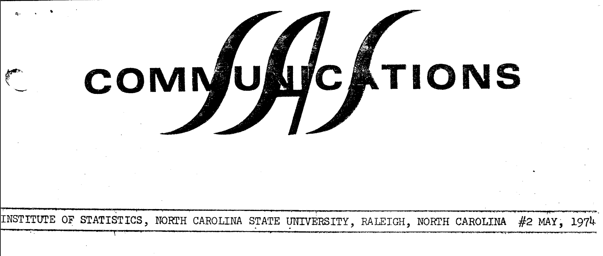

In May 1974 the second issue of "SAS Communications" was published by the SAS Project Group. Within these pages you discover fascinating insights into the early days of SAS.  A PDF of the original is available <a href="../resources/SAS_Communications_issue_2.pdf" target="_blank">here</a>.

<hr/>



# INSTITUTE OF STATISTICS, NORTH CAROLINA STATE UNIVERSITY, RALEIGH, NORTH CAROLINA #2 MAY, 1974

## SAS SUBSYSTEM FOR PESTICIDE LICENSING

Concerned about injuries and deaths due to misuse of pesticides, the North Carolina General Assembly enacted a law requiring vendors and appliers of pesticides to be licensed. Herbert J. Kirk, in cooperation with the Pest Control Division of the North Carolina Department of Agriculture, has developed a SAS-based system for handling most of the information-processing aspects of the licensing function.

Mr, Kirk utilizes SAS's data management facilities heavily. His subsystem grades the tests that prospective licensees must take (there are tests to correspond to each area of specialization a pesticide applier might choose).
Records of licensees are maintained as SAS data sets and updated with the MERGE facility. A custom-designed SAS procedure prints the licenses. The sorting and printing capabilities of SAS are used to furnish inspectors lists of licensees by county, Mr. Kirk claims that the integration of the necessary special- purpose routines into the framework of SAS not only saved program development time, but also reduced the time and staff nee-ed to perform the licensing function day-to-day,

Other SAS subsystems have been created and used with equal success. A user interested in developing such a sub-system should consult the SAS Programmer's Guide.


# USERS' FORUM

To The Editor:

I'd like to report a "bug" in the User's Guide write-up for the RANK procedure. It concerns the output for tied data when the FRACTION optian is used.

When the FRACTION option is not used, and several observations have the same value for the variable, those values are assigned an average rank, as stated in the User's Guide. However, when the FRACTION option is used, the value returned is the fraction that pertains to the highest rank for which they are tied. In the example shown on Page 72 of the User's Guide, the two tied values would receive fractional ranks of `3/8 = 0.38` rather than `2.5/8 = 0.31`.

This method of handling ties is reasonable if one is using the procedure to generate an empirical cumulative distribution function.

Sincerely yours,

Harvey J. Gold 

`----------------`

We are grateful to Dr. Gold for pointing out both our mistake and an alternative use for the RANK procedure. Please make the appropriate changes to Page 73 of your copy of the User's Guide.

# PROFILE: JAMES HOWARD GOODNIGHT

Jim Goodnight, co-developer of SAS, took a statistical programming course while an undergraduate at N. C. State University. In his work with SAS today, he is still exulting in the rewards of statistical programming that he discovered in that course. The satisfactions are direct, he claims. "You can see results, see programs grow and develop."

A native of North Carolina, Dr. Goodnight focused his interest on quantitative studies early. All his formal higher education was conducted at N, C, State: he was awarded a Bachelor's degree in Applied Mathematics in 1965, a Master of Experimental Statistics degree in 1968, and a Ph.D. in Statistics in 1972. Between college and graduate school, he worked in G. E.'s Apollo Support Department, first as an engineering programmer and later on information retrieval systems. Returning to N. C. State, he accepted a graduate research assistantship, then a faculty position as Assistant Statistician; he is now a Research Associate. He has been working on SAS since 1967 and doing additional consulting for corporate and university researchers. 

Dr. Goodnight's area of greatest competence within statistics is regression and least-squares methodology. He likes the matrix orientation of that field, for he finds the essential simplicity of matrices appealing. In programming, he admits to dwelling on "the aesthetics” of the printed results. "I like nice output," he smiles,

Looking at the future of SAS, Dr, Goodnight states that one of his main concerns is the "caveat emptor" approach that developers of statistical systems -- even, to some extent, the developers of SAS -- have traditionally taken. He feels that statistical programmers should be looking into what they can do to protect users. "Right now, we can diagnose syntactical errors,” he states. "We can't diagnose errors of application." 
Though there has not been enough research done in this area, he feels, some implementation is possible. For example, a lack-of-fit test for models might be built into a procedure and the analysis truncated if the test be significant. Tests of normality and homogeneity might be incorporated into routines whose validity depends on those assumptions. Dr. Goodnight questions both the availability of such screening techniques and the economy of including them, but he claims, "We must start taking these things into consideration."


# SAS Communications is published by the SAS Project Group:

* A. J. Barr, Systems
* J. H. Goodnight, Procedures and Administration
* J. Service, Documentation and Editing
* C. G. Perkins, Assistant for Systems
* J. Sall, Assistant, for Procedures
* H. J. Kirk, Consulting
* S. L. Biggs, Consulting
* J. Massengill, Secretary

> Institute of Statistics
> North Carolina State University
> Raleigh, North Carolina . 27607


# APPLICATION NOTE: SIMULATING EXPERIMENTS FOR INSTRUCTIONAL PURPOSES

The past few years have seen a sharp rise in interest in using computers for instructional purposes. In statistical methods courses, student use of data analysis programs has helped shift the courses' emphasis from calculation of numeric measures (the "cookbook" approach) to interpretation of data. Beyond this, computers have made it feasible to illustrate principles -- like laws of large numbers, sampling properties, and Central Limit Theorems -- that require rather sophisticated mathematics to prove. S. G. Carmer and F. B. Cady, among others, have propounded yet another approach;

> In order to eliminate the often tedious search for 'real-life' research data meeting the specifications for a given teaching situation, a logical approach is to have a computer generate sets of data according to a model whose structure and parameters (including magnitude and distribution of random error) are controlled by the teacher. In a given problem the selected param- eter values could be purely hypothetical in nature, and thus give rise to highly artificial data useful for illustrative pur- poses only. More realistic data could be generated by basing parameter values on research published in a subject matter (e.g., agriculture, biology, or engineering) journal or report where statistical summaries of real data, but not the data, appear ( _S. G. Carmer and F. B. Cady, "Computerized Data Generation for Teaching Statistics," American Statistician, Vol. 23, No. 5 (1969), pp. 33 ff._ )
 
Below we show one way of generating in SAS individualized data sets suitable for simple linear regression or correlation analysis,

```sas
DATA CLASS; INPUT NAME $ 1~15 BETAO 16-20 BETAl 21-25 SIGMA 26-30;
  COMMENT BE SURE THAT ALL THE NAMES DIFFER IN AT LEAST ONE
     OF THE FIRST 8 CHARACTERS;

N= 0;
COUNT:  N=N+1;
        X = 100 + 15*NORMAL(156983);
        Y = BETAO + BETA1*X + SIGMA*NORMAL(23387);
        OUTPUT ;
        IF N < 40 THEN GO TO COUNT;

CARDS;
ALLEN          0    .1   1
ANDERS         0    .1   10
BELL           0    10   1
BRYANT         0    10   10
BUFORD         10   .1   1
  .
  .
  .
ZIMMERMAN      5    1    10

PROC PRINT PAGE; VAR X Y; BY NAME;
    COMMENT STUDENTS' DATA;
PROC REGR C; BY NAME;
    COMMENT ANSWERS FOR INSTRUCTOR;
MODEL Y = X/P;
```

The following example illustrates what samples from an exponentially distributed population can be expected to look like and how well they conform to the Central Limit Theorems. We generate 50 samples of 80 observations each, produce a histogram for each sample, and produce a histogram of the sample means.

```sas
DATA EXP;
INPUT MU 1-10;
      COMMENT   MU IS THE POPULATION MEAN. WE USE THE INVERSE OF THE
                EXPONENTIAL CUMULATIVE DISTRIBUTION FUNCTION TO OBTAIN
                EXPONENTIAL PSEUDO-RANDOM VARIATES FROM THE UNIFORM
                PSEUDO-RANDOM VARIATES PROVIDED BY SAS;
SAMPLE = 0;
SET:  SAMPLE = SAMPLE + 1;
      N= 0;
      OBS:  N=N+1;
            X = -MU*LOG( 1-UNIFORM(33933))
            IF N < 80 THEN GO TO OBS;
      IF SAMPLE < 50 THEN GO TO SET;
CARDS;
1
PROC HIST; BY SAMPLE; VAR X;
     COMMENT    DON'T FORGET TO INCLUDE THE JOB CONTROL LANGUAGE
                STATEMENT THAT MAKES THE SUPPLEMENTARY LIBRARY
                PROCEDURES ACCESSIBLE;

PROC MEANS NOPRINT OUT=CLT; BY SAMPLE;
PROC HIST; VAR X;
     COMMENT    THIS LAST HISTOGRAM SHOWS THE EMPIRICAL SAMPLING
                DISTRIBUTION OF THE SAMPLE MEANS;
```

# SAS PUBLICATIONS

* Service, Jolayne. A User's Guide to the Statistical Analysis System. 1972.
* Perkins, Carroll Gray. A Guide to the Supplementary Procedure Library for the Statistical Analysis System. 1973.
* Barr, Anthony James, and James Howard Goodnight. SAS Programmer's Guide. 1972.

The User's Guide, published by and available from the Student Supply Stores, North Carolina State University, Raleigh, North Carolina 27607, tells how to use SAS. (Because of a recently enacted statute, the Student Supply Stores will no longer be allowed to sell the User's Guide to anyone off campus other than university book stores. The guide will not be reprinted as it is being revised at this time and the new edition will be out in September. At the time the new edition is complete, new arrangements will be made for publication and distribution, and all SAS users will be notified.)

The Supplementary Procedures Guide describes special-purpose SAS procedures. Programmers who want to implement their own procedures under the umbrella of SAS will need to consult the Programmer's Guide. The latter two guides are available from the SAS Project Group.

</hr>

# OPSCAN

A supplementary procedure called OPSCAN has been created to construct a SAS data set from the information on a magnetic tape produced by an OPSCAN/100 optical scanning reader. Developed by Carroll Perkins of the SAS Project Group, OPSCAN's first function was to facilitate processing of course-and-instructor-evaluation questionnaires. The procedure can handle information from the Optical Scanning Corporation's Standard Answer Form A; it also processes the forms of N.C State's Student Government Faculty Evaluation.

Users of OPSCAN/100 equipment are invited to request further details from Mr. Perkins.

</hr>

# APPLICATION NOTE: OBTAINING REGRESSION COEFFICIENTS FOR FURTHER COMPUTATION

Several users have asked how to obtain estimated regression coefficients ("b-values") from the REGR procedure for use in the same run. Since REGR ignores observations for which relevant values are missing, one can insert "dummy" observations (with missing dependent variable values) into the data set to be Analyzed. The OUTPUT statement can then pick out the b-values. In the example following, the first three observations are included in INFO for such a purpose. The data set FINAL will contain the b-values in every genuine observation along with X1, X2, Y and YHAT. A more realistic application would include using regression coefficients to generate "observations" for a plot of a regression line or surface. Such generation could be done by modifying slightly the program statements shown and adding statements like those shown in the User's Guide examples for the PLOT procedure.


</hr>

# NEW SUPPLEMENTARY PROCEDURES

Two procedures have been added to the Supplementary Procedure Library, one for testing Normality of numeric data and the other for printing histograms. Installations having service agreements are receiving these additions. We are including in this newsletter the documentation for both procedures so that users will not have to reorder the Supplementary Procedures Guide to find out about the additions,

## The KSLTEST Procedure

The KSLTEST procedure computes simple ‘univariate) statistics for testing normality of numeric variables in the input data set. The KSLTEST procedure is contributed to the Supplementary Procedure Library by Dr. Harvey J. Gold of the Biomathematics Program of the N. C. State University Department of Statistics.

The KSLTEST procedure first computes the sample mean and standard deviation for each variable. Next, the Kolmogorov statistic is computed as

`D = MAX | S(X) - F(X) |`, where `S` is the sample cumulative distribution function and `F` is the Normal distribution function with the sample mean and variance. Then, the Kolmogorov statistic is compared to the Lilliefors table of critical values if `N` is not greater than 30 (reference 1). If `N` is greater than 30, then the Kolmogorov statistic is compared against asymptotic values.

The Fisher G-statistics are computed as measures of sample skewness and kurtosis (reference 2). These statistics may be used to test normality, but they have no power against some alternatives since they are based on the unbiased estimates of the first four cumulants. Also, a minimum of four observations from the input data set are needed to calculate these statistics.

## OUTPUT

For each numeric variable, a table is output showing the number of observations, value of the Kolmogorov-Smirnov statistic, the Lilliefors significance level, the Fisher G-statistics, the standard errors of the G-statistics, the significance levels of the G-statistics, and the mean and standard deviation of the variable.

A minimum of four observations is ne2ded to produce any statistics.

## THE PROC KSLIESE STATEMENT

```
PROC KSLTEST <DATA=data_set_name>;
```

## PROCEDURE INFORMATION STATEMENTS

The VARIABLES or DROP statement can be used to restrict the procedure to specific numeric variables.

The BY statement may be used to force KSLTEST to calculate test statistics for groups of observations. If a BY statement is included, the data set must already be sorted according to the variables in the BY statement.

## TREATMENT OF MISSING VALUES

Missing values are omitted from the calculations.

EXAMPLE

```sas
DATA; INPUT X1 1-2 X2 4-6 1; CARDS;
19 371
93 719
72 391
28 829
45 3h1
“we 65 281
18 371
5 328
52 731
92 382
82 372
28 381
60 145
31 48
3 291
1 503
31 436
11 533
59 339
PROC KSLTEST;
```

------
REFERENCES

1. H.W. Lilliefors, Table of Critical Values from the Journal of the American Statistical Association, Volume 62, Page 399.
2. R. A. Fisher, Statistical Methods for Research Workers, Edition 13, Chapter 3.

</hr>

# The HIST Procedure

The HIST procedure will print one or more percentage frequency histograms. A histogram consists of vertical bars with class values printed below them, or horizontal bars with class values printed to the left. The percentage frequencies are printed perpendicular to the class values for all histograms. Optionally, the user may specify that a histogram's classes be broken down into subclassifications according to the value of one or more additional variables. Unless a VARTABLES statement is present, a histogram will be produced for every variable not appearing in a CLASSES, WEIGHT, BY, or DROP statement.

## OUTPUT

The histogram for each variable is printed in the format that will fit best on the printer being used. If possible, a vertical histogram is printed; otherwise, a horizontal histogram is printed. For each numeric variable, the total frequency of all values, frequency of missing values, sum, arithmetic mean, uncorrected sum of squares, corrected sum of squares, variance, standard deviation, coefficient of variation, and standard error of the mean will also be printed.

The classes for a character variable will be the distinct character values of that variable.

The classes for a numeric variable will be either distinct values of that variable or intervals depending on the number of distinct values in that variable. If the maximum number of classes for a numeric variable is not specified by the user, the HIST procedure assumes that 10 or fewer classes should be used. All numeric variables with more distinct values than the maximum allowable number of classes will be subject to grouping. If the number of classes for this type of numeric variable is not specified by the user, the HIST procedure assumes that `1+FLOOR(3.3*L0G10(n))` intervals should be used as classes for the variable, where n is the total number of non-missing data elements in the variable.

A unique feature of the HIST procedure is the ability to sub-classify values with classes, The subclassifications are denoted by printing the leftmost character of a character subclassification value or the leftmost digit of a numeric subclassification value to form the bars representing each class. Scaling remains the same for all subclassifications, thus allowing within-class comparisons to be made.

</hr>

# THE PROCEDURE HIST STATEMENT

```sas
                  L=__       W=__      N=__
PROC HIST <LOWMIDPT=__> <WIDTH=__> <NINT=__>
                  D=__
          <DISCRETE=__> <DATA=data_set_name>;
```

The parameters for the HIST procédure pertain only to numeric variables. In the specifications below, a numeric variable whose values are to be grouped into intervals is called "continuous".

## Parameters

* LOWMIDPT (L)=__ The LOWMIDPT parameter, which may alsa be written L, specifies the midpoint for the lowest interval for continuous numeric variables.
* WIDTH (W)= __ The WIDTH parameter, which may also be written W, on specifies the width of the intervals for continuous & numeric variables.
* NINT (N)=__ The NINT parameter, which may also be written N, specifies the number of intervals for continuous numeric variables.
* DISCRETE (D)=__ The DISCRETE parameter, which may also be written D, specifies the maximum number of distinct values a numeric variable may have before being considered continuous.

# PROCEDURE INFORMATION STATEMENTS
## WEIGHT Statement

The WEIGHT statement is of the form

`WEIGHT var_1<var_2 ... var_n>;`

The WEIGHT statement is used to assign a predetermined weight to an observation, in effect causing the observation to appear more than once in the input date.

If only one variable appears in the WEIGHT statement, its values will serve as weights for all the other variables. If more that one variable appears in the WEIGHT statement, a VARIABLES statement must appear also; these two statements must contain the same number of variables. The values of the first variable in the WEIGHT statement will be taken as weights for the first variable in the VARIABLES statement; the values of the second variable in the WEIGHT statement will be weights for the second variable in the VARIABLES statement, etc. All weighting variables must be numeric, and only the integer part of a weighting data element is used.

## CLASSES Statement

The CLASSES statement is used to specify variables whose values will form subclassifications within each class. As with the WEIGHT statement, one sub- classification variable may be assigned for all variables, or a separate sub- classification variable may be assigned for each variable in the VARIABLES statement. The rules for specifying subclassification are directly analogous to the rules given above for specifying weighting variables. Subclassification variables may be numeric or character. Only the first character of a character CLASSES variable or the first digit of a numeric CLASSES variable is printed, even though the complete value of the variable is used in performing the sub- classification operation.

## TREATMENT OF MISSING VALUES

Missing values are a unique class (or unique subclassification) in each histogram.

## EXAMPLE
In the following example, the HIST procedure is invoked three times.

```sas
DATA; INPUT GRADE $ 1 N 3-4 Y 6-8 1;
CARDS ;
D 18 86
F 16 96
E 11 54
A 17 61
B 15 75
C 17 75
B 16 76
D 20 87
A 18 67
E 19 48
C 17 72
F 17 66
A 15 57
C 18 79
D 16 71
F 19 46
E 21 52
B 15 74
C 18 83
E 18 53
F 19 81
B 16 93
A 22 78
D 14 65
PROC HIST;
PROC HIST L=4 W=.5 N=l4; VAR Y;
PROC HIST; VAR Y; WEIGHT N; CLASS GRADE;
```