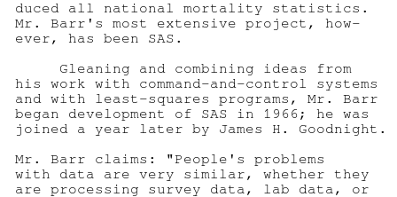
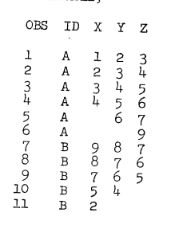
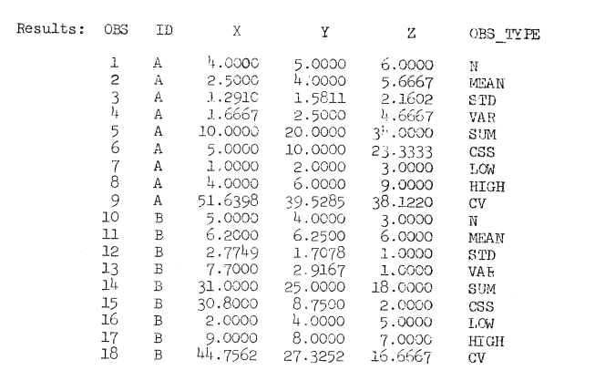
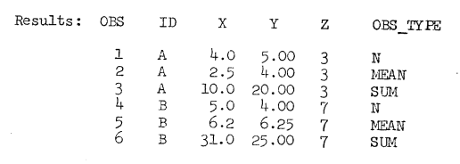

The third issue of "SAS Communications" was published in December 1974 by the SAS Project Group. Highlights of this issue include an interview with Tony Barr, the announcement of SAS-75 (to be released the following year), and a review of several new and modified procedures.  The original is available in pdf format <a href="../resources/SAS_Communications_issue_3.pdf" target="_blank">here</a>.

<hr/>



**INSTITUTE OF STATISTICS, NORTH CAROLINA STATE UNIVERSITY, RALEIGH, NORTH CAROLINA #3 DECEMBER, 1974**

# SAS USERS DESCRIBE APPLICATIONS TO COMPUTER SYSTEM MANAGEMENT

Two papers were recently presented that describe using SAS to make understandable the computer performance data generated by IBM's System Management Facilities (SMF). In SHARE's Computer Measurement and Evaluation Project Session (B301; August 28, 1974), H. W. Barry Merril of State Farm Mutual Auto Insurance Company, Inc., Bloomington, Illinois, discussed "Statistical Analysis of SMF Performance Data."
At GUIDE39, November 6, 1974, Session OPS-1, Steve Cullen, also of State Farm Mutual, and Soli Dastur of Procter and Gamble Company, Cincinnati, Ohio, jointly presented "Statistical Analysis of SMF Data."

Both papers detail how SAS is applied to SMF data. We quote the introduction to the paper of Mesrs. Cullen and Dastur:

> SMF, despite its many shortcomings and omissions, is without a doubt the best source of performance data about a computer system because the voluminous amount of data is so easy to collect.  But at a large installation like State Farm Mutual Automobile Insurance Company, the volume of data collected can be overwhelming. (Two 155s, a 165, and a 168 create in excess of 700,000 records weekly describing the processing of about 10,000 batch jobs and almost 1,800 TSO sessions.) Such a volume of data is impressive but of little value unless a means of reducing it to a reportable size and format is available. Our early attempts consisted of writing programs to reduce SMF records by type.  The result was a group of "homegrown" programs which produced large amounts of paper. Fortunately, in 1972, we discovered a better way -- the Statistical Analysis System.... SAS gave us the facility to create rapidly (in 5-30 minutes of coding) the JCL and control statements to produce almost any SMF-based report. This paper is a discussion of our use of SAS to reduce SMF data into usable reports, as well as to analyze them statistically,.. correlating various system parameters. Such usages have resulted in making our computer systems more effective and efficient.

Mr. Merrill's paper concludes, "SAS has proven itself as an extremely efficient and useful technique for analysis of this information, turning data into intuition."

We of the SAS Project Group are grateful to Messrs. Merrill, Cullen, and Dastur for communicating so widely and effectively their experiences with applying SAS to computer management, and we hope that other SAS installations may take advantage of the examples of SAS usage given in the bodies of the two papers.

# PROFILE: A. J. BARR

Anthony James Barr, who has led the development of SAS since its inception, remains a most enthusiastic proponent of the further development and improvement of SAS.

Reared in New Jersey, Mr Barr attended North Carolina State University and earned a B.S. degree in Applied Physics with honors. He was awarded a National Science Foundation fellowship and continued at NCSU, earning a M.S. degree in Physics. He began programming while working on his Master's degree, and computers quickly became his main professional interest. His first programming experience was the development of an analysis of variance program somewhat like the current ANOVA procedure. From 1964 to 1966, Mr. Barr worked for IBM, developing a military command and control system.

Returning to NCSU in 1966, primarily to work on analysis of variance procedures for the Department of Statistics, he began compiling a record of outstandingly varied achievements. Working with the NCSU School of Forest Resources, he co-invented in 1972 the Yield-O-Matic (patent pending), a mini-compuer-based, real-time system for scanning and marking boards so that the cutting of dimensioned parts is optimal. This achievement prompted the National Association of Furniture Manufacturers to give him a Special Challenger Award for his oustanding contribution to the industry. In the computer systems area, Mr. Barr pioneered both thte linking loader -- which reduced program execution time substantially on the IBM 360 -- and multileaving communications between IBM computers and non-IBM terminals.  He wrote EAOP multileaving terminal programs for the University Computing Company's COPE Terminal (1970) and the Singer Corporation's remote batch terminal (1971). Entering yet another area of computing, he developed in 1969 the ACME system, which the National Center for Health Statistics uses to process death records automatically and from which are produced all national mortality statistics. Mr. Barr's most extensive project, however, has been SAS.

Gleaning and combining ideas from his work with command-and-control systems and with least-squares programs, Mr. Barr began development of SAS in 1966; he was joined a year later by James H. Goodnight.

Mr. Barr claims: "People's problems with data are very similar, whether they are processing survey data, lab data, or the data that business or military installations accumulate."  His goal is "to have one consistent language" which people of widely varying professional backgrounds can learn and apply to solve their problems. His greatest concerns are making SAS handle large problems easily and making the system easy to extend to customized applications. "Our SAS language is a language for describing simple programming operations as well as complex processes to be performed," says Mr. Barr. "It's a more problem-orientated language than PL/1 or FORTRAN, which have been used on the same sort of file-processing problems. I feel that with SAS-75 we shall have a nearly complete system for processing and describing data sets which are organized as they are now in SAS."

Mr. Barr dreams, though, of another "generation" of ???, which would introduce the concept of hierarchically organized data sets.  In such a data set, an observation could consist not only of data elements (values of individual variables) but of data sets as well. This structure, beleives Mr. Barr, would increase tremendously the flexibility of the data handling and the ease of producing and processing the output from procedures.

# USER's FORUM

> Gentlemen,
> 
> I have been using your system of SAS for some time now... I would like to make one request, as a suggestion, not a criticism. The ability to lag variables, at various lengths of time, by my choice would be of great help to me in my use of regression analysis.
>
> I would hope you will consider this suggestion, as many people who work in Economics, as I do, would really appreciate this addition to your program.
>
> Thank you,  
> Danny Tatar  
> DeKalb, Illinois

Lagging is currently possible by the proper use of the OUTPUT statement.

Suppose you want two lags of X called XLAG1 and XLAG2. Then the following statements will suffice:  

```sas
DATA; INPUT X etc.;
OUTPUT; XLAG2=XLAG1; XLAG1=X;
```

Notice that the computed variables, XLAG1 and XLAG2, have missing values until they are set to be non-missing.  PROCEDURE REGR will throw away all observations with missing data.  Also note that when you use an OUTPUT statement, there is no longer a default output at the end of the program statements or upon encountering a RETURN statement. Try this method out using PROCEDURE PRINT. The generalization to higher-order lags should be obvious now.

This feature has not been obvious, and we intend to show lagging examples in next year's edition of the SAS User's Guide.

_John Sall, SAS Project_

> [Ed note:  See also the "Retention of Values" section (pages 30-31) and the OUTPUT Statements" section (pages 33-34) of the User's Guide.]

# BUG

We have discovered that using more than 256 variables with the REGR, ANOVA, or FREQ procedure may cause the procedure to "blow up" or go into an infinite loop.

To avoid this difficulty, a user working with a data set of more than 256 variables can create one or more subsets of his original data set, using the DROP or KEEP statement to limit each subset to 256 or fewer variables. The subsets can then be processed by the REGR, ANOVA, or FREQ procedure.

# NEW POLICY ON SAS PUBLICATIONS

_Service, Jolayne. <u> A User's Guide to the Statistical Analysis System.</u> 1972._

The User's Guide is the basic reference for using SAS.  Degree-granting educational institutions can order copies from the Student Supply Stores, North Carolina State University, P.O. Box 5245, Raleigh, NC 27607; other installations can order copies from Sparks Press, 115 HArrison Avenue, Raleigh, NC 27603. In either case, the cost is $3.95 per copy, plus 3% North Carolina sales tax plus 1% Wake County tax (residents only), plus mailing and handling charges ($0.39 for the first copy, $0.20 for each additional copy). Note: A revised edition of the User's Guide will be prepared for the new version of SAS.

_Perkins, Carroll Gray. <u> A Guide to the Supplementary Procedure Library for the Statistical Analysis System.</u> Last revised April, 1974._

_Barr, Anthony James, and James Howard Goodnight. <u> SAS Programmer's Guide.</u> 1972._

The supplementary procedures guide describes special-purpose SAS procedures. The programmer's guide tells programmers how to implement their own SAS procedures. One can obtain copies of the latter two guides from the SAS Project Group, Institute of Statistics, North Carolina State University, Raleigh, North Carolina 27607 at a total cost of $2.00 per copy.


# SAS-75

In our [first issue of SAS Communications](https://rawsas.com/sas-communications/), we described the SAS Project Group's activities, particularly the revision of the "systems" portion of SAS and the development of new and improved procedures. We stated several goals:


(1) to make the system easier to understand;  
(2) to make the internal code clearer;  
(3) to increase the efficiency of SAS, particularly in handling data sets;  
(4) to make "autobatching" of SAS possible;  
(5) to make SAS easier to use under the Time Sharing Option (TSO);  
(6) to make it simple to produce easily readable reports;  
(7) to make SAS statements more flexible; and of course  
(8) to expand SAS's statistical capabilities.

We are currently working to have a provisional version of the new SAS — called SAS-75 — ready for distribution by February 15, 1975. SAS-75 as released then will not include all the present SAS procedures; many installations will hence wish to offer simultaneously the version of SAS now used and SAS-75. Users could then use all SAS's present capabilities and begin to try out some of SAS-75's important new features. All SAS's present capabilities will be incorporated as soon as possible into SAS-75.

Here, then, is an outline of SAS-75's new features:


## I. Systems Features

### A. New INPUT and PUT statements.

All INPUT statements presently valid in SAS will remain valid under SAS-75. The INPUT statement, though, will acquire new options, allowing the user to describe data using a format similar to PL/1 or FORTRAN formats. In addition, SAS will be able to handle free-form (list-type) data (a boon especially to people who use SAS interactively).

The PUT statement will acquire the same form as the INPUT statement and will be used to print or punch data, thus greatly enhancing SAS's report-writing capabilities.

### B. Variable labeling.

A LABEL statement will associate a "label" of up to 40 characters with each variable name. Many of the procedures will use the label, if specified, rather than the variable name to identify items printed out. This feature too will contribute to SAS's role as a report generation tool.

### C. Creation of several SAS data sets at one time.

The DATA statement will be expanded in function so that several SAS data sets can be created simultaneously as SAS passes through the input data. Program statements will determine which data elements are coded to which SAS data set. This feature will increase greatly SAS's efficiency in processing large, complex collections of data.

### D. Function to test the value of a variable in the next observation.

A new function, to be used in program statements, will check to see if, in the observation being processed, the value of a variable is different from the variable's value in the observation immediately following.

### E. LENGTH statement.

Currently, every numeric data element stored as part of a SAS data set requires 8 characters of storage. This requirement has made it rather inefficient for users to store data which is mostly small integers as a SAS data set. The LENGTH statement will allow the user to specify how many characters (from 2 to 8) the values of a numeric variable are to take up on the storage medium. SAS's data management routines will then truncate each value to the specified number of characters before storing it. When such a stored variable is processed by a procedure, its data elements will each be expanded to 8 characters (without change of magnitude).

### F. Conservation of paper.

SAS statements and messages will be printed separately from the output of procedures, thus eliminating the waste of paper which currently occurs (e.g., a single PROCEDURE statement and its procedure information statements, if any, now take up a whole page).

## II.  New and Revised Procedures

### A. The FREQUENCY procedure.

A FREQUENCY procedure will produce multi-way frequency tables as a series of two-way tables. Three new algorithms will increase the efficiency of this procedure over that of the present procedure FREQ: a hash-coding algorithm will be used to produce one-way tables; a radix method (similar to the method used by compilers to handle multi-dimensional arrays) will be employed to produce multi-way tables; and if the data is sorted, special logic will be used to acquire the frequencies.

### B. The CONTENTS procedure.

This new procedure will give a physical and logical description of a stored SAS data set.

### C. The GLM procedure.

A GLM (for General Linear Models) procedure is being developed. It will combine the features of the present REGR and ANOVA procedures. For balanced designs, GLM will use the computational methods currently used in ANOVA; for unbalanced designs, it will use the techniques of REGR. Several new types of effects will be valid, including interactions and powers of continuous (numeric) variables, interactions between continuous variables and classification variables, and the effect of a continuous variable nested within a classification variable. One will be able to produce least-squares means as well as adjusted means. New missing-value rules will be established; the procedure will no longer omit an entire observation when one of the dependent variables has a missing value.

### D. The NLIN procedure.

SAS-75 will include a procedure for least-squares estimation of the parameters of a non-linear model. The user will describe the model and derivatives with SAS statements that are similar in form to present SAS program statements. The procedure will be able to use any one (or a combination) of the following techniques:

(1) modified Gauss-Newton method,  
(2) modified gradient method of Marquardt,  
(3) parabolic approximation technique of Mason, and  
(4) grid search to find starting values.

### E. The new DISCRIM procedure.

In addition to its present capabilities, the DISCRIM procedure will allow the user to store calibration information and apply it to other data sets.

### F. The new FACTOR procedure.

The FACTOR procedure is undergoing complete revision. The new version will offer several methods of communality estimation, several types of orthogonal and oblique factor rotation, and production of factor scores.


### G. The SYSREG procedure.

This procedure will estimate the parameters of interdependent systems of equations. SYSREG can use any of the following estimation methods: classical least squares, two-stage least squares, three-stage least squares, and limited information maximum likelihood. Features include restricted estimation, tests of hypotheses, and creation of a data set containing residuals and predicted values.

# A NOTE ON EFFICIENCY

Stored SAS data sets are kept on disk or tape as specified by the user; other SAS data sets created in the course of a job are stored on disk for the duration of the job. Hence every time a SAS data set is processed — when it appears in a SET or MERGE statement or when a procedure is applied to it — SAS must fetch the observations from the data storage unit and bring them into the central processing unit of the computer to work with them. This reading of observations from disk or tape can become quite costly when the data set has about 40,000 observations. The user is levied a charge each time SAS goes to fetch another group of observations. By increasing the blocksize of the SAS data set, however, the user can reduce the costs.

SAS reads SAS data sets block by block. Unless otherwise specified by the user, the blocksize of a SAS data set, stored or not, will be 2048. A SAS data set created just for the duration of the job is seen by the computer's operating system (OS) as a member of a partitioned OS data set whose data definition name (the name OS recognizes) is SASDATA. By telling OS that the blocksize of SASDATA is something larger than 2048, the user forces SAS to read larger blocks, containing more observations, than it ordinarily would. Furthermore, SAS is written so that the blocksize stated or implied for SASDATA is assumed to be the blocksize for all stored SAS data sets mentioned in that job as well. Thus the single Job Control Language statement:

`//SAS.SASDATA DD DCB=BLKSIZE=6400`

appearing immediately after the

`// EXEC SAS`

card will make SAS take the number 6400 to be the blocksize of all the job's SAS data sets, whether stored or members of SASDATA.

When in a subsequent job one is processing a stored SAS data set with a larger-than-2048 blocksize, one must be careful always to include the Job Control Language statement shown above, with BLKSIZE= a number at least as large as the blocksize with which the data set was originally stored.

# PROCEDURE MEANS: EXPANDED OUTPUT OPTIONS

_[Ed. note: We are grateful to PAUL D. HOPKINS of the Statistical Reporting Service, Research Division, United States Department of Agriculture, for preparing and allowing us to adapt and reprint this documentation of the expansion of SAS's MEANS procedure.]_

The latest release of SAS has a heretofore undocumented feature in the MEANS procedure. It allows users to create a SAS data set with any combination of the descriptive statistics the procedure can produce. Users may create SAS data sets with the number of observations, means, standard deviations, variances, sums, corrected sums of square, smallest values, largest values, coefficients of variation, or any combination of these items.

The particular item or items to be put in the output data set are selected by options on the PROC MEANS statement. There is one option for each item to be included in the output data set. The SAS data set produced always has the same variables as the input data set. If more than one type of statistic is desired, SAS creates multiple observations and adds a new character variable OBS_TYPE to the data set. The values of OBS_TYPE are the options used on the PROC MEANS statement, which identify the type of data in the remainder of the observation.

BY variables and character variables are included in the output data set. A BY statement causes a new series of observations for each distinct value in the BY variable. The value of a character variable included is the first value encountered in any BY group.

The VARIABLES statement produces the following results in the output data set: those variables included in the VARIABLES statement are properly processed and included in the output data set; all variables not in the VARIABLES statement are also written out, but contain the first value received in any BY group.

The PROC MEANS statement now has the following form:

```sas
    PROC MEANS <NOPRINT> <OUT=data_set_2> <DATA=data_set_1> 
               <N> <MEAN> <STD> <VAR> <SUM> <CS> <LOW> <HIGH> <CV>;
```

The NOPRINT and DATA options are described in the SAS User's Guide. The OUT option is expanded to include the options on the second line. Those options specify the type of items to be included in the output data set.


|---|---|
|Option|Type of statistic in observation|
|---|---|
|N   |            Number of observations.  |
|MEAN|            Mean or average. If no options are specified but the OUT parameter is included, the procedure will include only means on the output data set, data_set_2. MEAN must be specified if means and one or more other statistics are to be included in data_set_2.  |
|STD |            Standard deviation.  |
|VAR |            Variance.  |
|SUM |            Sum or total.  |
|CSS |            Corrected sum of squares.  |
|LOW |            Smallest value.  |
|HIGH|            Largest value.  |
|CV  |            Coefficient of variation|


**Examples:**  

The following SAS statements produce the data set EXAMPLE from cards and print it:  

```sas
DATA EXAMPLE; INPUT ID $ 1 X 2 Y 3 Z 4; CARDS;
A123
A234
A345
A456
A 67
A  9
B987
B876
B765
B54
B2
PROC PRINT DATA=EXAMPLE;
```




The following SAS statements make MEANS create a SAS data set with all available output items then print it out:

```sas
PROC MEANS NOPRINT OUT=STATS DATA=EXAMPLE N MEAN STD VAR SUM CSS LOW HIGH CV;
BY ID;
PROC PRINT DATA=STATS;
```




Note that the STATS data set has the same variables as EXAMPLE, plus OBS_TYPE. There is an observation created for each type of statistic selected in the option list. The value of OBS_TYPE identifies the type of statistic found in the observation, and the value of ID tells which BY group the observation belongs to. Missing values are deleted from computation.

The following SAS statements produce a data set of totals or sums and print it out:

```sas
PROC MEANS NOPRINT OUT=TOTALS DATA=EXAMPLE SUM; BY ID;
PROC PRINT DATA=TOTALS;
```

**Results:**  

```
OBS ID  X  Y  Z
1   A  10 20 34
2   B  31 25 18
```


Note that when only a single type of statistic is wanted, the variable OBS_TYPE is not added to the output data set.

The next two examples show what happens to the output data set when a VARIABLES statement is used with the MEANS procedure. Remember that all the variables in the input data set appear in the output data set.

```sas
PROC MEANS NOPRINT OUT=TOTXY DATA=EXAMPLE SUM; BY ID; 
VAR X Y;
PROC PRINT DATA=TOTXY;
```

**Results:**  

```
OBS ID X  Y Z
1   A 10 20 3
2   B 31 25 7
```

Even though Z was omitted from the VAR statement, it is included in the output data set. Also note that the value saved is the first Z in each BY group.

```sas
PROC MEANS NOPRINT OUT=TEST DATA=EXAMPLE N MEAN SUM; BY ID; VAR X Y;
PROC PRINT DATA=TEST;
```




Again note that the variable Z was not used in the computation process, but does retain the first value found in each BY group.

-----

**SAS Communications** is published by the SAS Project Group:  

- A. J. Barr, Systems and Administration  
- J. H. Goodnight, Procedures  
- J. Service, Documentation and Editing  
- G. C. Perkins, Assistant for Systems  
- J. Sall, Assistant for Procedures  
- B. S. Donaghy, Consulting  
- H. J. Kirk, Consulting  
- J. P. Massengill, Secretary and Administrative Assistant  
- D. Beckwith, Assistant  

>Institute of Statistics  
>North Carolina State University  
>Raleigh, North Carolina 27607