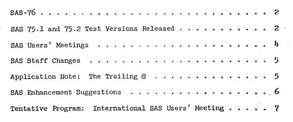
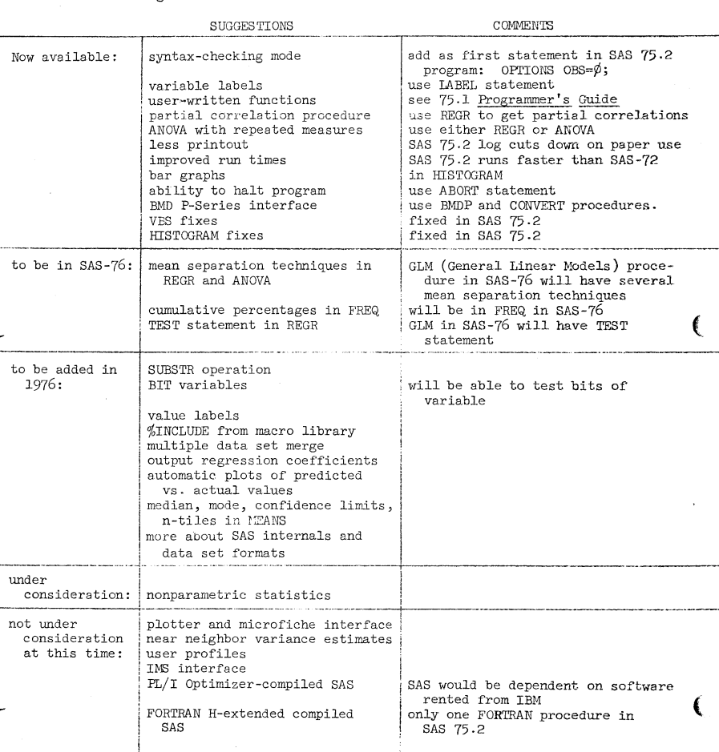

The fifth issue of "SAS Communications" came out in 1975 (we don't have a copy of issue #4). Highlights include some updates to SAS-75, the formation of the first SAS User Groups (Chicago and Florida), and personnel updates regarding Jolayne Service, Jane Helwig, Carroll Perkins and John Sall.  The original is <a href="../resources/SAS_Communications_issue_5.pdf" target="_blank">here</a>.

<hr/>



## SAS-76

SAS-76 is expected to be ready this spring. GLM, the new general linear models procedure that encompasses the SAS-72 procedures REGR and ANOVA, will appear in SAS-76. The new FREQ procedure for frequencies and crosstabulation will also be included, and capabilities for SAS data sets on tape will be ready too. Of course, all the new features now available in SAS 75.2 will also appear in SAS-76.

## SAS 75.1 and SAS 75.2 TEST VERSIONS RELEASED

SAS 75.1, a test version of the new SAS-76, was sent to 20 installations in June. The system was in a rough form and lacked such important features as the PUT statement and the SORT procedure. Provisional documentation accompanied SAS 75.1.

In October, SAS 75.2 was distributed to about 50 test sites. SAS 75.2 is a usable system, although it is not a replacement for SAS-72. Some of the new features in SAS 75.2:

- Variable names of the form ALPHAn-ALPHAnnn can be used: e.g.,
  
  ```sas
  INPUT NAME $ 1-20 Q1-Q25 ;
```

- Several data sets can be created at the same time.

- The INPUT statement has many new capabilities. Free-format input data can be read: e.g, "INPUT X Y Z;"  Zoned decimal, hexadecimal, and positive integer binary data can be read. Several `INPUT` statements can be used to read a file containing several record types (see "Application Note", p. 5). Repetitive formats can be given to read many variables with one format.

- The PUT statement which corresponds to the `INPUT` statement, can be used to write reports, write data on tape or disk, and punch cards.

- INFILE and FILE statements give information about the file read by the `INPUT` statement and the file written by the PUT statement, respectively.

- A number of new functions are available that give sample statistics.

- An ABORT statement lets you halt SAS execution immediately.

- The FORMAT statement lets you specify a format for a variable; SAS uses this format whenever it prints the values of the variable.

- The LABEL statement lets you give variable labels.

- TheLENGTH statement allows you to specify the number of characters used to store variables.

- The MERGE statement has been renamed UPDATE and has some new capabilities.

- Up to 10 TITLE statements can be given.

 New procedures in SAS 75.1 and 75.2

- **AUTOREG** is a new procedure for autoregression.

- **BMDP** calls any BMD P-Series program to analyze data in a SAS data set.

- **CONTENTS** prints descriptions and histories of your existing SAS data sets.

- **CONVERT** lets you convert SAS-72 data sets, **SPSS** system files, **OSIRIS** datasets, and **BMDP** save files to SAS data sets.

- **FORMS** can be used to print any continuous line printer forms: mailing labels, pre-printed forms, envelopes, external magnetic tape labels, and so forth.

- **MATRIX**, a comprehensive matrix-handling procedure, lets you use matrix operations and functions to solve a variety of problems. At **NCSU**, MATRIX has been used by students in two statistical methods courses to do homework exercises.

Here is an example of using MATRIX to find the least squares estimates for a linear model:

```sas
PROC MATRIX PRINT;

X = 1  1  1 /
    1  1 -1  /
    1 -1  1 / 
    1 -1 -1 ;

Y = 5 / 7 / 8 / 9 ;

BETA = INV(X’*X) * (X’*Y);
```
- **NEIGHBOR** performs nearest neighbor and nearest k-neighbor discriminant analysis.

- **NLIN** performs nonlinear regression, finding least squares or weighted least squares estimates of coefficients of a nonlinear model.

- **PROBIT** calculates maximum likelihood estimates for biological assay data.

- **SCATTER** replaces the **SAS-72** procedure **PLOT**.  A new **OVERLAY** option makes it easy to plot observed and predicted values.

- **SPECTRA** produces estimates of spectral and cross-spectral densities of a multivariate time series.

- **SAS72** calls any **SAS-72** procedure not available in **SAS 75.2**. For example, you might use it to call **REGR**.

- **TTEST** computes t-statistics for two groups.

- **VARCOMP** computes estimates of the variance components in a random effects model.

In addition, major changes were made to the **DISCRIM** and **FACTOR** procedures.

## Provisional Documentation for SAS 75.2

Provisional documentation for SAS 75.2 is ready. Copies can be ordered from:

**SAS Project**  
Institute of Statistics  
North Carolina State University  
P.O. Box 5457  
Raleigh, North Carolina 27607  

The price of $4.00 each includes postage. Please limit your order to five copies, since only a limited number is available.

---

## SAS USERS' MEETINGS

A SAS Regional Users' Meeting, sponsored by Abbott Laboratories, was held in Chicago on July 21-22. More than 80 SAS users attended; papers were given by Jim Barr, Jim Goodnight, and eleven users. A demonstration of SAS 75.2 under TSO was presented. Attendees voted on a number of suggestions for future changes to SAS.

Because of the success of that meeting, an International SAS Users' Meeting is planned by Julian and Evey Horwich for the Orlando Hyatt House, Kissimmee, Florida on January 26-28, 1976. On Monday, January 26, Jim Goodnight, Jim Barr, and John Sall will provide progress reports, problem sessions, and tutorials. Tutorials planned include Procedure Writing ,PROC MATRIX, SAS System Programming Features, PROC GLM, and Report Writing and Data Management. Users from the United States, Central and South America, England, and Canada have indicated probable attendance at the meeting. If you are interested in attending the conference, drop a note to:

SAS USERS' MEETING
1239 GLENCOE AVENUE
HIGHLAND PARK, ILLINOIS 60035

A tentative list of sessions scheduled for the SAS Users' Meeting in January begins on page 7.

---

## SAS Communications

**SAS Communications** is published by the SAS Project:

- A. J. Barr – Systems and Administration  
- J. H. Goodnight – Procedures and Administration  
- J. P. Sall – Procedures  
- C. G. Perkins – Systems  
- J. H. Helwig – Communications  
- S. B. Donaghy – Consulting  
- H. J. Kirk – Consulting  
- J. P. Massengill – Administrative Assistant  
- D. K. Beckwith – Assistant  

Institute of Statistics
North Carolina State University  
Raleigh, North Carolina 27607  

(919) 737-2585

## SAS STAFF CHANGES

For almost four years, Jolayne Service has been a member of the SAS Project. Jo wrote *A User’s Guide to the Statistical Analysis System*, which describes SAS-72, and revised it to describe SAS 75.1. Jo also edited **SAS Communications**.  
Although she worked with SAS only part-time, Jo’s contributions have made SAS accessible  
to thousands of users.

Jo has resigned her position with the SAS Project to pursue full-time a doctorate in educational research and evaluation. Our thanks and best wishes go with her.

Jane Harriss Helwig has taken over Jo’s duties and will edit all SAS manuals and **SAS Communications**. Jane, a SAS user since 1972, received a B.S. in chemistry from the University of North Carolina at Chapel Hill, where she has also done graduate work in economics. Jane comes to SAS from the User Services group at the UNC-CH Computation Center.

Carroll Perkins, who has been with the SAS Project since 1972, is leaving to become a systems analyst for the Corporate Data Center of Hanes Corporation in Winston-Salem, North Carolina. Carroll’s contributions to SAS include several procedures, the Programmer’s Guide, and the Supplementary Procedures Guide. We wish Carroll well in his new position.

John Sall, with SAS since 1973, is taking an increasingly larger role in the project. John is a heavy contributor to SAS-76; he has written twelve procedures, including MATRIX. John holds a B.A. from Beloit College, has a Master’s in economics from Northern Illinois University, and is working on his Ph.D. in statistics at NCSU.

---

## APPLICATION NOTE: THE TRAILING @

An `@` as the last item in an INPUT statement tells SAS 75.2 to keep the current observation rather than reading a new one when the next INPUT statement is encountered. You can use this feature to select only records of a given type for processing.  
Here is an example:

```sas
DATA SMF4;

INFILE SMF;

INPUT @3 REC_TYPE PIB2. @;

IF REC_TYPE = 4 THEN GO TO A;

INPUT; DELETE;

A: INPUT JOBNAME $ 15-22 @40 TIME PIB4.;
```

Note that when the record is not wanted, the statement `INPUT` must appear before the `DELETE` statement.
This INPUT statement removes the effect of the trailing @; the next INPUT statement will then read a new observation. If `INPUT` were left out, the program would loop.


When you use the trailing `@`, remember that its use means **the next** INPUT statement executed will not read a new observation. So a program like

```sas
DATA;
INPUT ID 1-2 @; CARDS;
```

will read the first record over and over until time runs out.

On the other hand, the program

```sas
DATA;
INPUT ID 1-2 @; CARDS;
```

reads each value that it sees on the first record as a value of ID. When the first record has been completely read, it continues on through the second and later records.

## SAS ENHANCEMENT SUGGESTIONS

Suggestions for SAS enhancements were circulated at the Regional SAS Users' Meeting in July.  Below are most of the suggestions on the list, along with our comments and the timetable for adding the features to SAS.



## TENTATIVE PROGRAM: INTERNATIONAL SAS USERS' MEETING

_EDITORS NOTE: Unfortunately this section is missing from the document!!!_