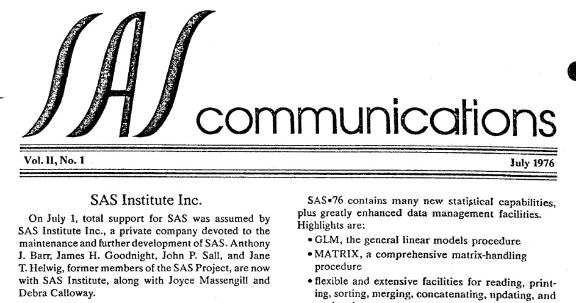
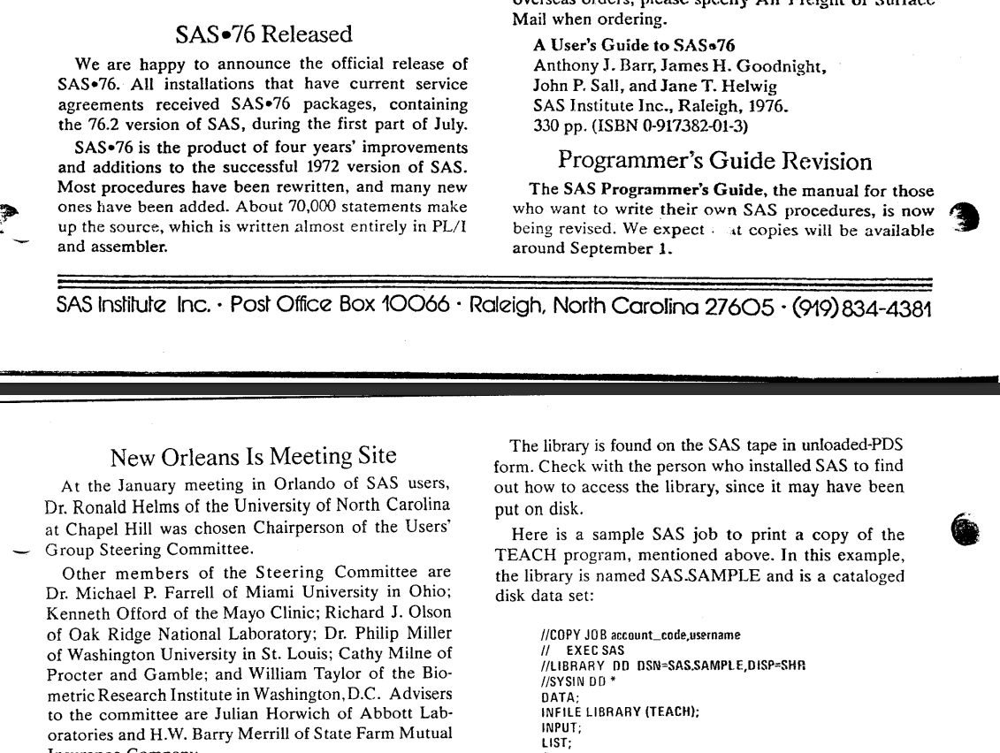
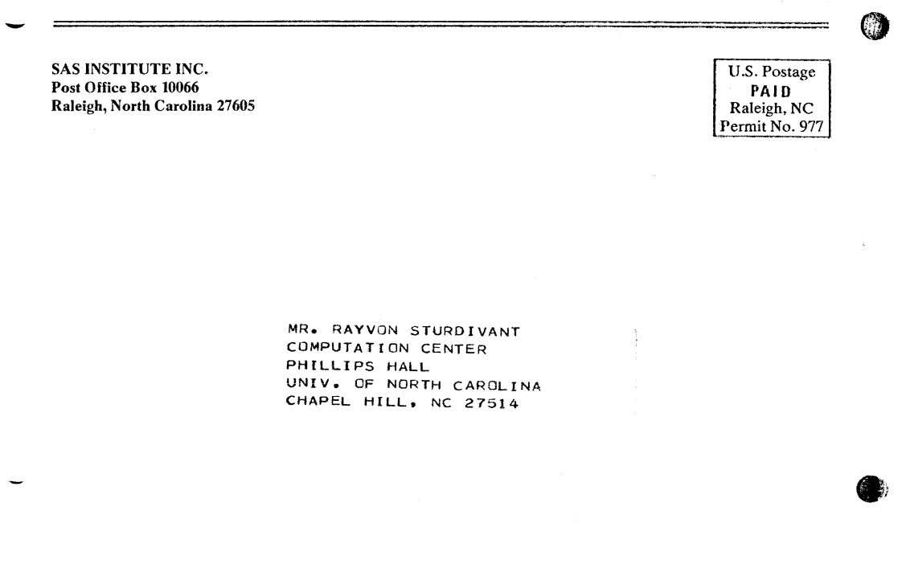

The second volume of "SAS Communications" issued in July 1976, marked the formation of SAS Institute (now a private company, no longer a university initiative). Highlights of this issue include the official release of SAS 76, release of `PROC PRINTTO` and the `_INFILE_` (automatic) variable, an update regarding the first ever SUGI event, and an enhancement to the precision of numeric informats.  The original is <a href="../resources/SAS_Communications_issue_6.pdf" target="_blank">here</a>.

<hr/>



# **SAS Communications**

**Vol. II, No. 1**  
**July 1976**

---

## **SAS Institute Inc.**

On **July 1**, total support for SAS was assumed by **SAS Institute Inc.**,  a private company devoted to the maintenance and further development of SAS.  Anthony J. Barr, James H. Goodnight, John P. Sall, and Jane T. Helwig, former members of the SAS Project, are now with SAS Institute, along with Joyce Massengill and Debra Calloway.

Through an agreement with the **Institute of Statistics** at **North Carolina State University**, SAS Institute now supports all current service agreements between the  Institute of Statistics and SAS installations.

As SAS Institute, we intend to maintain SAS at the same high level as in the past.  We will continue to do our best to make SAS as useful as possible for solving data analysis problems.

The offices of SAS Institute are at **2806 Hillsborough Street in Raleigh**, across the street from **North Carolina State University**. Both **Jim Barr** and **Jim Goodnight** have adjunct positions on the **NCSU faculty**.

Of course, our address has changed.  Please send all correspondence to

    SAS Institute Inc.  
    Post Office Box 10066  
    Raleigh, North Carolina 27605

Note that Our box has changed from **10522**, the interim number, to **10066**.

Our new telephone number is (919) 834-4381.

---

## **SAS-76 Released**

We are happy to announce the official release of SAS-76. All installations that have current service agreements received SAS-76 packages containing the **76.2 version** of SAS during the first part of July.

SAS-76 is the product of four years improvements and additions to the successful 1972 version of SAS. Most procedures have been rewritten, and many new ones have been added. About **70,000 statements** make up the source, written almost entirely in **PL/I** and assembler.

SAS-76 contains many new statistical capabilities, plus greatly enhanced data management facilities.  Highlights are:

- **GLM**: The general linear models procedure
- **MATRIX**: A comprehensive matrix-handling procedure
- Flexible and extensive facilities for reading, printing, sorting, merging, concatenating, updating, and storing data
- A new **report-writing facility**
- The ability to use SAS **interactively under TSO**

---

## **New Manual Ready**

**A User's Guide to SAS-76** is now ready.  The manual provides information needed to use SAS-76, with complete descriptions and extensive examples of data management abilities and statistical procedures.
An index is included, along with a glossary of computer and SAS terms.  Appendixes deal with such topics as converting SAS-72 jobs to SAS-76; using SAS under TSO; and the theory behind the new GLM procedure.

Copies of "A User's Guide to SAS-76" may be ordered through your local bookstore or from:

    SAS Institute Inc.  
    Post Office Box 10066  
    Raleigh, North Carolina 27605 

The cost is $6.95 each, plus shipping charges. For overseas orders, please specify Air Freight or Surface Mail when ordering.

    A User's Guide to SAS-76
    Anthony J. Barr, James H. Goodnight,
    John P. Sall, and Jane T. Helwig
    SAS Institute Inc., Raleigh, 1976.
    330 pp. (ISBN 0-917382-01-3)

---

## **Programmer’s Guide Revision**

The **SAS Programmer's Guide**, the manual for those who want to write their own SAS procedures, is now being revised.  

We expect that copies will be available around September 1.



---

## **New Orleans Is Meeting Site**

At the **January meeting** in **Orlando** of SAS users,  **Dr. Ronald Helms** of the **University of North Carolina at Chapel Hill** was chosen Chairperson of the Users’ Group Steering Committee.

Other members of the steering committee are **Dr. Michael P. Farrell** of Miami University in Ohio; **Kenneth Offord** of the Mayo Clinic; **Richard J. Olson** of Oak Ridge National Laboratory; **Dr. Philip Miller** of Washington University in St. Louis; **Cathy Milne** of Procter and Gamble; and **William Taylor** of the Biometric Research Institute in Washington, D.C.  Advisers to the Committee are **Julian Horwich** of Abbott Laboratories and **H.W. Barry Merrill** of State Farm Mutual Insurance Company.

**Dr. Helms** reports that the Steering Committee is now planning the **Second International SAS Users’ Conference**, to be held in late **January** or early **February 1977**.  The committee has selected **New Orleans** as the conference site.

---

## **Conference Proceedings Available**

The **Proceedings** of the **International SAS Users’ Conference**, held **January 26-28 in Orlando**, are now being published. Conference attendees will each receive a copy when ready.

Additional copies are available from **SAS Institute** at **$10.00 each**.

---

## **Newsletter Quarterly**

To keep in better touch with users, **SAS Institute** will publish **SAS Communications** quarterly.

Let us know if you would like to see an article on a particular topic.  If you want to share information about SAS, send it in.

---

## **Interesting Samples**

One way to learn more about **interesting SAS applications** is to explore the **sample SAS jobs** found on each **SAS installation tape**.  Besides sample jobs to test each procedure, examples like this are included:

- **ANOVA2**: Analyzing a Latin-square split plot design
- **CENSUS**: Reading hierarchical files of the U.S. Census Bureau Public Use Sample tapes
- **HARRIS**: Reading Harris Poll tapes coded in column-binary format
- **TEHLIST2**: Reading a PDS directory
- **KIVIAT**: Plotting Kiviat graphs
- **LOADMAP**: Reading and mapping a load module
- **MAPDISK**: Reading a VTOC and mapping a disk pack
- **SMFPAGE**: Analyzing SMF type 71 records  (Courtesy of J. Frank Chambers, Avco Financial Services)
- **TEACH**: Teaching your child arithmetic

The library is found on the SAS tape in **unloaded-PDS form**.  Check with the person who installed SAS to find out how to access the library, as it may have been put on disk.

Here is a sample SAS Job to Print a copy of the TEACH program, mentioned above. In this example, the library is named SAS.SAMPLE and is a catloged disk data set:

```
//COPY JOB account_code,username
// EXEC SAS
//LIBRARY DD DSN=SAS.SAMPLE,DISP=SHR
//SYSIN DD *
DATA;  
INFILE LIBRARY (TEACH);  
INPUT;  
LIST;  
/*
```

Note that this example is written for SAS-76.

---

## PROC PRINTTO

PRINTTO is a new SAS procedure that gives you control over the output of SAS procedures. Normally, this output goes to the printer. With PRINTTO, however, you can:

- Write SAS output on tape for COM (computer output to microfiche)
- Selectively suppress SAS output
- Print several copies of SAS output
- Use SAS output as input data, in the same job.

PRINTTO transfers only the output pages produced by SAS procedures. The log of SAS statements that SAS-76 prints at the beginning of each job is not affected.

1. Here is an example that puts the output of `PROC FREQ` onto tape:

```
//COM JOB acct_code,username
// EXEC SAS
//FT20F001 DD UNIT=2400,VOL=SER=TAPE05,DSN=TABLE,
// DCB=(RECFM=FB,LRECL=133,BLKSIZE=3990)
DATA;
INPUT X Y Z;
CARDS;
...
PROC PRINTTO NEW UNIT=20; * OUTPUT TO UNIT 20;
PROC FREQ; TABLES X*Y*Z;  * OUTPUT TO TAPE;
PROC PRINTTO; * BACK TO PRINTER;
PROC CORR; * WILL BE PRINTED;
```

The statement:

```sas
PROC PRINTTO NEW UNIT=nn;
```

changes the default output unit from the printer to `FTnnF001.` (In the example above, nn is 20.)

Subsequent SAS procedure output will be written on the file defined by the `FT20F001` DD statement; In this case, the file is on a tape. The NEW option initialises the file, using the DCB attributes `RECFM = VBA`, `LRECL = 137` and `BLKSIZE = 6391`.  They can be overridden by the JCL.

The statement:

```sas
PROC PRINTTO;
```

Resets the default output unit to the printer.

The statement:

```sas
PROC PRINTTO UNIT=20;
```

Does not appear in the example, but it could have been used later in the job to write more output on the file described by the FT20F001 DD statement.

2. This example prints four copies of the FREQ and MEANS output for a dataset containing student grades. The output is written to FT20F001, a temporary disk file, which is then read back in and printed four times.

```
//GRADES JOB acct_code,username
// EXEC SAS
//FT20F001 DD UNIT=3330,SPACE=(TRK,(15,5))
DATA; INPUT SSN 1-9 GRADE 11-13; CARDS;
...
PROC PRINTTO UNIT=20 NEW; * PRINT TO UNIT=20;
PROC FREQ; PROC MEANS; * PRODUCE STATISTICS;
MACRO PR
DATA _NULL_; FILE PRINT NOPRINT;
INFILE FT20F001; INPUT;
PUT _INFILE_; %
PROC PRINTTO; * SET PRINT BACK TO PRINTER;
PR PR PR PR   * EXECUTE MACRO 4 TIMES;
/*
```


3. Here is an example that puts GLM output on a temporary disk file. The output is then read back in and each line printed: this output will look the same as if the PROC PRINTTO statement had not appeared. Next, the temporary file is read again, and this time, beta values and error mean square values are read and put into a SAS data set. `PROC MEANS` is then used to find the mean of the ERRORMS values.

```sas
//GLM JOB acct_code,username
// EXEC SAS
//FT20F001 DD UNIT=3330, SPACE=(TRK (20,5))
DATA; INPUT X1-X10 Y1-Y5; CARDS;
...
PROC PRINTTO UNIT=20 NEW; * SEND OUTPUT TO 20;
PROC GLM; MODEL Y1-Y5=X1-X10; * GLM OUTPUT ON 20;
PROC PRINTTO; * PRINTER NOW DEFAULT;
DATA _NULL_; INFILE FT20F001; INPUT;
FILE PRINT NOPRINT; PUT _INFILE_;
DATA;
INFILE FT20F001;
INPUT @2 NAME $@;
IF NAME='ERROR' THEN INPUT B1 B2 ERRORMS;
IF NAME='ERROR' THEN OUTPUT;
PROC PRINT; * PRINT BETAS AND ERRORMS;
PROC MEANS; VAR ERRORMS; * GET MEAN OF ERRORMS;
```

---
## `PUT _INFILE_`

`_INFILE_`, new in SAS-76, lets you use the current data line or card in PUT statements. For example, this SAS job prints all eighty columns of each data card:

```sas
DATA;
INPUT X 10-12 Y 24-28;
PUT _INFILE_; * PRINT ENTIRE INPUT CARD;
CARDS;
.
. data cards
.
``` 

You can use `_INFILE_` in PUT statements as you would other variables. For example, in this program pairs 80-byte input records to produce a file with an LRECL of 160:

```sas
DATA;
INFILE IN;
FILE OUT LRECL=160;
INPUT; PUT _INFILE_ @;
INPUT; PUT @81 _INFILE_;
```

You can also use other variables with `_INFILE_` to rewrite parts of the input lines. For example, this SAS job duplicates a card deck, putting sequence numbers in columns 73-80:

```sas
DATA;
INPUT;
N +100;   * INCREMENT SEQUENCE NUMBER;
FILE PUNCH;
PUT _INFILE_ @73 N Z8.; 
CARDS;
.
. cards to be reproduced
.
```

Leading zeros will appear on the output cards because N values are written with the Z format. If columns 73-80 of the data cards contain any information, the sequence numbers will be "written over" it.  

The LENGTH parameter of the INFALE statement can also extend `_INFILE_` capabilities. For example, you can truncate `_INFILE_` with a program like this:
```sas
DATA;
INFILE CARDS LENGTH=L;
INPUT;
L=L-20;
PUT _INFILE_; * ONLY COLUMNS 1-50 PRINTED;
CARDS;
...
```  
Another parameter of the INFILE statement that extends the usefulness of `_INFILE_` is START ( not documented  in a **A User's Guide to SAS-76**) You can define the starting column for `_INFILE_` with a program like this:
```sas
DATA;
INFILE CARDS START=S;
INPUT;
S=20;
PUT _INFILE_; * ONLY COLUMNS 20-80 PRINTED;
```
The LENGTH and START parameters can be used together. For example, this program will output `_INFILE_` less the first 10 characters and the last 20 characters:

```sas
DATA;
INFILE TAPE START=S LENGTH=L;
INPUT;
S=11; L=L-20;
FILE TAPEOUT;   * COLUMNS 11-60 PRINTED;
PUT _INFILE_; 
```

---
## Input Formats

Rules for input formats, given on pages 15-16 of **A User's Guide to SAS-76**, have been relaxed.
One rule applies to numeric format items of the form w.d, where 
- w is the number of columns used to hold the value,  
- d is the number of places right of the decimal.

The d value, which formerly had to be less than w, now has no limits. When the d vakue is greater than w, zeros are inserted to provide the proper number of decimal places.  

For example, using
```sas
INPUT (X1-X10) (1.3);
```
to read the card
```sas
3276542201
```
produces an X1 value of .003, X2 value of .002, and so on.

The PIB., RB., IB., PD., and ZD. formats can now have decimal items with values ranging from 0 to 10.
Thus, formats like these are valid:
```sas
RB4.2  
PIB2.4  
ZD8.2
```
Note that these changes apply to *input* formats ( used in INPUT and INFORMAT statements).  For output formats (used in PUT and FORMAT statements), the number of decimal places must be smaller than the column width.

SAS Communications is published quarterly by SAS Institute Inc.


    Anthony J. Barr – Systems
    James H. Goodnight – Procedures
    John P. Sall – Procedures
    Jane T. Helwig – Communications
    Joyce P. Massengill – Administration
    Debra L. Calloway – Assistant

Address all correspondence to SAS Institute Inc. Post Office Box 10066, Raleigh, NC 27605.

