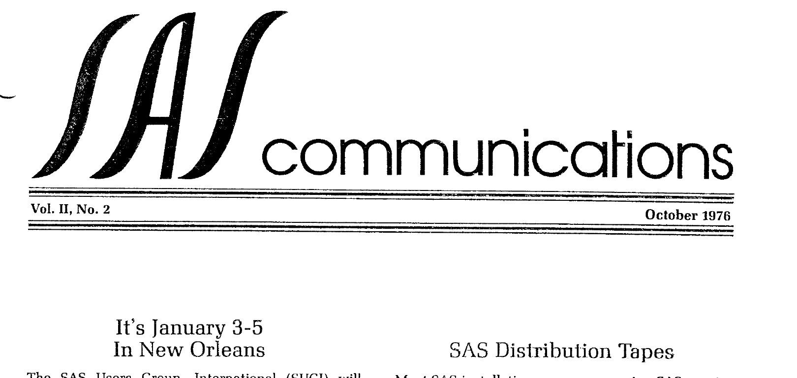
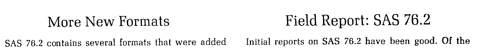
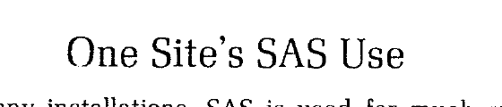

The second issue of Volume II of "SAS Communications" was published in October 1976, shortly after the formation of SAS Institute. Highlights of this issue include the announcement of the second SUGI conference (New Orleans, January 1977), the new SAS autobatch supervisor, an INQUIRE database interface, several new formats (including DOLLAR and WORDS), a field report on SAS 76.2, and a fascinating letter from Cleveland Trust describing their (non statistical) uses of SAS. The original is <a href="../resources/SAS_Communications_issue_7.pdf" target="_blank">here</a>.

# **SAS Communications**

**Vol. II, No. 2**  
**October 1976**

---

## **It's January 3-5 In New Orleans**

The SAS Users Group, International (SUGI) will hold its annual conference in New Orleans January 3-5, 1977. Those on the SAS Communications mailing list received conference and registration information a few weeks ago.

Dr. Ronald Helms, SUGI chairman, promises a conference that will be "informative, educational, useful to your work, and a great deal of fun." He encourages SAS users to submit abstracts of papers or "Darn Cute Code" to Ken Offord, Program Chairman, Mayo Clinic, Department of MEDRES, Rochester, Minnesota 55901.

For information about the conference, write or call Dr. Ronald Helms, Post Office Box 957, Chapel Hill, North Carolina 27514 (919/942-3175).

## **SAS Autobatch Is Ready**

We have completed the SAS autobatch supervisor. Under autobatch mode, many SAS jobs are run sequentially with the system overhead of only one job. Thus, costs are often cut substantially. Autobatch is particularly useful in educational environments where students run many small SAS jobs.

If you want to run SAS in autobatch mode now, let us know and we will send you the SAS 76.4 interim release. The next general distribution tape, to be sent to all installations this winter, will include the autobatch supervisor.

## **SAS Distribution Tapes**

Most SAS installations are now running SAS version 76.2. New installations are receiving SAS version 76.4, and this version is available to other installations that request it. (SAS 76.3 was a transient version that ran only locally.)

During the winter, SAS version 76.5 will be sent to all installations. Major new features included in SAS 76.5 will be facilities for storing SAS data sets on tape; the autobatch supervisor; means in GLM and ANOVA; a new plot procedure; a new histogram procedure; and date and time formats.

## **INQUIRE Interface Now Available**

A mutual development effort by ICI-United States and SAS Institute has produced a versatile interface routine that converts an INQUIRE data base to a SAS data set.

The interface is written as a SAS procedure. Users can specify selected fields for conversion, or convert all fields.

The project was spearheaded by Dr. Robert Teichman of ICI. David Haynes and John Duffy of ICI cooperated with Dr. James Goodnight of SAS Institute in the implementation of the interface.

The INQUIRE-SAS interface is now available from SAS Institute on a one-time fee basis. Let us know if you are interested in acquiring it.

---

## **More New Formats**

SAS 76.2 contains several formats that were added after the User's Guide went to press:

### dollars

When the `DOLLARw.d` output format is used for numeric variables, a dollar sign is placed in front of the number. In addition, commas mark off thousands of dollars. The d value must be either 0 or 2. In calculating the w value, which can range from 2 to 32, allow for the dollar sign and any commas that will be needed.

### words

The `WORDSw.` output format prints a numeric value in English: for example, -176 prints as "MINUS ONE HUNDRED SEVENTY-SIX." When the data contains one or two decimal places, they are used: 5.20 prints as "FIVE AND TWENTY HUNDREDTHS." Numbers greater than 99,999,999 print as "LARGE NUMBER." The w value can range from 8 to 200; the default is 10. When insufficient space is provided, the result is truncated on the right and the last character prints as "\*".

### column binary

Four new input formats provide SAS users the ability to read column binary data, also known as multipunched data. Each card column contains several pieces of information rather than one as usual. Although column binary is rare and becoming obsolete, many important data libraries are in column binary form.

The column binary documentation is too lengthy to show here; if you are interested, let us know and we will send you a copy.

### other new formats

Other new formats have been developed and will appear in the next general release:

- unsigned packed decimal
- zoned decimal in IBM 1410, 1401, and 1620 format
- Roman numerals
- fractions

Next on the format development schedule are comprehensive date and time formats.

## **Field Report: SAS 76.2**

Initial reports on SAS 76.2 have been good. Of the problems that have arisen, many have already been fixed by the zap cards that were sent to all installations. Others are being fixed for the next SAS distribution tape.

Listed below are problems that might affect the correctness of your results without warning:

- In GLM, when there is a continuous by class interaction, predicted values output to a SAS data set are in error. Printed predicted values are correct.
- In AUTOREG, the transformation of the first few observations is slightly off.
- In MATRIX, the DET function's result may have the wrong sign.

In addition, an incompatibility between SAS 76.2 and IBM 3340 and 3350 disk drives causes intermittent errors when these drives are used for SAS data sets.

These problems have been fixed for interim release SAS 76.4.

## **User's Guide Corrections**

A User's Guide to SAS-76 is now in its third printing. In the second and third printings, we fixed several errors. Most of these were obvious to the reader. Listed below are those problems that a reader would not notice:

- p. 42, column 2, 10th line from bottom: the word "not" should not appear
- p. 219, 2nd line from bottom of input example should contain the statement `MODEL Y=X1-X5 / START=3 STOP=4;`
- p. 234, midway through column 2. Paragraph should read: If the IBM 2314 storage device is used, s must be at least nxv/50000.

In addition, PROC STANDARD's description is off slightly. PROC STANDARD's default action is to create a new data set containing the standardized values rather than replacing the original values with standardized values. This change was made to protect users from inadvertently destroying their original data.

---

## **One Site's SAS Use**

At many installations, SAS is used for much more than statistical analysis. Recently, we received a letter from Walter J. Guthrie, Group Leader in the Systems Support Department of Cleveland Trust, giving some of the ways SAS is used in his department. Excerpts from Jim's letter are printed below.

> ...I have been using PROC CORR as an application program debugging tool. I read from SMF files the step CPU, the step elapsed time, and EXCP's by DSNAME. I then correlate CPU time and elapsed time against each file's EXCP's. I have seen correlations as high as 95%, which means that if the user can reduce the size of that file, or if the programmer can optimize that data set, program run time or CPU time can be cut significantly.
>
> ...we used SAS to combine information out of our SLACMON software monitor. The spooled printouts of SLACMON (run for one hour each) are read by SAS and SAS summarizes module usage.
>
> ...the programmer who maintains OS/MVT uses SAS to build cross-references from SMP data. SMP provides a list of PTF's, prerequisites, and successors, as well as affected module names. The data is sorted in different orders. We can go by module name and find all PTF's against that module.
>
> ...after SAS76 was installed, a programmer used it to do frequency distributions on the BankAmericard logtape. He printed activity by transaction type and by hour. He also did a distribution on dollar volume by hour.
>
> ...another programmer is installing UCC's Tape Management System (TMS) Version 4.2. A SAS program was written to read the Version 4.2 log and create transactions for the Version 3.1 update, in case we had to revert to the old version.
>
> ...all our files are on a SAS card system. Each piece of correspondence in our master file has a card with TO-FROM-SUBJECT-DATE-RETENTION. These cards are sorted and listed by each variable.
>
> ...our IBM manuals each have a card. They are sorted and printed in number and subject sequence.

From Cleveland Trust's report and from others like it we have received, it seems clear that SAS applications are limitless. We'd be interested in hearing from others on the uses that they have found for SAS.

## **Programmer's Guide Delayed**

Revision of the SAS Programmer's Guide, the manual for those who want to write their own SAS procedures, was delayed until recently. We are now rewriting much of the Programmer's Guide and expect that it will be a more usable manual.

Publication date for the Programmer's Guide is now December 1.

## **SAS Training Courses**

Several two-day SAS training courses have been given, and more are planned. Courses so far have been oriented to new SAS users. However, since we tailor each training course for the prospective audience, more advanced subjects (e.g., writing SAS procedures) could be covered.

If your organization is interested in learning more about these SAS training courses, which are normally given at the customer's site, please let us know.

In addition to these courses, we plan to offer SAS short courses in central locations so that individual users can attend. Notice of these courses will be sent to all **SAS Communications** recipients.

## **Staff Additions**

Users who call SAS Institute may hear a new voice answering the telephone: Kathy Fulp has joined us as secretary.

Also joining us is Ann Baggett, who is handling publication orders.

---

SAS Institute Inc. - Post Office Box 10066 - Raleigh, North Carolina 27605 - (919) 834-4384
