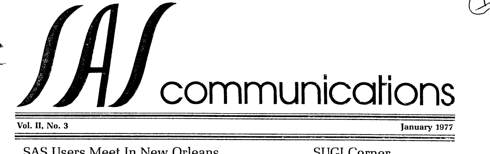
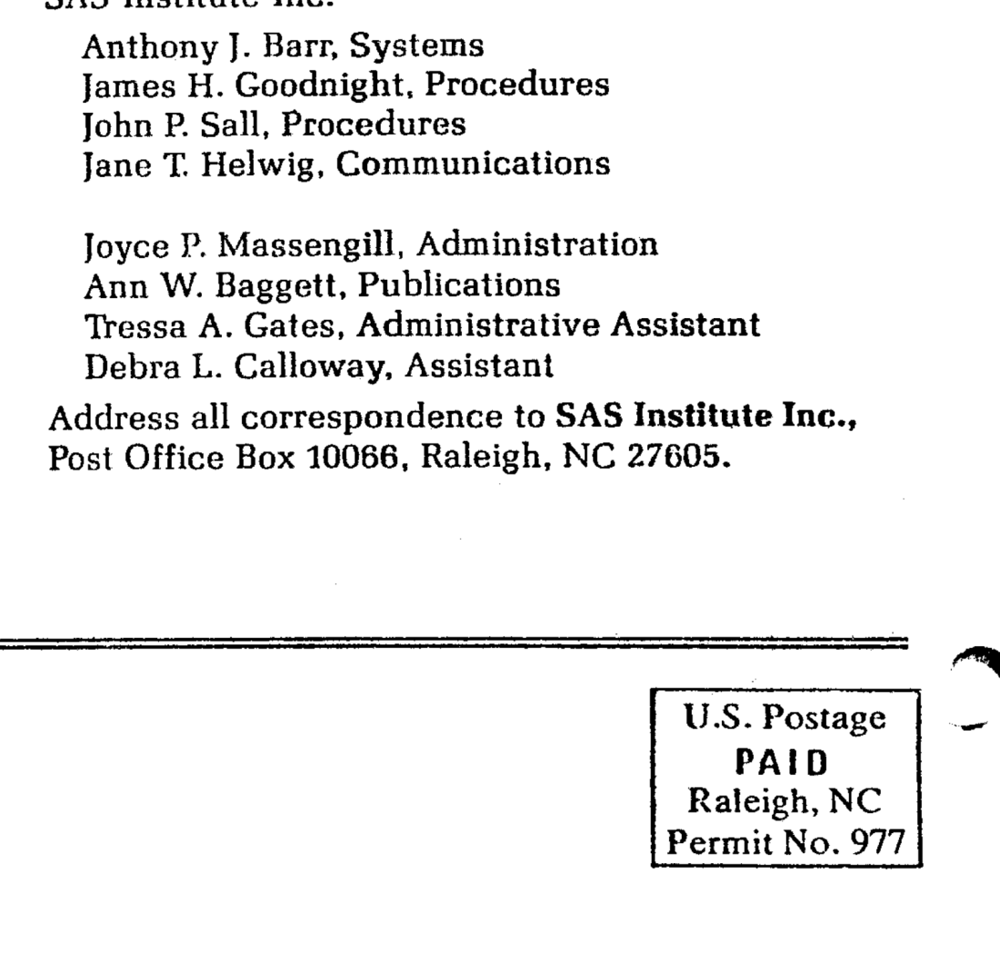

The third issue of Volume II of "SAS Communications" was published in January 1977, fresh from the second annual SUGI conference in New Orleans. Highlights include the SUGI software ballot results (DO loops! IF-THEN/ELSE! SAS data sets on tape!), the SAS 76.5 feature list (including PROC PLOT and PROC NPAR1WAY), a system note on the dangers of "update in place" under `OBS=0`, a neat recoding trick using logical expressions, bit testing, hexadecimal formats, Kruskal-Wallis and Friedman tests via PROC RANK, and the news that SAS Institute had taken over distribution of Barry Merrill's SMF tape. The original is <a href="../resources/SAS_Communications_issue_8.pdf" target="_blank">here</a>.

<hr/>



# **SAS Communications**

**Vol. II, No. 3**  
**January 1977**

---

## **SAS Users Meet In New Orleans**

Warm, sunny New Orleans was host to more than 200 SAS users in January for the second annual meeting of the SAS Users Group, International (SUGI). Meeting participants learned new uses of SAS, shared knowledge of the system, and heard news about the future of SAS. In addition, users voted on SAS enhancement priorities and gave many suggestions to the SAS staff.

Conference proceedings are being readied by Ken Offord of the Mayo Clinic, Program Chairman. They will be published by SAS Institute and a copy sent to each attendee. Additional copies will be available for $10.00 each.

New SUGI officers were chosen in New Orleans: co-chairmen for the coming year are Dr. Michael Farrell of Miami University in Ohio and Dr. Rodney Strand of Oak Ridge National Laboratory in Tennessee.

A complete report of the software ballot results will appear in the conference proceedings. To summarize these results, the top items are listed below:

- SAS data sets on tape
- DO loops; DO groups
- a histogram procedure
- assignment statements of the form `X1-X9=LOG(Y1-Y9);`
- more output data sets from procedures
- procedures for non-parametric statistics
- subscripted variables
- character-numeric conversions
- organization of supplementary procedures and distribution of documentation
- IF-THEN/ELSE statements
- contrasts and means in GLM.

Plans for next year's SUGI conference, which will include tutorials on using SAS, are underway, and Las Vegas is the tentative site. The April issue of SAS Communications will contain more information, as well as the call for papers.

## **SUGI Corner**

SUGI Co-chairman Rod Strand reports that a new column, SUGI Corner, will begin in the April issue of SAS Communications. Editor of the SUGI Corner will be Helene Cavior of the Federal Bureau of Prisons in Pleasanton, California.

Contributions of SAS users to the SUGI Corner are welcomed. Dr. Strand suggests the following as examples of contributions:

- short notes on SAS
- "darn cute code"
- correspondence of interest to SUGI members
- reports on projects in which SAS was particularly useful
- ways in which SAS is used for various applications.

Please send your SUGI Corner contributions to:

    SUGI Corner
    c/o SAS Institute Inc.
    Post Office Box 10066
    Raleigh, North Carolina 27605

They will be forwarded to the SUGI Corner editor.

## **SAS Plans For The Future**

At the SUGI meeting in New Orleans, the SAS staff presented timetables showing anticipated SAS developments during the next six months. Our next major goal is the release of SAS 76.5 in early spring. New features for SAS 76.5 include:

- **PROC PLOT**, a comprehensive plotting procedure that replaces SCATTER
- MEANS and WEIGHT statements in **PROC GLM**
- a facility for storing SAS data sets on tape
- enhancements to **PROC MATRIX**
- new formats and functions for time and date
- **PROC NPAR1WAY**, a new procedure for one-way rank tests
- **SAS Supplementary Library**, a short manual containing interim documentation of the above features and descriptions of supplementary procedures.

Work scheduled at SAS Institute for the spring and summer includes:

- a new histogram procedure
- adjusted means, contrasts, and expected mean squares in GLM
- enhancements to MACRO capabilities
- an internal editor for SAS under TSO
- a categorical linear models procedure
- improvements to the FREQ procedure
- a SAS Primer to help new users learn SAS.

---

## **System Notes**

### Syntax Checking with OBS=0

What happens when you specify

```
OPTIONS OBS=0;
```

for syntax checking, or when an error occurs and SAS sets OBS to zero?

SAS continues through the SAS statements in the job, actually executing each DATA and PROC statement. Since the number of observations to be processed is zero, procedures produce a message noting that the input data set contains zero observations. Procedures and DATA statements create any requested SAS data sets, although these data sets will contain zero observations. Since data sets are created as requested in PROC and DATA statements, SAS continues through the job, not stopping because a specified data set does not exist.

Thus, although no observations are actually processed, the syntax of the SAS statements is checked and any syntax errors are caught.

Because SAS does create data sets as requested in the job, using statements of the form

```
DATA OLD.X;
SET OLD.X;
```

to "update in place" is dangerous. If OBS=0 were in effect when these statements were executed, the data set OLD.X would be recreated with zero observations. The original contents of OLD.X would be lost. Using statements of this form is therefore not recommended when the original data cannot be easily regenerated.

### The LENGTH Statement

Although not explicitly stated in the User's Guide, the LENGTH statement is only effective when it appears before the first definition of a variable. Thus, it should appear before an INPUT statement referencing variables listed in the LENGTH statement. For data sets created with SET, MERGE, or UPDATE, the LENGTH statement should appear before the SET, MERGE, or UPDATE statement.

## **Recoding**

Lawrence Muhlbaier of Duke University has suggested a useful mechanism for recoding SAS variables. This method relies on the fact that logical expressions are evaluated as either 1 (true) or 0 (false). For example, the logical expression

```
A<B
```

has a value of 1 if A is less than B; 0 otherwise.

Consider the following situation. A data set contains a variable called AGE, whose values range from 0 up. We want to create a new variable, AGEGROUP, whose value will be 1 if the subject's age is under 25; 2 if the age is between 26 and 75; and 3 if the age is over 75.

This statement accomplishes the recode:


```
AGEGROUP = 1*(AGE<=25) + 2*(26<=AGE<=75) + 3*(AGE>75) + AGE*(AGE=.);
```

Note that the first three logical expressions define the three groups. When an AGE value falls into, say, the third group, the logical expression AGE>75 will be true and will have a value of 1. This value is then multiplied by 3. Since the other logical expressions all have a value of 0 when AGE is greater than 75, the AGEGROUP value will be 3.

The last expression `AGE*(AGE=.)` assures that a missing AGE value results in a missing AGEGROUP value. When the logical expression is true, multiplying it by AGE (a missing value in this case) produces another missing value.

An alternate method: the four statements below could also be used to produce the same result:

```
IF AGE<=25 THEN AGEGROUP=1;
IF 26<=AGE<=75 THEN AGEGROUP=2;
IF AGE>75 THEN AGEGROUP=3;
IF AGE=. THEN AGEGROUP=.;
```

## **Testing Bits**

Testing bit values in SAS can be accomplished with two extra steps. The first step shifts the bit in question to the rightmost position, and the second isolates it for testing.

For example, to test bit 5 (where bits are numbered 0 to 7) of a one-byte numeric variable I, use these SAS statements:

```
INPUT I PIB1.;
J=INT(I/4);      * SHIFT BIT 2 POSITIONS RIGHT;
BIT=MOD(J,2);    * ISOLATE BIT;
IF BIT THEN...;  * TEST BIT;
```

Note that the value of the constant in the second statement above depends on the bit to be tested. Use the value 2^n, where n is the number of positions to shift the bit. Above, the constant is 4 since the bit is being shifted 2 positions. If we were testing bit 4, we would use the constant 2^3=8 in the second statement.

## **Staff Changes**

Kathy Fulp has moved with her husband to Wichita, Kansas. Our new administrative assistant is Tressa Gates.

---

## **More About Hexadecimal Formats**

The numeric format item HEX is useful for converting decimal numbers to hexadecimal numbers, and vice versa. For example, the SAS statements

```
DATA;
INPUT D 2. X HEX2.;
PUT D= 2. 'IN DECIMAL' @20 D= HEX2. 'IN HEX' /
    X= HEX2. 'IN HEX' @20 X= 3. 'IN DECIMAL' //;
CARDS;
11 A1
16 16
```

produce this output:

```
D=11 IN DECIMAL    D=0B IN HEX
X=A1 IN HEX        X=161 IN DECIMAL

D=16 IN DECIMAL    D=10 IN HEX
X=16 IN HEX        X=22 IN DECIMAL
```

Similarly, the character format item $HEX converts character values to their hexadecimal representations. When you use $HEX, remember that the hexadecimal representation of a single character takes two columns to display. Thus, for output, the width specified should be twice the number of characters in the variable. For example, the SAS statements

```
DATA;
INPUT A $1. B $2.;
PUT A=$1. @15 A= $HEX2. 'IN HEX' /
    B=$2. @15 B= $HEX4. 'IN HEX' //;
CARDS;
P TO
9 22
```

produce this output:

```
A=P            A=D7 IN HEX
B=TO           B=E3D6 IN HEX

A=9            A=F9 IN HEX
B=22           B=F2F2 IN HEX
```

The HEX format is often useful for handling systems data. For example, the system completion code (SCC) is stored in SMF records as a two-byte binary field, although it is usually printed in its hex representation. The SAS statements

```
INPUT SCC PIB2.;
FORMAT SCC HEX3.;
```

read the SCC and assign it a hex format, so that any subsequent printing of the SCC will use the hex representation.

## **Kruskal-Wallis and Friedman Tests in SAS**

You may not be aware that many non-parametric tests can be performed using PROC RANK with PROC ANOVA or PROC GLM. Frank Harrell and Bill Gjertsen of the Lipids Program at UNC-Chapel Hill have pointed out several such uses.

The Kruskal-Wallis test is a one-way analysis of variance on ranks. If you have a balanced one-way layout, with Y as the response variable and TMT as the classification variable, run these SAS statements:

```
PROC RANK; VARIABLES Y; RANKS YR;
PROC ANOVA; CLASSES TMT; MODEL YR=TMT;
```

Then compute

```
H=SST*12/(N*(N+1))
```

where SST is the sum of squares for TMT in ANOVA and N is the number of observations. Critical values or significance probabilities for H, the Kruskal-Wallis statistic, can be found in tables, or a chi-square approximate value can be used.

The Friedman test is a two-way analysis of variance on ranks. If you have a two-way layout of blocks (BLOCK) and treatments (TMT) with one observation per cell and Y the response variable, run these SAS statements:

```
PROC SORT; BY BLOCK;
PROC RANK; BY BLOCK; VAR Y; RANKS YR;
PROC ANOVA; CLASSES BLOCK TMT;
MODEL YR=BLOCK TMT;
```

Then compute

```
F=SST*12/(T*(T+1))
```

where SST is the sum of squares in ANOVA for TMT, and T is the number of treatments. Friedman's statistic F is tabled; it is approximately chi-square with T-1 degrees of freedom.

Converting to a chi-square test above is not absolutely necessary: the F tests that PROC ANOVA produces are asymptotically valid, and may be reasonable even in fairly small samples.

## **SAS Publication News**

The SAS Programmer's Guide, containing much new material and a new organization, is now available from SAS Institute. Single copies are $6.95 plus $.25 postage.

The Programmer's Guide gives directions for writing SAS procedures using FORTRAN or PL/I, as well as brief descriptions of the macros and subroutines used in SAS. Note that adding new SAS procedures does not mean maintaining a separate version of SAS on disk; you need only concatenate your load library to the main SAS library.

Also available is a brochure on SAS called "SAS: A New Concept in Statistical Software". Universities and service bureaus have found this booklet useful for describing SAS to prospective users. We are happy to send out single copies on request. In quantity, we make the brochure available at our cost of $.35 per copy.

We are beginning work on the SAS Primer, a new publication that will introduce new users to SAS and get them started. We expect to have a draft available for review in early May, with publication scheduled for summer. Please send us any handouts you have used to introduce SAS to new users if you think these handouts would be helpful to us in writing the Primer.

SAS Supplementary Library should be available in April. This guide will include descriptions of the supplementary procedures we now have, as well as documentation of the new SAS 76.5 features. If you have any locally written SAS procedures that you would like to include in the SAS Supplementary Library, we encourage you to submit them to us, along with complete documentation and sample output.

---

## **SMF Samples Available**

For some time Barry Merrill, formerly with State Farm and now with Suntech, has been making available to other SAS users a tape containing his SAS programs to process SMF (System Management Facilities) data.

SAS Institute has taken over distribution of this SMF tape, and copies are available at a charge of $25.00 to cover tape and copying costs. Let us know if you would like a copy of the tape.

Note that neither Barry Merrill nor SAS Institute assumes any responsibility for the programs on the tape: they are presented as examples that will probably be helpful to people doing SMF analysis.

## **SAS Makes Honor Roll**

DATAPRO's annual survey of software users showed that SAS was among the top 38 software products, placing on the DATAPRO Honor Roll. This was our first mention among the DATAPRO results, and we are gratified that SAS entered the competition at a high level.



---

SAS Institute Inc. - Post Office Box 10066 - Raleigh, North Carolina 27605 - (919) 834-4381
