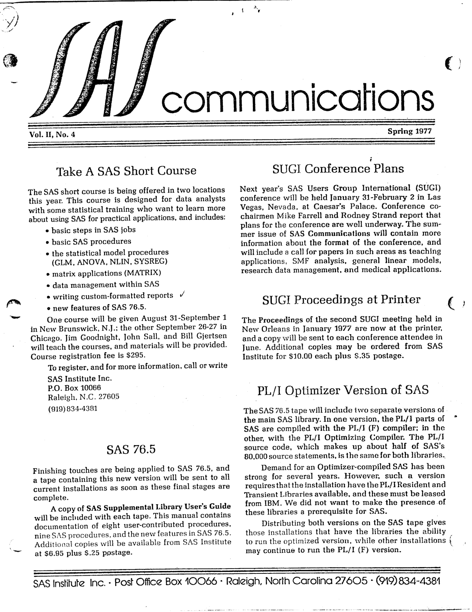
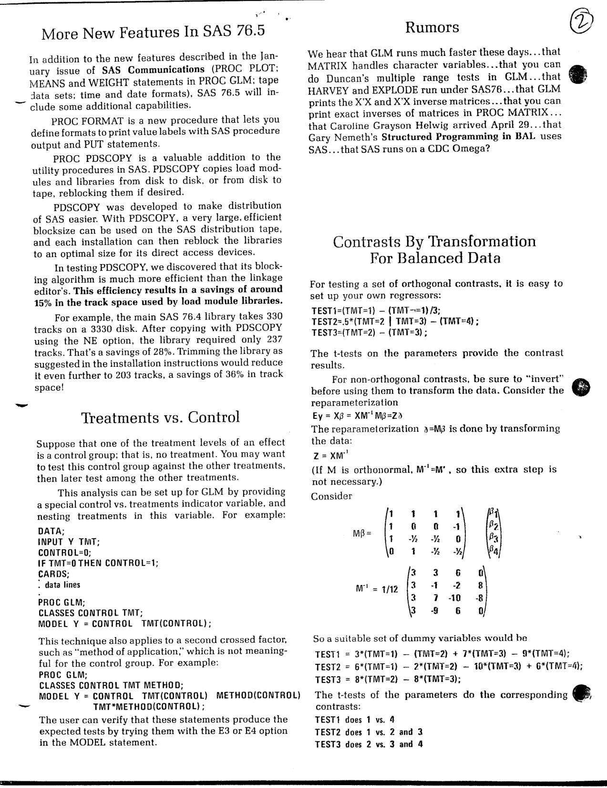
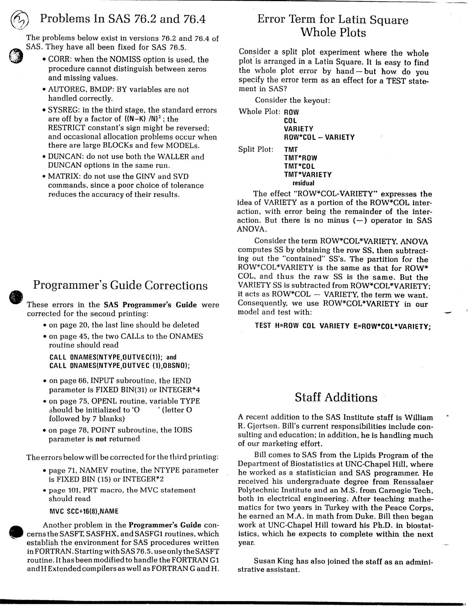

The fourth and final issue of Volume II of "SAS Communications" was published in Spring 1977, as SAS Institute prepared to ship SAS 76.5. Highlights include the announcement of SAS short courses in New Brunswick and Chicago, the PL/I Optimizer version of SAS, new features in SAS 76.5 (PROC FORMAT, PROC PDSCOPY, character-handling routines), a technique for testing treatments against a control in GLM using nested effects, a matrix transformation approach to orthogonal contrasts, a round-up of bugs fixed in 76.2 and 76.4, the correct error term for Latin Square whole plots, and the addition of Bill Gjertsen to the SAS Institute staff. The original is <a href="../resources/SAS_Communications_issue_9.pdf" target="_blank">here</a>.

<hr/>



# **SAS Communications**

**Vol. II, No. 4**
**Spring 1977**

---

## **Take A SAS Short Course**

The SAS short course is being offered in two locations this year. This course is designed for data analysts with some statistical training who want to learn more about using SAS for practical applications, and includes:

- basic steps in SAS jobs
- basic SAS procedures
- the statistical model procedures (GLM, ANOVA, NLIN, SYSREG)
- matrix applications (MATRIX)
- data management within SAS
- writing custom-formatted reports
- new features of SAS 76.5.

One course will be given August 31-September 1 in New Brunswick, N.J.; the other September 26-27 in Chicago. Jim Goodnight, John Sall, and Bill Gjertsen will teach the courses, and materials will be provided. Course registration fee is $295.

To register, and for more information, call or write

    SAS Institute Inc.
    P.O. Box 10066
    Raleigh, N.C. 27605
    (919) 834-4381

## **SAS 76.5**

Finishing touches are being applied to SAS 76.5, and a tape containing this new version will be sent to all current installations as soon as these final stages are complete.

A copy of SAS Supplemental Library User's Guide will be included with each tape. This manual contains documentation of eight user-contributed procedures, nine SAS procedures, and the new features in SAS 76.5. Additional copies will be available from SAS Institute at $6.95 plus $.25 postage.

## **SUGI Conference Plans**

Next year's SAS Users Group International (SUGI) conference will be held January 31-February 2 in Las Vegas, Nevada, at Caesar's Palace. Conference co-chairmen Mike Farrell and Rodney Strand report that plans for the conference are well underway. The summer issue of SAS Communications will contain more information about the format of the conference, and will include a call for papers in such areas as teaching applications, SMF analysis, general linear models, research data management, and medical applications.

## **SUGI Proceedings at Printer**

The Proceedings of the second SUGI meeting held in New Orleans in January 1977 are now at the printer, and a copy will be sent to each conference attendee in June. Additional copies may be ordered from SAS Institute for $10.00 each plus $.35 postage.

## **PL/I Optimizer Version of SAS**

The SAS 76.5 tape will include two separate versions of the main SAS library. In one version, the PL/I parts of SAS are compiled with the PL/I (F) compiler; in the other, with the PL/I Optimizing Compiler. The PL/I source code, which makes up about half of SAS's 80,000 source statements, is the same for both libraries.

Demand for an Optimizer-compiled SAS has been strong for several years. However, such a version requires that the installation have the PL/I Resident and Transient Libraries available, and these must be leased from IBM. We did not want to make the presence of these libraries a prerequisite for SAS.

Distributing both versions on the SAS tape gives those installations that have the libraries the ability to run the optimized version, while other installations may continue to run the PL/I (F) version.

---



## **More New Features In SAS 76.5**

In addition to the new features described in the January issue of SAS Communications (PROC PLOT; MEANS and WEIGHT statements in PROC GLM; tape data sets; time and date formats), SAS 76.5 will include some additional capabilities.

PROC FORMAT is a new procedure that lets you define formats to print value labels with SAS procedure output and PUT statements.

PROC PDSCOPY is a valuable addition to the utility procedures in SAS. PDSCOPY copies load modules and libraries from disk to disk, or from disk to tape, reblocking them if desired.

PDSCOPY was developed to make distribution of SAS easier. With PDSCOPY, a very large, efficient blocksize can be used on the SAS distribution tape, and each installation can then reblock the libraries to an optimal size for its direct access devices.

In testing PDSCOPY, we discovered that its blocking algorithm is much more efficient than the linkage editor's. This efficiency results in a savings of around 15% in the track space used by load module libraries.

For example, the main SAS 76.4 library takes 330 tracks on a 3330 disk. After copying with PDSCOPY using the NE option, the library required only 237 tracks. That's a savings of 28%. Trimming the library as suggested in the installation instructions would reduce it even further to 203 tracks, a savings of 36% in track space!

## **Treatments vs. Control**

Suppose that one of the treatment levels of an effect is a control group; that is, no treatment. You may want to test this control group against the other treatments, then later test among the other treatments.

This analysis can be set up for GLM by providing a special control vs. treatments indicator variable, and nesting treatments in this variable. For example:

```
DATA;
INPUT Y TMT;
CONTROL=0;
IF TMT=0 THEN CONTROL=1;
CARDS;
. data lines
.
PROC GLM;
CLASSES CONTROL TMT;
MODEL Y = CONTROL TMT(CONTROL);
```

This technique also applies to a second crossed factor, such as "method of application," which is not meaningful for the control group. For example:

```
PROC GLM;
CLASSES CONTROL TMT METHOD;
MODEL Y = CONTROL TMT(CONTROL) METHOD(CONTROL)
          TMT*METHOD(CONTROL);
```

The user can verify that these statements produce the expected tests by trying them with the E3 or E4 option in the MODEL statement.

## **Rumors**

We hear that GLM runs much faster these days...that MATRIX handles character variables...that you can do Duncan's multiple range tests in GLM...that HARVEY and EXPLODE run under SAS76...that GLM prints the X'X and X'X inverse matrices...that you can print exact inverses of matrices in PROC MATRIX...that Caroline Grayson Helwig arrived April 29...that Gary Nemeth's Structured Programming in BAL uses SAS...that SAS runs on a CDC Omega?

## **Contrasts By Transformation For Balanced Data**

For testing a set of orthogonal contrasts, it is easy to set up your own regressors:

```
TEST1=(TMT=1) - (TMT¬=1)/3;
TEST2=.5*(TMT=2 | TMT=3) - (TMT=4) ;
TEST3=(TMT=2) - (TMT=3) ;
```

The t-tests on the parameters provide the contrast results.

For non-orthogonal contrasts, be sure to "invert" before using them to transform the data. Consider the reparameterization

```
EY = Xβ = XM⁻¹Mβ = Zδ
```

The reparameterization δ=Mβ is done by transforming the data:

```
Z = XM⁻¹
```

(If M is orthonormal, M⁻¹=M', so this extra step is not necessary.)

Consider

```
        /1   1    1    1\   /β1\
        |1   0    0   -1|   |β2|
Mβ =    |1  -½   -½    0|   |β3|
        \0   1   -½   -½/   \β4/

             /3   3    6    0\
M⁻¹ = 1/12   |3  -1   -2    8|
             |3   7  -10   -8|
             \3  -9    6    0/
```

So a suitable set of dummy variables would be

```
TEST1 = 3*(TMT=1) - (TMT=2) + 7*(TMT=3) - 9*(TMT=4);
TEST2 = 6*(TMT=1) - 2*(TMT=2) - 10*(TMT=3) + 6*(TMT=4);
TEST3 = 8*(TMT=2) - 8*(TMT=3);
```

The t-tests of the parameters do the corresponding contrasts:

- TEST1 does 1 vs. 4
- TEST2 does 1 vs. 2 and 3
- TEST3 does 2 vs. 3 and 4

---



## **Problems In SAS 76.2 and 76.4**

The problems below exist in versions 76.2 and 76.4 of SAS. They have all been fixed for SAS 76.5.

- CORR: when the NOMISS option is used, the procedure cannot distinguish between zeros and missing values.
- AUTOREG, BMDP: BY variables are not handled correctly.
- SYSREG: in the third stage, the standard errors are off by a factor of ((N–K) /N)² ; the RESTRICT constant's sign might be reversed; and occasional allocation problems occur when there are large BLOCKs and few MODELs.
- DUNCAN: do not use both the WALLER and DUNCAN options in the same run.
- MATRIX: do not use the GINV and SVD commands, since a poor choice of tolerance reduces the accuracy of their results.

## **Programmer's Guide Corrections**

These errors in the SAS Programmer's Guide were corrected for the second printing:

- on page 20, the last line should be deleted
- on page 45, the two CALLs to the ONAMES routine should read

```
CALL ONAMES(NTYPE,OUTVEC(1)); and
CALL ONAMES(NTYPE,OUTVEC(1),OBSNO);
```

- on page 66, INPUT subroutine, the IEND parameter is FIXED BIN(31) or INTEGER*4
- on page 75, OPENL routine, variable TYPE should be initialized to 'O       ' (letter O followed by 7 blanks)
- on page 78, POINT subroutine, the IOBS parameter is not returned

The errors below will be corrected for the third printing:

- page 71, NAMEV routine, the NTYPE parameter is FIXED BIN (15) or INTEGER*2
- page 101, PRT macro, the MVC statement should read

```
MVC SCC+16(8),NAME
```

Another problem in the Programmer's Guide concerns the SASFT, SASFHX, and SASFG1 routines, which establish the environment for SAS procedures written in FORTRAN. Starting with SAS 76.5, use only the SASFT routine. It has been modified to handle the FORTRAN G1 and H Extended compilers as well as FORTRAN G and H.

## **Error Term for Latin Square Whole Plots**

Consider a split plot experiment where the whole plot is arranged in a Latin Square. It is easy to find the whole plot error by hand — but how do you specify the error term as an effect for a TEST statement in SAS?

Consider the keyout:

```
Whole Plot: ROW
COL
VARIETY
ROW*COL – VARIETY

Split Plot: TMT
TMT*ROW
TMT*COL
TMT*VARIETY
residual
```

The effect "ROW\*COL-VARIETY" expresses the idea of VARIETY as a portion of the ROW\*COL interaction, with error being the remainder of the interaction. But there is no minus (—) operator in SAS ANOVA.

Consider the term ROW\*COL\*VARIETY. ANOVA computes SS by obtaining the row SS, then subtracting out the "contained" SS's. The partition for the ROW\*COL\*VARIETY is the same as that for ROW\*COL, and thus the raw SS is the same. But the VARIETY SS is subtracted from ROW\*COL\*VARIETY; it acts as ROW\*COL — VARIETY, the term we want. Consequently, we use ROW\*COL\*VARIETY in our model and test with:

```
TEST H=ROW COL VARIETY E=ROW*COL*VARIETY;
```

## **Staff Additions**

A recent addition to the SAS Institute staff is William R. Gjertsen. Bill's current responsibilities include consulting and education; in addition, he is handling much of our marketing effort.

Bill comes to SAS from the Lipids Program of the Department of Biostatistics at UNC-Chapel Hill, where he worked as a statistician and SAS programmer. He received his undergraduate degree from Renssalaer Polytechnic Institute and an M.S. from Carnegie Tech, both in electrical engineering. After teaching mathematics for two years in Turkey with the Peace Corps, he earned an M.A. in math from Duke. Bill then began work at UNC-Chapel Hill toward his Ph.D. in biostatistics, which he expects to complete within the next year.

Susan King has also joined the staff as an administrative assistant.

---

SAS Institute Inc. - Post Office Box 10066 - Raleigh, North Carolina 27605 - (919) 834-4381
