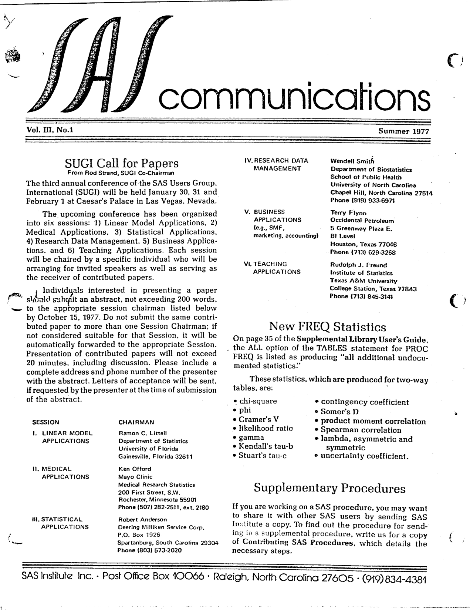
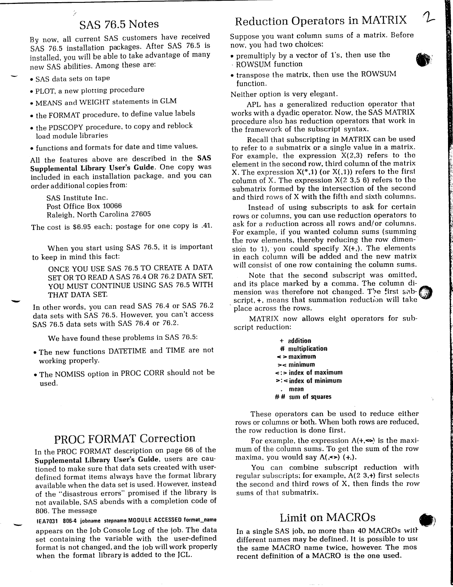
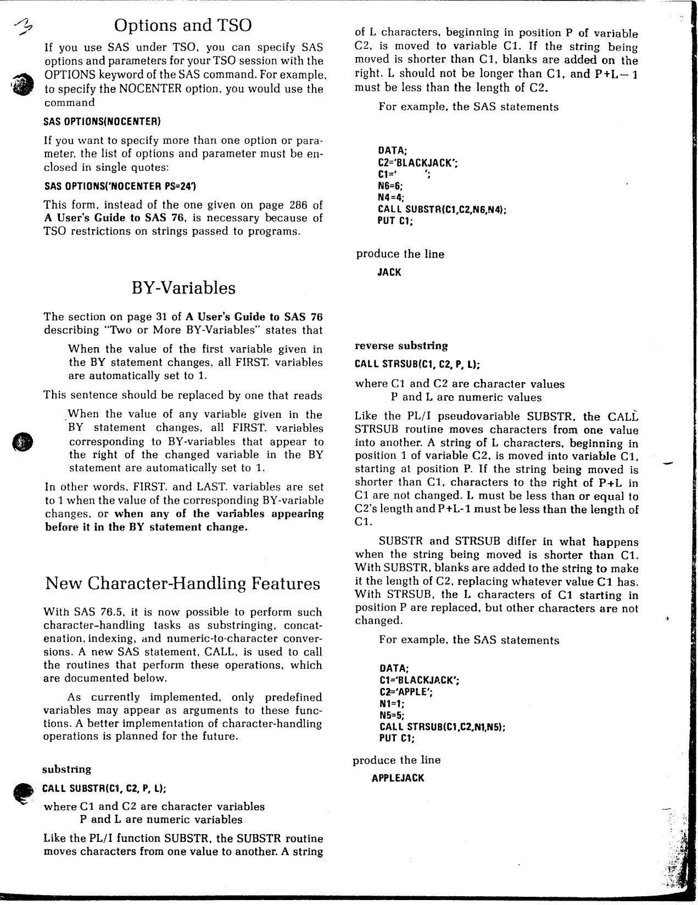
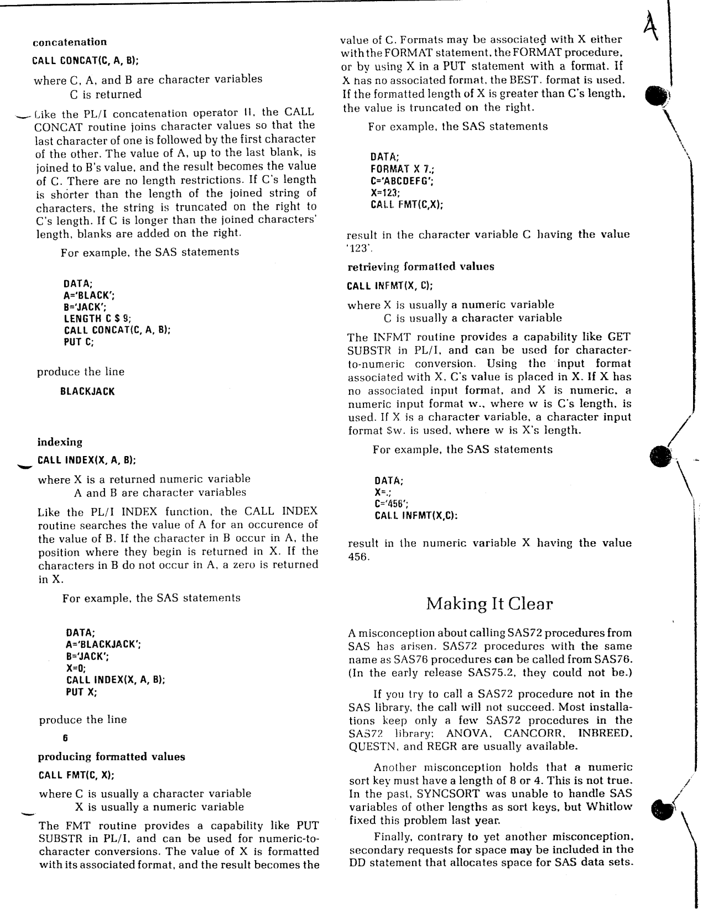
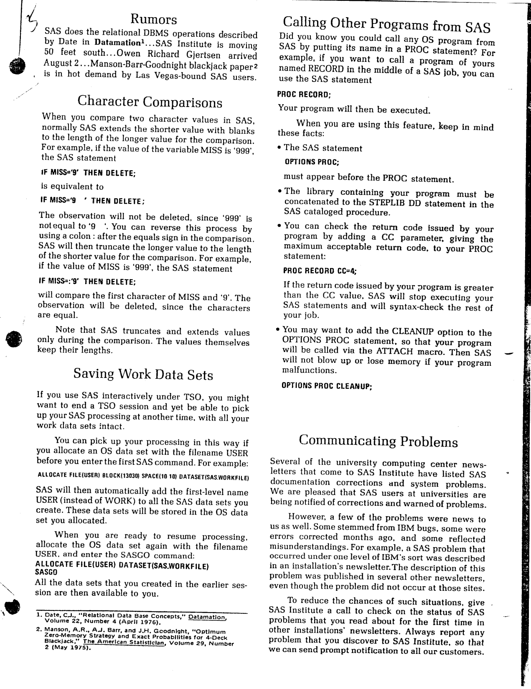
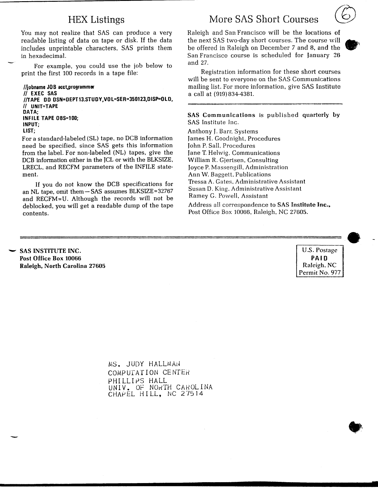

The first issue of Volume III of "SAS Communications" was published in Summer 1977, with SAS 76.5 now in the hands of every customer. Highlights include the call for papers for the third SUGI conference at Caesar's Palace in Las Vegas (with the full list of session chairmen), the undocumented statistics behind PROC FREQ's ALL option, the one-way data set compatibility rule for SAS 76.5 (and two bugs found after release), the first appearance of the CALL statement for character handling (SUBSTR, STRSUB, CONCAT, INDEX, FMT, INFMT), reduction operators in PROC MATRIX, a correction to the FIRST./LAST. BY-variable rule, the colon comparison operator for truncating character comparisons, how to save TSO work data sets between sessions, and how to call any OS program from SAS via PROC. The original is <a href="../resources/SAS_Communications_issue_10.pdf" target="_blank">here</a>.

<hr/>



# **SAS Communications**

**Vol. III, No. 1**  
**Summer 1977**

---

## **SUGI Call for Papers**

From Rod Strand, SUGI Co-Chairman

The third annual conference of the SAS Users Group, International (SUGI) will be held January 30, 31 and February 1 at Caesar's Palace in Las Vegas, Nevada.

The upcoming conference has been organized into six sessions: 1) Linear Model Applications, 2) Medical Applications, 3) Statistical Applications, 4) Research Data Management, 5) Business Applications, and 6) Teaching Applications. Each session will be chaired by a specific individual who will be arranging for invited speakers as well as serving as the receiver of contributed papers.

Individuals interested in presenting a paper should submit an abstract, not exceeding 200 words, to the appropriate session chairman listed below by October 15, 1977. Do not submit the same contributed paper to more than one Session Chairman; if not considered suitable for that Session, it will be automatically forwarded to the appropriate Session. Presentation of contributed papers will not exceed 20 minutes, including discussion. Please include a complete address and phone number of the presenter with the abstract. Letters of acceptance will be sent, if requested by the presenter at the time of submission of the abstract.

**SESSION** | **CHAIRMAN**

I. LINEAR MODEL APPLICATIONS | Ramon C. Littell, Department of Statistics, University of Florida, Gainesville, Florida 32611

II. MEDICAL APPLICATIONS | Ken Offord, Mayo Clinic, Medical Research Statistics, 200 First Street, S.W., Rochester, Minnesota 55901, Phone (507) 282-2511, ext. 2180

III. STATISTICAL APPLICATIONS | Robert Anderson, Deering Milliken Service Corp., P.O. Box 1926, Spartanburg, South Carolina 29304, Phone (803) 573-2020

IV. RESEARCH DATA MANAGEMENT | Wendell Smith, Department of Biostatistics, School of Public Health, University of North Carolina, Chapel Hill, North Carolina 27514, Phone (919) 933-6971

V. BUSINESS APPLICATIONS | Terry Flynn, Occidental Petroleum, Inc., SMF, 5 Greenway Plaza E., Houston, Texas 77046, Phone (713) 629-3268

VI. TEACHING APPLICATIONS | Rudolph J. Freund, Institute of Statistics, Texas A&M University, College Station, Texas 77843, Phone (713) 845-3141

## **New FREQ Statistics**

On page 35 of the Supplemental Library User's Guide, the ALL option of the TABLES statement for PROC FREQ is listed as producing "all additional undocumented statistics."

These statistics, which are produced for two-way tables, are:

- chi-square
- phi
- Cramer's V
- likelihood ratio
- gamma
- Kendall's tau-b
- Stuart's tau-c
- contingency coefficient
- Somer's D
- product moment correlation
- Spearman correlation
- lambda, asymmetric and symmetric
- uncertainty coefficient.

## **Supplementary Procedures**

If you are working on a SAS procedure, you may want to share it with other SAS users by sending SAS Institute a copy. To find out the procedure for sending in a supplemental procedure, write us for a copy of Contributing SAS Procedures, which details the necessary steps.

---



## **SAS 76.5 Notes**

By now, all current SAS customers have received SAS 76.5 installation packages. After SAS 76.5 is installed, you will be able to take advantage of many new SAS abilities. Among these are:

- SAS data sets on tape
- PLOT, a new plotting procedure
- MEANS and WEIGHT statements in GLM
- the FORMAT procedure, to define value labels
- the PDSCOPY procedure, to copy and reblock load module libraries
- functions and formats for date and time values.

All the features above are described in the SAS Supplemental Library User's Guide. One copy was included in each installation package, and you can order additional copies from:

    SAS Institute Inc.
    Post Office Box 10066
    Raleigh, North Carolina 27605

The cost is $6.95 each; postage for one copy is $.41.

When you start using SAS 76.5, it is important to keep in mind this fact:

ONCE YOU USE SAS 76.5 TO CREATE A DATA SET OR TO READ A SAS 76.4 OR 76.2 DATA SET, YOU MUST CONTINUE USING SAS 76.5 WITH THAT DATA SET.

In other words, you can read SAS 76.4 or SAS 76.2 data sets with SAS 76.5. However, you can't access SAS 76.5 data sets with SAS 76.4 or 76.2.

We have found these problems in SAS 76.5:

- The new functions DATETIME and TIME are not working properly.
- The NOMISS option in PROC CORR should not be used.

## **PROC FORMAT Correction**

In the PROC FORMAT description on page 66 of the Supplemental Library User's Guide, users are cautioned to make sure that data sets created with user-defined format items always have the format library available when the data set is used. However, instead of the "disastrous errors" promised if the library is not available, SAS abends with a completion code of 806. The message

```
1EA7031 806-4 jobname stepname MODULE ACCESSED format_name
```

appears on the Job Console Log of the job. The data set containing the variable with the user-defined format is not changed, and the job will work properly when the format library is added to the JCL.

## **Reduction Operators in MATRIX**

Suppose you want column sums of a matrix. Before now, you had two choices:

- premultiply by a vector of 1's, then use the ROWSUM function, or
- transpose the matrix, then use the ROWSUM function.

Neither option is very elegant.

APL has a generalized reduction operator that works with a dyadic operator. Now, the SAS MATRIX procedure also has reduction operators that work in the framework of the subscript syntax.

Recall that subscripting in MATRIX can be used to refer to a submatrix or a single value in a matrix. For example, the expression X(2,3) refers to the element in the second row, third column of the matrix X. The expression X(*,1) (or X(,1)) refers to the first column of X. The expression X(2 3,5 6) refers to the submatrix formed by the intersection of the second and third rows of X with the fifth and sixth columns of X.

Instead of using subscripts to ask for certain rows or columns, you can use reduction operators to ask for a reduction across all rows and/or columns. For example, if you wanted column sums (summing the row elements, thereby reducing the row dimension to 1), you could specify X(+,). The elements in each column will be added and the new matrix will consist of one row containing the column sums.

Note that the second subscript was omitted, and its place marked by a comma. The column dimension was therefore not changed. The first subscript, +, means that summation reduction will take place across the rows.

MATRIX now allows eight operators for subscript reduction:

- `+` addition
- `#` multiplication
- `<>` maximum
- `><` minimum
- `<:>` index of maximum
- `>:<` index of minimum
- `.` mean
- `##` sum of squares

These operators can be used to reduce either rows or columns or both. When both rows are reduced, the row reduction is done first.

For example, the expression A(+,<>) is the maximum of the column sums. To get the sum of the row maxima, you would say A(,<>) (+,).

You can combine subscript reduction with regular subscripts; for example, A(2 3,+) first selects the second and third rows of X, then finds the row sums of that submatrix.

## **Limit on MACROs**

In a single SAS job, no more than 40 MACROs with different names may be defined. It is possible to use the same MACRO name twice, however. The most recent definition of a MACRO is the one used.

---



## **Options and TSO**

If you use SAS under TSO, you can specify SAS options and parameters for your TSO session with the OPTIONS keyword of the SAS command. For example, to specify the NOCENTER option, you would use the command

```
SAS OPTIONS(NOCENTER)
```

If you want to specify more than one option or parameter, the list of options and parameters must be enclosed in single quotes:

```
SAS OPTIONS('NOCENTER PS=24')
```

This form, instead of the one given on page 286 of A User's Guide to SAS 76, is necessary because of TSO restrictions on strings passed to programs.

## **BY-Variables**

The section on page 31 of A User's Guide to SAS 76 describing "Two or More BY-Variables" states that

> When the value of the first variable given in the BY statement changes, all FIRST. variables are automatically set to 1.

This sentence should be replaced by one that reads

> When the value of any variable given in the BY statement changes, all FIRST. variables corresponding to BY-variables that appear to the right of the changed variable in the BY statement are automatically set to 1.

In other words, FIRST. and LAST. variables are set to 1 when the value of the corresponding BY-variable changes, or when any of the variables appearing before it in the BY statement change.

## **New Character-Handling Features**

With SAS 76.5, it is now possible to perform such character-handling tasks as substringing, concatenation, indexing, and numeric-to-character conversions. A new SAS statement, CALL, is used to call the routines that perform these operations, which are documented below.

As currently implemented, only predefined variables may appear as arguments to these functions. A better implementation of character-handling operations is planned for the future.

### substring

```
CALL SUBSTR(C1, C2, P, L);

where C1 and C2 are character variables
      P and L are numeric variables
```

Like the PL/I function SUBSTR, the SUBSTR routine moves characters from one value to another. A string of L characters, beginning in position P of variable C2, is moved to variable C1. If the string being moved is shorter than C1, blanks are added on the right. L should not be longer than C1, and P+L-1 must be less than the length of C2.

For example, the SAS statements

```
DATA;
C2="BLACKJACK";
N6=6;
N4=4;
CALL SUBSTR(C1,C2,N6,N4);
PUT C1;
```

produce the line

```
JACK
```

### reverse substring

```
CALL STRSUB(C1, C2, P, L);

where C1 and C2 are character values
      P and L are numeric values
```

Like the PL/I pseudovariable SUBSTR, the CALL STRSUB routine moves characters from one value into another. A string of L characters, beginning in position 1 of variable C2, is moved into variable C1, starting at position P. If the string being moved is shorter than C1, characters to the right of P+L in C1 are not changed. L must be less than or equal to C2's length and P+L-1 must be less than the length of C1.

SUBSTR and STRSUB differ in what happens when the string being moved is shorter than C1. With SUBSTR, blanks are added to the string to make it the length of C2, replacing whatever value C1 has. With STRSUB, the L characters of C1 starting in position P are replaced, but other characters are not changed.

For example, the SAS statements

```
DATA;
C1="BLACKJACK";
C2="APPLE";
N1=1;
N5=5;
CALL STRSUB(C1,C2,N1,N5);
PUT C1;
```

produce the line

```
APPLEJACK
```

---



### concatenation

```
CALL CONCAT(C, A, B);

where C, A, and B are character variables
      C is returned
```

Like the PL/I concatenation operator ||, the CALL CONCAT routine joins character values so that the last character of one is followed by the first character of the other. The value of A, up to the last blank, is joined to B's value, and the result becomes the value of C. There are no length restrictions. If C's length is shorter than the length of the joined string of characters, the string is truncated on the right to C's length. If C is longer than the joined characters' length, blanks are added on the right.

For example, the SAS statements

```
DATA;
A="BLACK";
B="JACK";
LENGTH C $ 9;
CALL CONCAT(C,A,B);
PUT C;
```

produce the line

```
BLACKJACK
```

### indexing

```
CALL INDEX(X, A, B);

where X is a returned numeric variable
      A and B are character variables
```

Like the PL/I INDEX function, the CALL INDEX routine searches the value of A for an occurrence of the value of B. If the characters in B occur in A, the position where they begin is returned in X. If the characters in B do not occur in A, a zero is returned in X.

For example, the SAS statements

```
DATA;
A="BLACKJACK";
B="JACK";
CALL INDEX(X,A,B);
PUT X;
```

produce the line

```
6
```

### producing formatted values

```
CALL FMT(C, X);

where C is usually a character variable
      X is usually a numeric variable
```

The FMT routine provides a capability like PUT SUBSTR in PL/I, and can be used for numeric-to-character conversions. The value of X is formatted with its associated format, and the result becomes the value of C. Formats may be associated with X either with the FORMAT statement, the FORMAT procedure, or by using X in a PUT statement with a format. If X has no associated format, the BEST. format is used. If the formatted length of X is greater than C's length, the value is truncated on the right.

For example, the SAS statements

```
DATA;
FORMAT X 7.;
C="ABCDEFG";
X=123;
CALL FMT(C,X);
```

result in the character variable C having the value

```
123
```

### retrieving formatted values

```
CALL INFMT(X, C);

where X is usually a numeric variable
      C is usually a character variable
```

The INFMT routine provides a capability like GET SUBSTR in PL/I, and can be used for character-to-numeric conversion. Using the input format associated with X, C's value is placed in X. If X has no associated input format, and X is numeric, a numeric input format w., where w is C's length, is used. If X is a character variable, a character input format $w. is used, where w is X's length.

For example, the SAS statements

```
DATA;
X=.;
C="456";
CALL INFMT(X,C);
```

result in the numeric variable X having the value

```
456
```

## **Making It Clear**

A misconception about calling SAS72 procedures from SAS has arisen. SAS72 procedures with the same name as SAS76 procedures can be called from SAS76. (In the early release SAS75.2, they could not be.)

If you try to call a SAS72 procedure not in the SAS library, the call will not succeed. Most installations keep only a few SAS72 procedures in the SAS72 library: ANOVA, CANCORR, INBREED, QUESTN, and REGR are usually available.

Another misconception holds that a numeric sort key must have a length of 8 or 4. This is not true. In the past, SYNCSORT was unable to handle SAS variables of other lengths as sort keys, but Whitlow fixed this problem last year.

Finally, contrary to yet another misconception, secondary requests for space may be included in the DD statement that allocates space for SAS data sets.

---



## **Rumors**

SAS does the relational DBMS operations described by Date in Datamation<sup>1</sup>...SAS Institute is moving 50 feet south...Owen Richard Gjertsen arrived August 2...Manson-Barr-Goodnight blackjack paper<sup>2</sup> is in hot demand by Las Vegas-bound SAS users.

## **Character Comparisons**

When you compare two character values in SAS, normally SAS extends the shorter value with blanks to the length of the longer value for the comparison. For example, if the value of the variable MISS is "999", the SAS statement

```
IF MISS="9" THEN DELETE;
```

is equivalent to

```
IF MISS="9  " THEN DELETE;
```

The observation will not be deleted, since "999" is not equal to "9  ". You can reverse this process by using a colon after the equals sign in the comparison. SAS will then truncate the longer value to the length of the shorter value for the comparison. For example, if the value of MISS is "999", the SAS statement

```
IF MISS=:"9" THEN DELETE;
```

will compare the first character of MISS and "9". The observation will be deleted, since the characters are equal.

Note that SAS truncates and extends values only during the comparison. The values themselves keep their lengths.

## **Saving Work Data Sets**

If you use SAS interactively under TSO, you might want to end a TSO session and yet be able to pick up your SAS processing at another time, with all your work data sets intact.

You can pick up your processing in this way if you allocate an OS data set with the filename USER before you enter the first SAS command. For example:

```
ALLOCATE FILE(USER) BLOCK(13030) SPACE(10 10) DATASET(SAS.WORKFILE)
```

SAS will then automatically add the first-level name USER (instead of WORK) to all the SAS data sets you create. These data sets will be stored in the OS data set you allocated.

When you are ready to resume processing, allocate the OS data set again with the filename USER, and enter the SASGO command:

```
ALLOCATE FILE(USER) DATASET(SAS.WORKFILE)
SASGO
```

All the data sets that you created in the earlier session are then available to you.

## **Calling Other Programs from SAS**

Did you know you could call any OS program from SAS by putting its name in a PROC statement? For example, if you want to call a program of yours named RECORD in the middle of a SAS job, you can use the SAS statement

```
PROC RECORD;
```

Your program will then be executed.

When you are using this feature, keep in mind these facts:

- The SAS statement

```
OPTIONS PROC;
```

must appear before the PROC statement.

- The library containing your program must be concatenated to the STEPLIB DD statement in the SAS cataloged procedure.
- You can check the return code issued by your program by adding a CC parameter, giving the maximum acceptable return code, to your PROC statement:

```
PROC RECORD CC=4;
```

If the return code issued by your program is greater than the CC value, SAS will stop executing your SAS statements and will syntax-check the rest of your job.

- You may want to add the CLEANUP option to the OPTIONS PROC statement, so that your program will be called via the ATTACH macro. Then SAS will not blow up or lose memory if your program malfunctions.

```
OPTIONS PROC CLEANUP;
```

## **Communicating Problems**

Several of the university computing center newsletters that come to SAS Institute have listed SAS documentation corrections and system problems. We are pleased that SAS users at universities are being notified of corrections and warned of problems.

However, a few of the problems were news to us as well. Some stemmed from IBM bugs, some were errors corrected months ago, and some reflected misunderstandings. For example, a SAS problem that occurred under one level of IBM's sort was described in an installation's newsletter. The description of this problem was published in several other newsletters, even though the problem did not occur at those sites.

To reduce the chances of such situations, give SAS Institute a call to check on the status of SAS problems that you read about for the first time in other installations' newsletters. Always report any problem that you discover to SAS Institute, so that we can send prompt notification to all our customers.

---



## **HEX Listings**

You may not realize that SAS can produce a very readable listing of data on tape or disk. If the data includes unprintable characters, SAS prints them in hexadecimal.

For example, you could use the job below to print the first 100 records in a tape file:

```
//jobname JOB acct,programmer
//SAS EXEC SAS
//TAPE DD DSN=DEPT13.STUDY,VOL=SER=350123,DISP=OLD,
// UNIT=TAPE
DATA;
INFILE TAPE OBS=100;
INPUT;
LIST;
```

For a standard-labeled (SL) tape, no DCB information need be specified, since SAS gets this information from the label. For non-labeled (NL) tapes, give the DCB information either in the JCL or with the BLKSIZE, LRECL, and RECFM parameters of the INFILE statement.

If you do not know the DCB specifications for an NL tape, omit them. SAS assumes BLKSIZE=32767 and RECFM=U. Although the records will not be deblocked, you will get a readable dump of the tape contents.

## **More SAS Short Courses**

Raleigh and San Francisco will be the locations of the next SAS two-day short courses. The course will be offered in Raleigh on December 7 and 8, and the San Francisco course is scheduled for January 26 and 27.

Registration information for these short courses will be sent to everyone on the SAS Communications mailing list. For more information, give SAS Institute a call at (919) 834-4381.

---

SAS Communications is published quarterly by SAS Institute Inc.

Anthony J. Barr, Systems  
James H. Goodnight, Procedures  
John P. Sall, Procedures  
Jane T. Helwig, Communications  
William R. Gjertsen, Consulting  
Joyce P. Massengill, Administration  
Ann W. Baggett, Publications  
Tressa A. Gates, Administrative Assistant  
Susan D. King, Administrative Assistant  
Ramey G. Powell, Assistant

Address all correspondence to SAS Institute Inc., Post Office Box 10066, Raleigh, NC 27605.

---

SAS Institute Inc. - Post Office Box 10066 - Raleigh, North Carolina 27605 - (919) 834-4381

<!--
Summer 1977 - the first issue of Volume III, and SAS 76.5 has shipped to everyone.

The one-way compatibility rule is the big operational news: once SAS 76.5 touches a data set, 76.2 and 76.4 can't read it anymore. Plus two post-release bugs - DATETIME and TIME functions broken, NOMISS in CORR unsafe - right after the "all problems fixed" issue of Spring 1977.

The CALL statement makes its first appearance: SUBSTR, STRSUB, CONCAT, INDEX, FMT and INFMT bring PL/I-style character handling to the DATA step. The examples all spell out BLACKJACK - fitting, as the Manson-Barr-Goodnight blackjack paper is "in hot demand by Las Vegas-bound SAS users" ahead of SUGI at Caesar's Palace.

PROC MATRIX gains APL-style reduction operators (+, #, <>, ><, index-of, mean, sum-of-squares), the FIRST./LAST. BY-variable rule gets corrected in the User's Guide, and the colon comparison (=:) truncates instead of pads. There's also the trick of calling any OS program from a PROC statement with OPTIONS PROC, and how to keep TSO work data sets alive between sessions.

#sas #sugi #sas76 #matrix #pl1 #techhistory #retrocomputing #sasinstitute
-->
