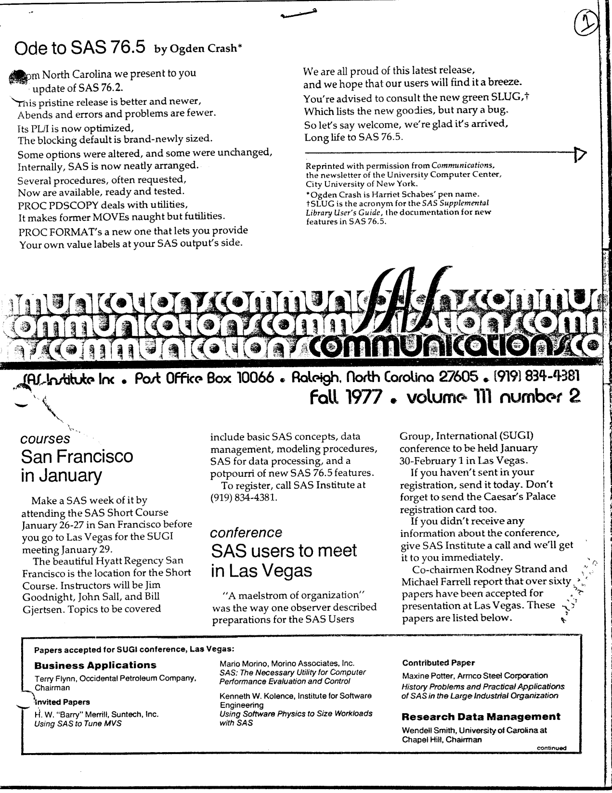
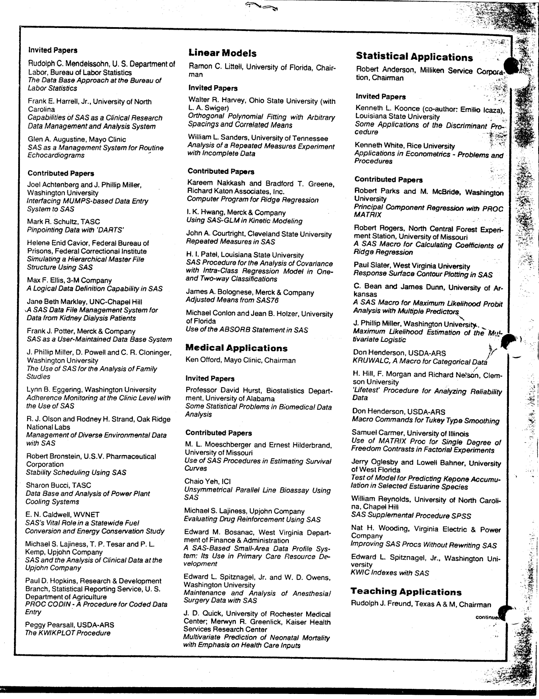
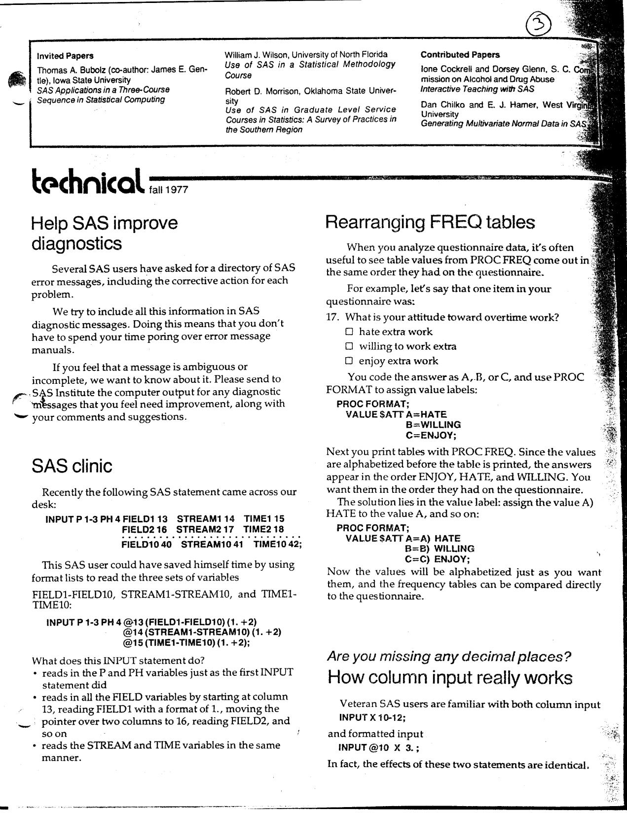
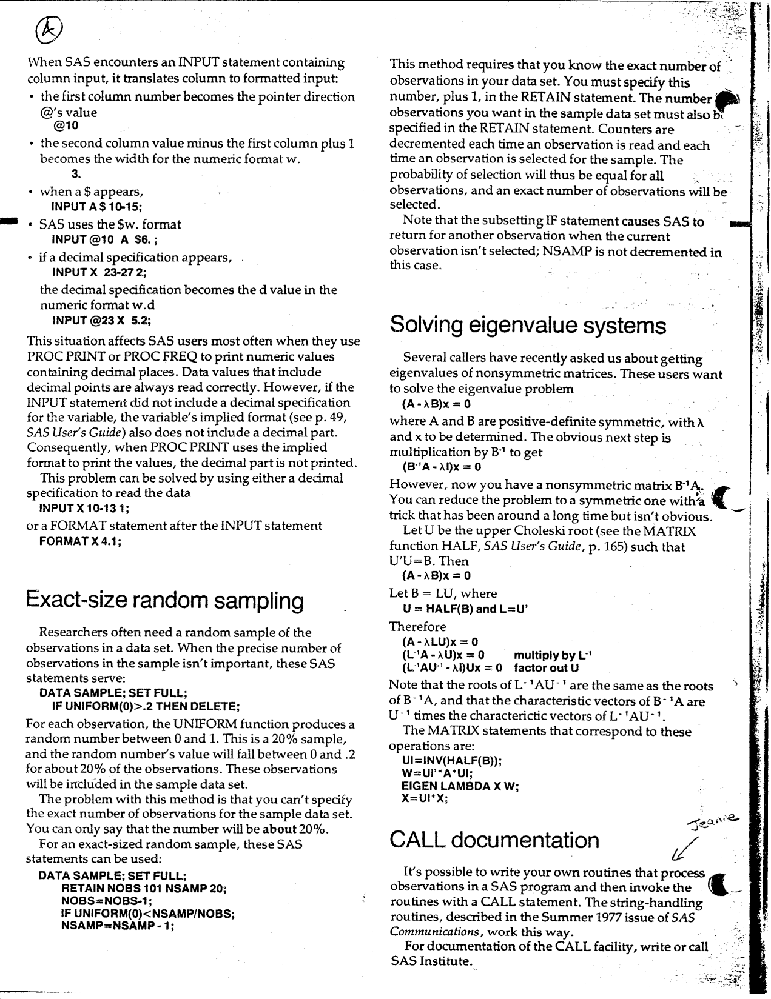
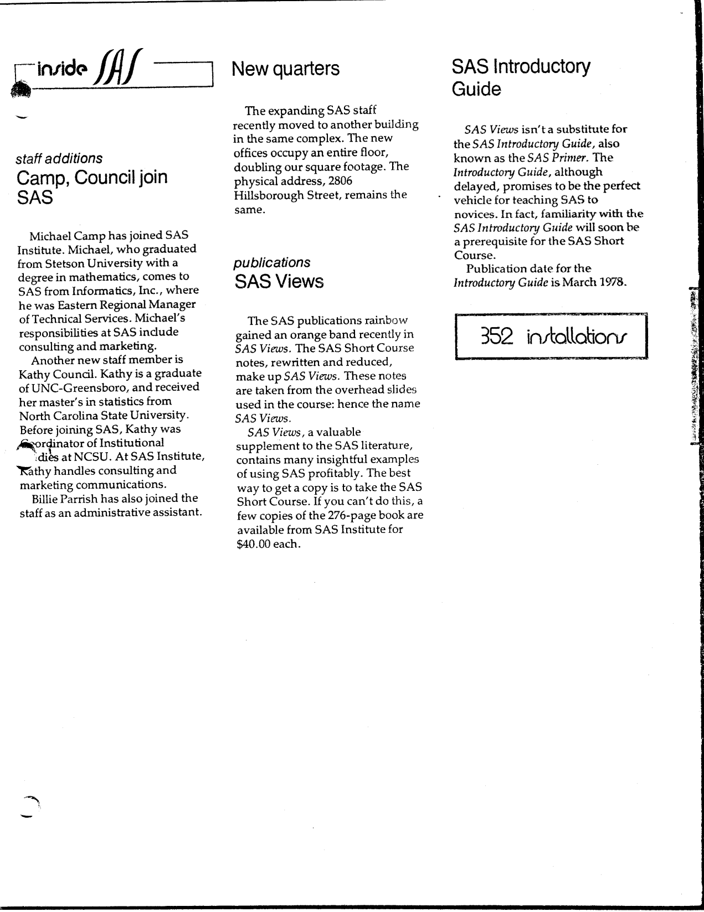

The second issue of Volume III of "SAS Communications" was published in Fall 1977, as SAS 76.5 settled in and SUGI 78 took shape. Highlights include an "Ode to SAS 76.5" reprinted from the City University of New York, the short course in San Francisco that ran the day before the Las Vegas SUGI meeting, the full list of over sixty papers accepted for SUGI 78 (invited and contributed, session by session), a request for feedback on SAS diagnostic messages, a clinic on format lists that turn a sprawling INPUT statement into three lines, how column input is really translated into formatted input (and why your decimal places go missing), exact-size random sampling with UNIFORM and a pair of counters, a Choleski trick for getting eigenvalues of nonsymmetric matrices in PROC MATRIX, and three new staff at SAS Institute. The original is <a href="../resources/SAS_Communications_issue_11.pdf" target="_blank">here</a>.

<hr/>



# **SAS Communications**

**Vol. III, No. 2**
**Fall 1977**

---

## **Ode To SAS 76.5**

By Ogden Crash*

From North Carolina we present to you  
An update of SAS 76.2.  
This pristine release is better and newer,  
Abends and errors and problems are fewer.  
Its PL/I is now optimized,  
The blocking default is brand-newly sized.  
Some options were altered, and some were unchanged,  
Internally, SAS is now neatly arranged.  
Several procedures, often requested,  
Now are available, ready and tested.  
PROC PDSCOPY deals with utilities,  
It makes former MOVEs naught but futilities.  
PROC FORMAT's a new one that lets you provide  
Your own value labels at your SAS output's side.  
We are all proud of this latest release,  
and we hope that our users will find it a breeze.  
You're advised to consult the new green SLUG,*  
Which lists the new goodies, but nary a bug.  
So let's say welcome, we're glad it's arrived,  
Long life to SAS 76.5.

Reprinted with permission from Communications, the newsletter of the University Computer Center, City University of New York.

*Ogden Crash is Harriet Schabes' pen name.

+SLUG is the acronym for the SAS Supplemental Library User's Guide, the documentation for new features in SAS 76.5.

## **San Francisco In January**

Make a SAS week of it by attending the SAS Short Course January 26-27 in San Francisco before you go to Las Vegas for the SUGI meeting January 29.

The beautiful Hyatt Regency San Francisco is the location for the Short Course. Instructors will be Jim Goodnight, John Sall, and Bill Gjertsen. Topics to be covered include basic SAS concepts, data management, modeling procedures, SAS for data processing, and a potpourri of new SAS 76.5 features.

To register, call SAS Institute at (919) 834-4381.

## **SAS Users To Meet In Las Vegas**

"A maelstrom of organization" was the way one observer described preparations for the SAS Users Group, International (SUGI) conference to be held January 30-February 1 in Las Vegas.

If you haven't sent in your registration, send it today. Don't forget to send the Caesar's Palace registration card too.

If you didn't receive any information about the conference, give SAS Institute a call and we'll get it to you immediately.

Co-chairmen Rodney Strand and Michael Farrell report that over sixty papers have been accepted for presentation at Las Vegas. These papers are listed below.

## **Papers Accepted For SUGI Conference, Las Vegas**

### **Business Applications**

Terry Flynn, Occidental Petroleum Company, Chairman

**Invited Papers**

H. W. "Barry" Merrill, Suntech, Inc.  
*Using SAS to Tune MVS*

Mario Morino, Morino Associates, Inc.  
*SAS: The Necessary Utility for Computer Performance Evaluation and Control*

Kenneth W. Kolence, Institute for Software Engineering  
*Using Software Physics to Size Workloads with SAS*

**Contributed Paper**

Maxine Potter, Armco Steel Corporation  
*History Problems and Practical Applications of SAS in the Large Industrial Organization*

### **Research Data Management**

Wendell Smith, University of Carolina at Chapel Hill, Chairman

---



**Invited Papers**

Rudolph C. Mendelssohn, U. S. Department of Labor, Bureau of Labor Statistics  
*The Data Base Approach at the Bureau of Labor Statistics*

Frank E. Harrell, Jr., University of North Carolina  
*Capabilities of SAS as a Clinical Research Data Management and Analysis System*

Glen A. Augustine, Mayo Clinic  
*SAS as a Management System for Routine Echocardiograms*

**Contributed Papers**

Joel Achtenberg and J. Phillip Miller, Washington University  
*Interfacing MUMPS-based Data Entry System to SAS*

Mark R. Schultz, TASC  
*Pinpointing Data with 'DARTS'*

Helene Enid Cavior, Federal Bureau of Prisons, Federal Correctional Institute  
*Simulating a Hierarchical Master File Structure Using SAS*

Max F. Ellis, 3-M Company  
*A Logical Data Definition Capability in SAS*

Jane Beth Markley, UNC-Chapel Hill  
*A SAS Data File Management System for Data from Kidney Dialysis Patients*

Frank J. Potter, Merck & Company  
*SAS as a User-Maintained Data Base System*

J. Phillip Miller, D. Powell and C. R. Cloninger, Washington University  
*The Use of SAS for the Analysis of Family Studies*

Lynn B. Eggering, Washington University  
*Adherence Monitoring at the Clinic Level with the Use of SAS*

R. J. Olson and Rodney H. Strand, Oak Ridge National Labs  
*Management of Diverse Environmental Data with SAS*

Robert Bronstein, U.S.V. Pharmaceutical Corporation  
*Stability Scheduling Using SAS*

Sharon Bucci, TASC  
*Data Base and Analysis of Power Plant Cooling Systems*

E. N. Caldwell, WVNET  
*SAS's Vital Role in a Statewide Fuel Conversion and Energy Conservation Study*

Michael S. Lajiness, T. P. Tesar and P. L. Kemp, Upjohn Company  
*SAS and the Analysis of Clinical Data at the Upjohn Company*

Paul D. Hopkins, Research & Development Branch, Statistical Reporting Service, U. S. Department of Agriculture  
*PROC CODIN - A Procedure for Coded Data Entry*

Peggy Pearsall, USDA-ARS  
*The KWIKPLOT Procedure*

### **Linear Models**

Ramon C. Littell, University of Florida, Chairman

**Invited Papers**

Walter R. Harvey, Ohio State University (with L. A. Swiger)  
*Orthogonal Polynomial Fitting with Arbitrary Spacings and Correlated Means*

William L. Sanders, University of Tennessee  
*Analysis of a Repeated Measures Experiment with Incomplete Data*

**Contributed Papers**

Kareem Nakkash and Bradford T. Greene, Richard Katon Associates, Inc.  
*Computer Program for Ridge Regression*

I. K. Hwang, Merck & Company  
*Using SAS-GLM in Kinetic Modeling*

John A. Courtright, Cleveland State University  
*Repeated Measures in SAS*

H. I. Patel, Louisiana State University  
*SAS Procedure for the Analysis of Covariance with Intra-Class Regression Model in One- and Two-way Classifications*

James A. Bolognese, Merck & Company  
*Adjusted Means from SAS76*

Michael Conlon and Jean B. Holzer, University of Florida  
*Use of the ABSORB Statement in SAS*

### **Medical Applications**

Ken Offord, Mayo Clinic, Chairman

**Invited Papers**

Professor David Hurst, Biostatistics Department, University of Alabama  
*Some Statistical Problems in Biomedical Data Analysis*

**Contributed Papers**

M. L. Moeschberger and Ernest Hilderbrand, University of Missouri  
*Use of SAS Procedures in Estimating Survival Curves*

Chaio Yeh, ICI  
*Unsymmetrical Parallel Line Bioassay Using SAS*

Michael S. Lajiness, Upjohn Company  
*Evaluating Drug Reinforcement Using SAS*

Edward M. Bosanac, West Virginia Department of Finance & Administration  
*A SAS-Based Small-Area Data Profile System: Its Use in Primary Care Resource Development*

Edward L. Spitznagel, Jr. and W. D. Owens, Washington University  
*Maintenance and Analysis of Anesthesia/Surgery Data with SAS*

J. D. Quick, University of Rochester Medical Center; Merwyn R. Greenlick, Kaiser Health Services Research Center  
*Multivariate Prediction of Neonatal Mortality with Emphasis on Health Care Inputs*

### **Statistical Applications**

Robert Anderson, Milliken Service Corporation, Chairman

**Invited Papers**

Kenneth L. Koonce (co-author: Emilio Icaza), Louisiana State University  
*Some Applications of the Discriminant Procedure*

Kenneth White, Rice University  
*Applications in Econometrics - Problems and Procedures*

**Contributed Papers**

Robert Parks and M. McBride, Washington University  
*Principal Component Regression with PROC MATRIX*

Robert Rogers, North Central Forest Experiment Station, University of Missouri  
*A SAS Macro for Calculating Coefficients of Ridge Regression*

Paul Slater, West Virginia University  
*Response Surface Contour Plotting in SAS*

E. Bean and James Dunn, University of Arkansas  
*A SAS Macro for Maximum Likelihood Probit Analysis with Multiple Predictors*

J. Phillip Miller, Washington University  
*Maximum Likelihood Estimation of the Multivariate Logistic*

Don Henderson, USDA-ARS  
*KRUWALC, A Macro for Categorical Data*

H. Hill, F. Morgan and Richard Nelson, Clemson University  
*'Lifetest' Procedure for Analyzing Reliability Data*

Don Henderson, USDA-ARS  
*Macro Commands for Tukey Type Smoothing*

Samuel Carmer, University of Illinois  
*Use of MATRIX Proc for Single Degree of Freedom Contrasts in Factorial Experiments*

Jerry Oglesby and Lowell Bahner, University of West Florida  
*Test of Model for Predicting Kepone Accumulation in Selected Estuarine Species*

William Reynolds, University of North Carolina, Chapel Hill  
*SAS Supplemental Procedure SPSS*

Nat H. Wooding, Virginia Electric & Power Company  
*Improving SAS Procs Without Rewriting SAS*

Edward L. Spitznagel, Jr., Washington University  
*KWIC Indexes with SAS*

### **Teaching Applications**

Rudolph J. Freund, Texas A & M, Chairman

---



**Invited Papers**

Thomas A. Bubolz (co-author: James E. Gentle), Iowa State University  
*SAS Applications in a Three-Course Sequence in Statistical Computing*

William J. Wilson, University of North Florida  
*Use of SAS in a Statistical Methodology Course*

Robert D. Morrison, Oklahoma State University  
*Use of SAS in Graduate Level Service Courses in Statistics: A Survey of Practices in the Southern Region*

**Contributed Papers**

Ione Cockrell and Dorsey Glenn, S. C. Commission on Alcohol and Drug Abuse  
*Interactive Teaching with SAS*

Dan Chilko and E. J. Harner, West Virginia University  
*Generating Multivariate Normal Data in SAS*

## **Help SAS Improve Diagnostics**

Several SAS users have asked for a directory of SAS error messages, including the corrective action for each problem.

We try to include all this information in SAS diagnostic messages. Doing this means that you don't have to spend your time poring over error message manuals.

If you feel that a message is ambiguous or incomplete, we want to know about it. Please send to SAS Institute the computer output for any diagnostic messages that you feel need improvement, along with your comments and suggestions.

## **SAS Clinic**

Recently the following SAS statement came across our desk:

```
INPUT P 1-3 PH 4 FIELD1 13 STREAM1 14 TIME1 15
FIELD2 16 STREAM2 17 TIME2 18
...
FIELD10 40 STREAM10 41 TIME10 42;
```

This SAS user could have saved himself time by using format lists to read the three sets of variables FIELD1-FIELD10, STREAM1-STREAM10, and TIME1-TIME10:

```
INPUT P 1-3 PH 4 @13 (FIELD1-FIELD10) (1. +2)
@14 (STREAM1-STREAM10) (1. +2)
@15 (TIME1-TIME10) (1. +2);
```

What does this INPUT statement do?

- reads in the P and PH variables just as the first INPUT statement did
- reads in all the FIELD variables by starting at column 13, reading FIELD1 with a format of 1., moving the pointer over two columns to 16, reading FIELD2, and so on
- reads the STREAM and TIME variables in the same manner.

## **Rearranging FREQ Tables**

When you analyze questionnaire data, it's often useful to see table values from PROC FREQ come out in the same order they had on the questionnaire.

For example, let's say that one item in your questionnaire was:

```
17. What is your attitude toward overtime work?
[ ] hate extra work
[ ] willing to work extra
[ ] enjoy extra work
```

You code the answer as A, B, or C, and use PROC FORMAT to assign value labels:

```
PROC FORMAT;
VALUE SATT A=HATE
B=WILLING
C=ENJOY;
```

Next you print tables with PROC FREQ. Since the values are alphabetized before the table is printed, the answers appear in the order ENJOY, HATE, and WILLING. You want them in the order they had on the questionnaire. The solution lies in the value label: assign the value A) HATE to the value A, and so on:

```
PROC FORMAT;
VALUE SATT A=A) HATE
B=B) WILLING
C=C) ENJOY;
```

Now the values will be alphabetized just as you want them, and the frequency tables can be compared directly to the questionnaire.

## **How Column Input Really Works**

*Are you missing any decimal places?*

Veteran SAS users are familiar with both column input

```
INPUT X 10-12;
```

and formatted input

```
INPUT @10 X 3.;
```

In fact, the effects of these two statements are identical.

---



When SAS encounters an INPUT statement containing column input, it translates column to formatted input:

- the first column number becomes the pointer direction @'s value

```
@10
```

- the second column value minus the first column plus 1 becomes the width for the numeric format w.

```
3.
```

- when a $ appears,

```
INPUT A$ 10-15;
```

SAS uses the $w. format

```
INPUT @10 A $6.;
```

- if a decimal specification appears,

```
INPUT X 23-27 2;
```

the decimal specification becomes the d value in the numeric format w.d

```
INPUT @23 X 5.2;
```

This situation affects SAS users most often when they use PROC PRINT or PROC FREQ to print numeric values containing decimal places. Data values that include decimal points are always read correctly. However, if the INPUT statement did not include a decimal specification for the variable, the variable's implied format (see p. 49, SAS User's Guide) also does not include a decimal part. Consequently, when PROC PRINT uses the implied format to print the values, the decimal part is not printed.

This problem can be solved by using either a decimal specification to read the data

```
INPUT X 10-13 1;
```

or a FORMAT statement after the INPUT statement

```
FORMAT X 4.1;
```

## **Exact-Size Random Sampling**

Researchers often need a random sample of the observations in a data set. When the precise number of observations in the sample isn't important, these SAS statements serve:

```
DATA SAMPLE; SET FULL;
IF UNIFORM(0)>.2 THEN DELETE;
```

For each observation, the UNIFORM function produces a random number between 0 and 1. This is a 20% sample, and the random number's value will fall between 0 and .2 for about 20% of the observations. These observations will be included in the sample data set.

The problem with this method is that you can't specify the exact number of observations for the sample data set. You can only say that the number will be about 20%.

For an exact-sized random sample, these SAS statements can be used:

```
DATA SAMPLE; SET FULL;
RETAIN NOBS 101 NSAMP 20;
NOBS=NOBS-1;
IF UNIFORM(0)<NSAMP/NOBS;
NSAMP=NSAMP - 1;
```

This method requires that you know the exact number of observations in your data set. You must specify this number, plus 1, in the RETAIN statement. The number of observations you want in the sample data set must also be specified in the RETAIN statement. Counters are decremented each time an observation is read and each time an observation is selected for the sample. The probability of selection will thus be equal for all observations, and an exact number of observations will be selected.

Note that the subsetting IF statement causes SAS to return for another observation when the current observation isn't selected; NSAMP is not decremented in this case.

## **Solving Eigenvalue Systems**

Several callers have recently asked us about getting eigenvalues of nonsymmetric matrices. These users want to solve the eigenvalue problem

(A - &lambda;B)x = 0

where A and B are positive-definite symmetric, with &lambda; and x to be determined. The obvious next step is multiplication by B<sup>-1</sup> to get

(B<sup>-1</sup>A - &lambda;I)x = 0

However, now you have a nonsymmetric matrix B<sup>-1</sup>A. You can reduce the problem to a symmetric one with a trick that has been around a long time but isn't obvious.

Let U be the upper Choleski root (see the MATRIX function HALF, SAS User's Guide, p. 165) such that U'U = B. Then

(A - &lambda;B)x = 0

Let B = LU, where

U = HALF(B) and L = U'

Therefore

(A - &lambda;LU)x = 0

(L<sup>-1</sup>A - &lambda;U)x = 0    multiply by L<sup>-1</sup>

(L<sup>-1</sup>AU<sup>-1</sup> - &lambda;I)Ux = 0    factor out U

Note that the roots of L<sup>-1</sup>AU<sup>-1</sup> are the same as the roots of B<sup>-1</sup>A, and that the characteristic vectors of B<sup>-1</sup>A are U<sup>-1</sup> times the characteristic vectors of L<sup>-1</sup>AU<sup>-1</sup>.

The MATRIX statements that correspond to these operations are:

```
UI=INV(HALF(B));
W=UI'*A*UI;
EIGEN LAMBDA X W;
X=UI*X;
```

## **CALL Documentation**

It's possible to write your own routines that process observations in a SAS program and then invoke the routines with a CALL statement. The string-handling routines, described in the Summer 1977 issue of SAS Communications, work this way.

For documentation of the CALL facility, write or call SAS Institute.

---



## **Camp, Council Join SAS**

Michael Camp has joined SAS Institute. Michael, who graduated from Stetson University with a degree in mathematics, comes to SAS from Informatics, Inc., where he was Eastern Regional Manager of Technical Services. Michael's responsibilities at SAS include consulting and marketing.

Another new staff member is Kathy Council. Kathy is a graduate of UNC-Greensboro, and received her master's in statistics from North Carolina State University. Before joining SAS, Kathy was coordinator of Institutional Studies at NCSU. At SAS Institute, Kathy handles consulting and marketing communications.

Billie Parrish has also joined the staff as an administrative assistant.

## **New Quarters**

The expanding SAS staff recently moved to another building in the same complex. The new offices occupy an entire floor, doubling our square footage. The physical address, 2806 Hillsborough Street, remains the same.

## **SAS Views**

The SAS publications rainbow gained an orange band recently in SAS Views. The SAS Short Course notes, rewritten and reduced, make up SAS Views. These notes are taken from the overhead slides used in the course: hence the name SAS Views.

SAS Views, a valuable supplement to the SAS literature, contains many insightful examples of using SAS profitably. The best way to get a copy is to take the SAS Short Course. If you can't do this, a few copies of the 276-page book are available from SAS Institute for $40.00 each.

## **SAS Introductory Guide**

SAS Views isn't a substitute for the SAS Introductory Guide, also known as the SAS Primer. The Introductory Guide, although delayed, promises to be the perfect vehicle for teaching SAS to novices. In fact, familiarity with the SAS Introductory Guide will soon be a prerequisite for the SAS Short Course.

Publication date for the Introductory Guide is March 1978.

---

SAS Institute Inc. - Post Office Box 10066 - Raleigh, North Carolina 27605 - (919) 834-4381

<!--
Fall 1977 - SAS 76.5 is out, and this issue is mostly a guest list.

More than sixty papers were accepted for SUGI 78 at Caesar's Palace, and the newsletter prints the lot - invited and contributed, session by session. The SAS Institute staff were still small enough that the same names turn up as chairmen, authors and reviewers.

The best item in the issue is the Ode to SAS 76.5, written by Harriet Schabes under the pen name Ogden Crash for the City University of New York's computer centre newsletter and reprinted here with permission. It rhymes "PROC PDSCOPY" with "futilities" and "the new green SLUG" with "nary a bug".

On the technical side: a SAS clinic showing how format lists turn a sprawling INPUT statement into three lines, an explanation of how column input is really translated into formatted input (and why decimal places vanish when the variable has no decimal specification), an exact-size random sampling recipe built on UNIFORM and a pair of counters, and a Choleski-root trick for getting eigenvalues of nonsymmetric matrices in PROC MATRIX.

Plus a new home for the growing SAS staff (an entire floor at 2806 Hillsborough Street), SAS Views at $40 a copy, and the SAS Introductory Guide promised for March 1978.

#sas #sugi #sas76 #matrix #pl1 #statisticalsoftware #techhistory #retrocomputing #sasinstitute
-->
