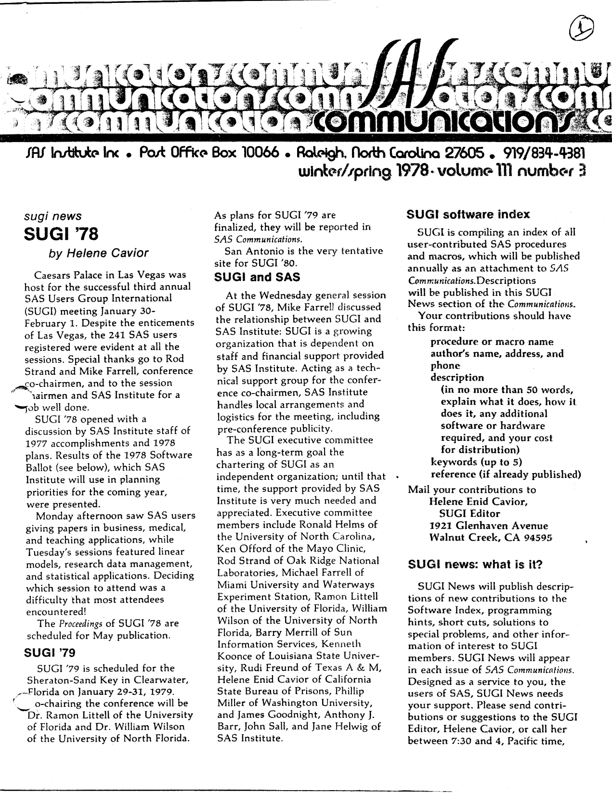
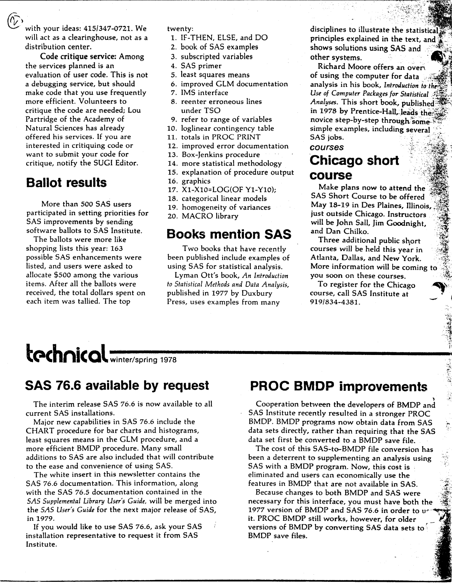
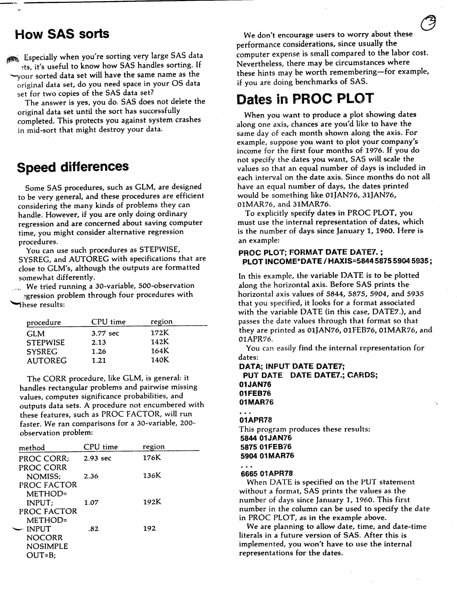
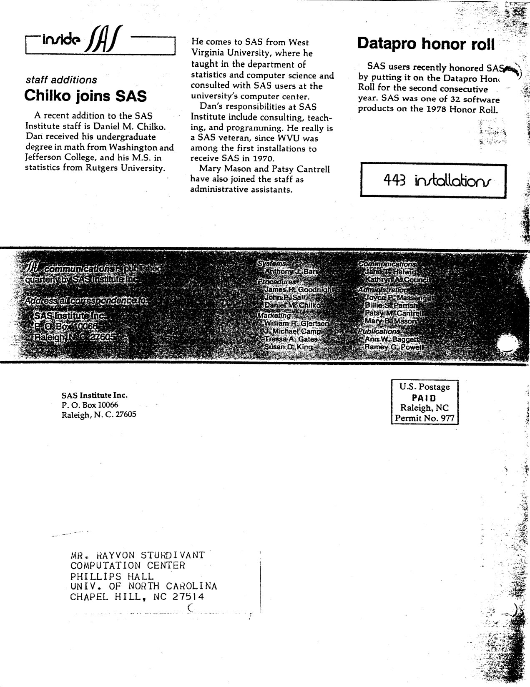

The third issue of Volume III of "SAS Communications" was published in Winter/Spring 1978, with SAS 76.6 available on request. Highlights include a report on the third annual SUGI meeting at Caesar's Palace in Las Vegas (241 registered users, and Clearwater pencilled in for SUGI '79), the top twenty items from the 1978 Software Ballot (IF-THEN/ELSE leads, after more than 500 users spent a notional $500 each), the new SUGI software index and code critique service, two recently published statistics books that use SAS, the Chicago short course, the SAS 76.6 release notes and the new direct SAS-to-BMDP interface, an explanation of how SAS sorts (and why you need room for two copies), CPU-time comparisons of GLM against STEPWISE, SYSREG and AUTOREG, a trick for pinning specific dates onto a PROC PLOT axis, and three new staff at SAS Institute. The original is <a href="../resources/SAS_Communications_issue_12.pdf" target="_blank">here</a>.

<hr/>



# **SAS Communications**

**Vol. III, No. 3**  
**Winter/Spring 1978**

---

## **SUGI '78**

Caesars Palace in Las Vegas was host for the successful third annual SAS Users Group International (SUGI) meeting January 30-February 1. Despite the enticements of Las Vegas, the 241 SAS users registered were evident at all the sessions. Special thanks go to Rod Strand and Mike Farrell, conference co-chairmen, and to the session chairmen and SAS Institute for a job well done.

SUGI '78 opened with a discussion by SAS Institute staff of 1977 accomplishments and 1978 plans. Results of the 1978 Software Ballot (see below), which SAS Institute will use in planning priorities for the coming year, were presented.

Monday afternoon saw SAS users giving papers in business, medical, and teaching applications, while Tuesday's sessions featured linear models, research data management, and statistical applications. Deciding which session to attend was a difficulty that most attendees encountered!

The Proceedings of SUGI '78 are scheduled for May publication.

## **SUGI '79**

SUGI '79 is scheduled for the Sheraton-Sand Key in Clearwater, Florida on January 29-31, 1979. Co-chairing the conference will be Dr. Ramon Littell of the University of Florida and Dr. William Wilson of the University of North Florida.

As plans for SUGI '79 are finalized, they will be reported in SAS Communications.

San Antonio is the very tentative site for SUGI '80.

## **SUGI and SAS**

At the Wednesday general session of SUGI '78, Mike Farrell discussed the relationship between SUGI and SAS Institute: SUGI is a growing organization that is dependent on staff and financial support provided by SAS Institute. Acting as a technical support group for the conference co-chairmen, SAS Institute handles local arrangements and logistics for the meeting, including pre-conference publicity.

The SUGI executive committee has as a long-term goal the chartering of SUGI as an independent organization; until that time, the support provided by SAS Institute is very much needed and appreciated. Executive committee members include Ronald Helms of the University of North Carolina, Ken Offord of the Mayo Clinic, Rod Strand of Oak Ridge National Laboratories, Michael Farrell of Miami University and Waterways Experiment Station, Ramon Littell of the University of Florida, William Wilson of the University of North Florida, Barry Merrill of Sun Information Services, Kenneth Koonce of Louisiana State University, Rudi Freund of Texas A & M, Helene Enid Cavior of California State Bureau of Prisons, Phillip Miller of Washington University, and James Goodnight, Anthony J. Barr, John Sall, and Jane Helwig of SAS Institute.

## **SUGI Software Index**

SUGI is compiling an index of all user-contributed SAS procedures and macros, which will be published annually as an attachment to SAS Communications. Descriptions will be published in this SUGI News section of the Communications.

Your contributions should have this format:

- procedure or macro name
- author's name, address, and phone
- description (in no more than 50 words, explain what it does, how it does it, any additional software or hardware required, and your cost for distribution)
- keywords (up to 5)
- reference (if already published)

Mail your contributions to Helene Enid Cavior, SUGI Editor, 1921 Glenhaven Avenue, Walnut Creek, CA 94595.

## **SUGI News: What Is It?**

SUGI News will publish descriptions of new contributions to the Software Index, programming hints, short cuts, solutions to special problems, and other information of interest to SUGI members. SUGI News will appear in each issue of SAS Communications. Designed as a service to you, the users of SAS, SUGI News needs your support. Please send contributions or suggestions to the SUGI Editor, Helene Cavior, or call her between 7:30 and 4, Pacific time, with your ideas: 415/347-0721. We will act as a clearinghouse, not as a distribution center.

## **Code Critique Service**

Among the services planned is an evaluation of user code. This is not a debugging service, but should make code that you use frequently more efficient. Volunteers to critique the code are needed; Lou Partridge of the Academy of Natural Sciences has already offered his services. If you are interested in critiquing code or want to submit your code for critique, notify the SUGI Editor.

## **Ballot Results**

More than 500 SAS users participated in setting priorities for SAS improvements by sending software ballots to SAS Institute.

The ballots were more like shopping lists this year: 163 possible SAS enhancements were listed, and users were asked to allocate $500 among the various items. After all the ballots were received, the total dollars spent on each item was tallied. The top twenty:

1. IF-THEN, ELSE, and DO
2. book of SAS examples
3. subscripted variables
4. SAS primer
5. least squares means
6. improved GLM documentation
7. IMS interface
8. reenter erroneous lines under TSO
9. refer to range of variables
10. loglinear contingency table
11. totals in PROC PRINT
12. improved error documentation
13. Box-Jenkins procedure
14. more statistical methodology
15. explanation of procedure output
16. graphics
17. `X1-X10=LOG(OF Y1-Y10);`
18. categorical linear models
19. homogeneity of variances
20. MACRO library

## **Books Mention SAS**

Two books that have recently been published include examples of using SAS for statistical analysis.

Lyman Ott's book, *An Introduction to Statistical Methods and Data Analysis*, published in 1977 by Duxbury Press, uses examples from many disciplines to illustrate the statistical principles explained in the text, and shows solutions using SAS and other systems.

Richard Moore offers an overview of using the computer for data analysis in his book, *Introduction to the Use of Computer Packages for Statistical Analyses*. This short book, published in 1978 by Prentice-Hall, leads the novice step-by-step through some simple examples, including several SAS jobs.

## **Chicago Short Course**

Make plans now to attend the SAS Short Course to be offered May 18-19 in Des Plaines, Illinois, just outside Chicago. Instructors will be John Sall, Jim Goodnight, and Dan Chilko.

Three additional public short courses will be held this year in Atlanta, Dallas, and New York. More information will be coming to you soon on these courses.

To register for the Chicago course, call SAS Institute at 919/834-4381.

---



## **SAS 76.6 Available By Request**

The interim release SAS 76.6 is now available to all current SAS installations.

Major new capabilities in SAS 76.6 include the CHART procedure for bar charts and histograms, least squares means in the GLM procedure, and a more efficient BMDP procedure. Many small additions to SAS are also included that will contribute to the ease and convenience of using SAS.

The white insert in this newsletter contains the SAS 76.6 documentation. This information, along with the SAS 76.5 documentation contained in the *SAS Supplemental Library User's Guide*, will be merged into the *SAS User's Guide* for the next major release of SAS, in 1979.

If you would like to use SAS 76.6, ask your SAS installation representative to request it from SAS Institute.

## **PROC BMDP Improvements**

Cooperation between the developers of BMDP and SAS Institute recently resulted in a stronger PROC BMDP. BMDP programs now obtain data from SAS data sets directly, rather than requiring that the SAS data set first be converted to a BMDP save file.

The cost of this SAS-to-BMDP file conversion has been a deterrent to supplementing an analysis using SAS with a BMDP program. Now, this cost is eliminated and users can economically use the features in BMDP that are not available in SAS.

Because changes to both BMDP and SAS were necessary for this interface, you must have both the 1977 version of BMDP and SAS 76.6 in order to use it. PROC BMDP still works, however, for older versions of BMDP by converting SAS data sets to BMDP save files.

---



## **How SAS Sorts**

Especially when you're sorting very large SAS data sets, it's useful to know how SAS handles sorting. If your sorted data set will have the same name as the original data set, do you need space in your OS data set for two copies of the SAS data set?

The answer is yes, you do. SAS does not delete the original data set until the sort has successfully completed. This protects you against system crashes in mid-sort that might destroy your data.

## **Speed Differences**

Some SAS procedures, such as GLM, are designed to be very general, and these procedures are efficient considering the many kinds of problems they can handle. However, if you are only doing ordinary regression and are concerned about saving computer time, you might consider alternative regression procedures.

You can use such procedures as STEPWISE, SYSREG, and AUTOREG with specifications that are close to GLM's, although the outputs are formatted somewhat differently.

We tried running a 30-variable, 500-observation regression problem through four procedures with these results:

|procedure|CPU time|region|
|---|---|---|
|GLM|3.77 sec|172K|
|STEPWISE|2.13|142K|
|SYSREG|1.26|164K|
|AUTOREG|1.21|140K|

The CORR procedure, like GLM, is general: it handles rectangular problems and pairwise missing values, computes significance probabilities, and outputs data sets. A procedure not encumbered with these features, such as PROC FACTOR, will run faster. We ran comparisons for a 30-variable, 200-observation problem:

|method|CPU time|region|
|---|---|---|
|PROC CORR;|2.93 sec|176K|
|PROC CORR NOMISS;|2.36|136K|
|PROC FACTOR METHOD=INPUT;|1.07|192K|
|PROC FACTOR METHOD=INPUT NOCORR NOSIMPLE OUT=B;|.82|192K|

We don't encourage users to worry about these performance considerations, since usually the computer expense is small compared to the labor cost. Nevertheless, there may be circumstances where these hints may be worth remembering - for example, if you are doing benchmarks of SAS.

## **Dates In PROC PLOT**

When you want to produce a plot showing dates along one axis, chances are you'd like to have the same day of each month shown along the axis. For example, suppose you want to plot your company's income for the first four months of 1976. If you do not specify the dates you want, SAS will scale the values so that an equal number of days is included in each interval on the date axis. Since months do not all have an equal number of days, the dates printed would be something like 01JAN76, 31JAN76, 01MAR76, and 31MAR76.

To explicitly specify dates in PROC PLOT, you must use the internal representation of dates, which is the number of days since January 1, 1960. Here is an example:

```
PROC PLOT; FORMAT DATE DATE7.;
PLOT INCOME*DATE / HAXIS=5844 5875 5904 5935;
```

In this example, the variable DATE is to be plotted along the horizontal axis. Before SAS prints the horizontal axis values of 5844, 5875, 5904, and 5935 that you specified, it looks for a format associated with the variable DATE (in this case, DATE7.), and passes the date values through that format so that they are printed as 01JAN76, 01FEB76, 01MAR76, and 01APR76.

You can easily find the internal representation for dates:

```
DATA; INPUT DATE DATE7;
PUT DATE DATE DATE7.; CARDS;
01JAN76
01FEB76
01MAR76
...
01APR78
```

This program produces these results:

```
5844 01JAN76
5875 01FEB76
5904 01MAR76
...
6665 01APR78
```

When DATE is specified on the PUT statement without a format, SAS prints the values as the number of days since January 1, 1960. This first number in the column can be used to specify the date in PROC PLOT, as in the example above.

We are planning to allow date, time, and date-time literals in a future version of SAS. After this is implemented, you won't have to use the internal representations for the dates.

---



## **Chilko Joins SAS**

A recent addition to the SAS Institute staff is Daniel M. Chilko. Dan received his undergraduate degree in math from Washington and Jefferson College, and his M.S. in statistics from Rutgers University.

He comes to SAS from West Virginia University, where he taught in the department of statistics and computer science and consulted with SAS users at the university's computer center.

Dan's responsibilities at SAS Institute include consulting, teaching, and programming. He really is a SAS veteran, since WVU was among the first installations to receive SAS in 1970.

Mary Mason and Patsy Cantrell have also joined the staff as administrative assistants.

## **Datapro Honor Roll**

SAS users recently honored SAS by putting it on the Datapro Honor Roll for the second consecutive year. SAS was one of 32 software products on the 1978 Honor Roll.

---

SAS Communications is published quarterly by SAS Institute Inc.

Anthony J. Barr, Systems  
James H. Goodnight, Procedures  
John P. Sall, Procedures  
Daniel M. Chilko, Procedures  
William R. Gjertsen, Marketing  
J. Michael Camp, Marketing  
Tressa A. Gates, Marketing  
Susan D. King, Marketing  
Jane T. Helwig, Communications  
Kathryn A. Council, Communications  
Joyce P. Massengill, Administration  
Billie S. Parrish, Administration  
Patsy M. Cantrell, Administration  
Mary B. Mason, Administration  
Ann W. Baggett, Publications  
Ramey G. Powell, Publications

Address all correspondence to SAS Institute Inc., Post Office Box 10066, Raleigh, NC 27605.

---

SAS Institute Inc. - Post Office Box 10066 - Raleigh, North Carolina 27605 - (919) 834-4381

<!--
Winter/Spring 1978 - SAS 76.6 is out on request, and SUGI has been to Las Vegas.

241 SAS users registered for the third annual SUGI meeting at Caesar's Palace, and the write-up in this issue is mostly logistics: who chairs what, where the next one goes (Clearwater, Florida, January 1979), and what the relationship between SUGI and SAS Institute actually is. The executive committee's long-term goal is chartering SUGI as an independent organization; until then SAS Institute does the local arrangements.

The 1978 Software Ballot is the fun part. 163 possible enhancements, more than 500 users, $500 each to allocate. IF-THEN/ELSE and DO takes first place, then a book of SAS examples, then subscripted variables. Number seventeen on the list is literally the line X1-X10=LOG(OF Y1-Y10); - a syntax request, not a feature.

On the technical side: SAS 76.6 brings CHART, least squares means in GLM, and a faster BMDP. PROC BMDP can now read SAS data sets directly instead of going through a BMDP save file. There is a note on sorting (SAS keeps the original data set until the sort completes, so you need room for two copies), a CPU-time shootout that puts GLM at 3.77 seconds against AUTOREG at 1.21 for the same regression, and a PROC PLOT trick for putting exact dates on an axis using the internal day numbers - 01JAN76 is 5844 days after January 1, 1960.

Plus the new SUGI software index and code critique service, two statistics books that use SAS (Ott 1977, Moore 1978), and three new staff: Dan Chilko, Mary Mason and Patsy Cantrell.

Transcribed from the original newsletter, published by SAS Institute Inc., for historical interest.

#sas #sugi #sas76 #bmdp #procplot #statisticalsoftware #techhistory #retrocomputing #sasinstitute
-->
