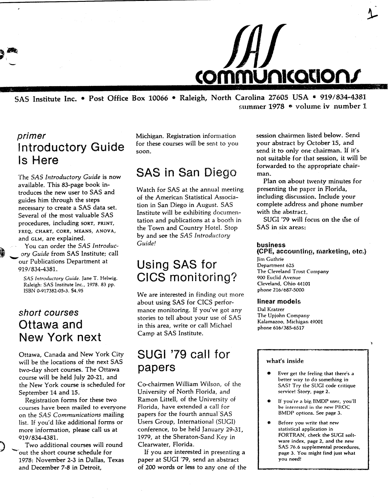
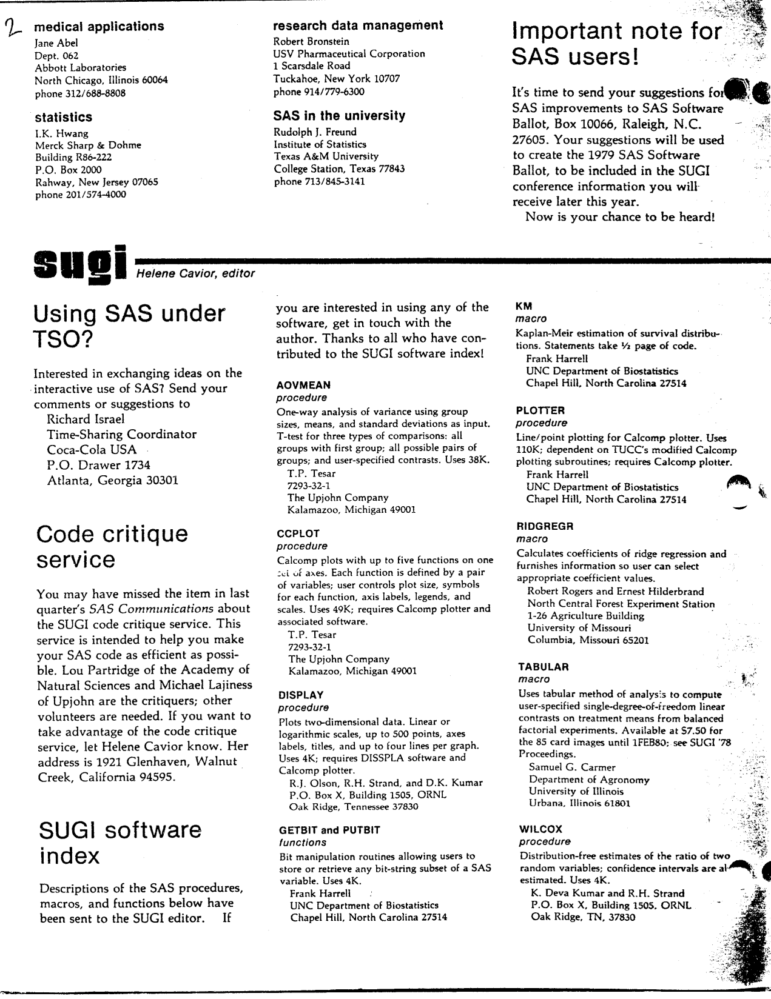
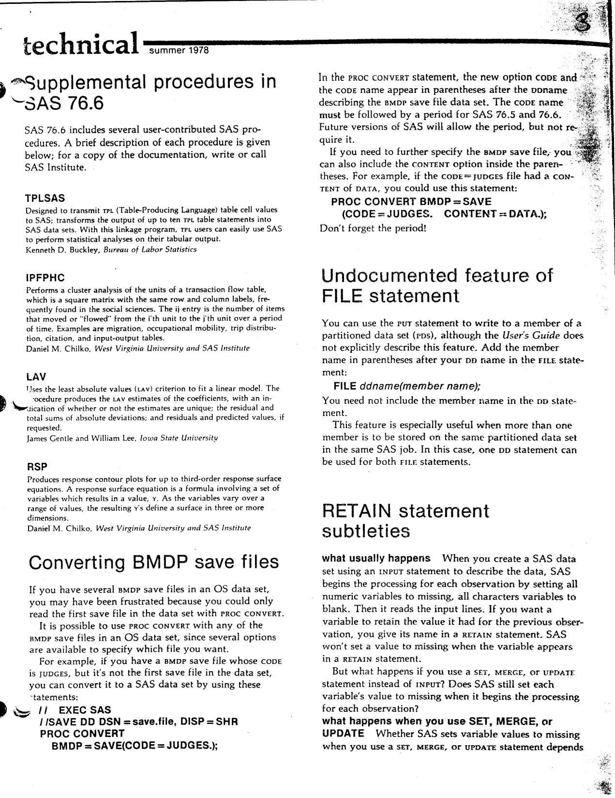
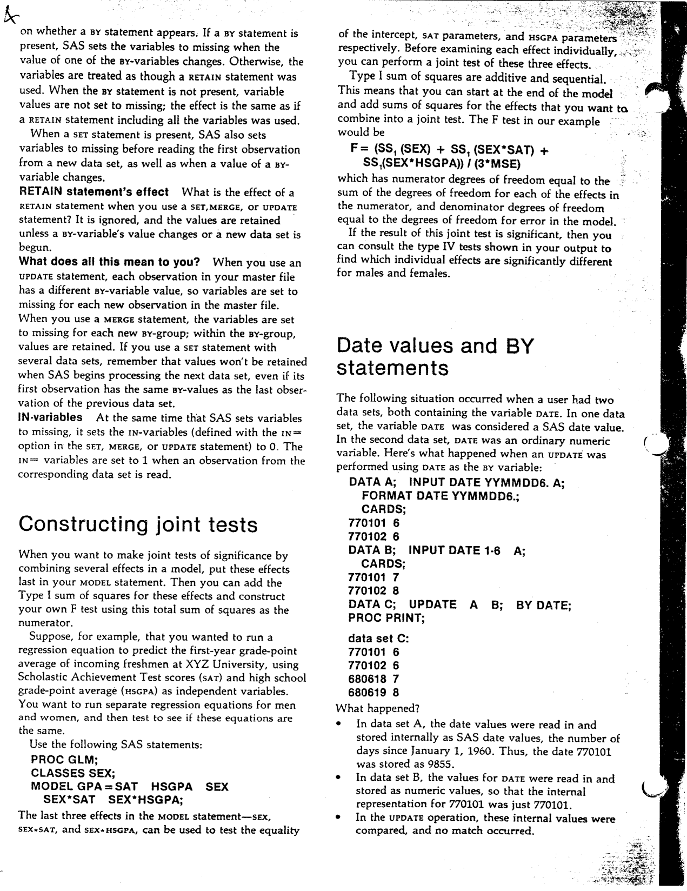
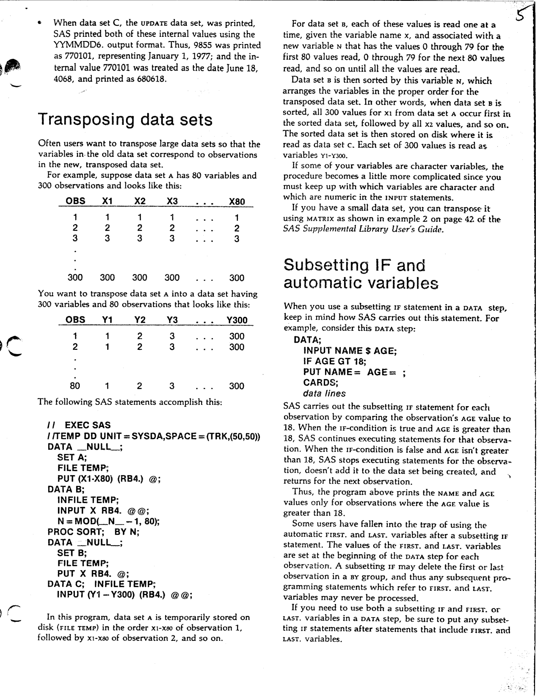
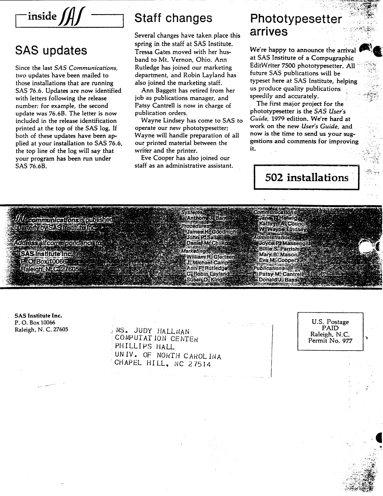

The first issue of Volume IV of "SAS Communications" was published in Summer 1978, with the new SAS Introductory Guide on sale and the fourth SUGI conference taking shape. Highlights include the 83-page SAS Introductory Guide, the full SUGI '79 call for papers with all six session chairmen, a SUGI software index of nine user-contributed procedures and macros, the supplemental procedures shipped with SAS 76.6 (TPLSAS, IPFPHC, LAV and RSP), PROC CONVERT options for reading any BMDP save file in an OS data set, an undocumented FILE statement feature for partitioned data sets, a careful explanation of RETAIN and what SET, MERGE and UPDATE really do to missing values, a recipe for constructing joint tests in PROC GLM, a cautionary tale about date values and BY statements, a program that transposes a data set without PROC TRANSPOSE, and a trap with subsetting IF and the automatic FIRST. and LAST. variables. The original is <a href="../resources/SAS_Communications_issue_13.pdf" target="_blank">here</a>.

<hr/>



# **SAS Communications**

**Vol. IV, No. 1**  
**Summer 1978**

---

## **Introductory Guide Is Here**

The SAS Introductory Guide is now available. This 83-page book introduces the new user to SAS and guides him through the steps necessary to create a SAS data set. Several of the most valuable SAS procedures, including SORT, PRINT, FREQ, CHART, CORR, MEANS, ANOVA, and GLM, are explained.

You can order the SAS Introductory Guide from SAS Institute; call our Publications Department at 919/834-4381.

*SAS Introductory Guide. Jane T. Helwig. Raleigh: SAS Institute Inc., 1978. 83 pp. ISBN 0-917382-05-3. $4.95*

## **Ottawa And New York Next**

Ottawa, Canada and New York City will be the locations of the next SAS two-day short courses. The Ottawa course will be held July 20-21, and the New York course is scheduled for September 14 and 15.

Registration forms for these two courses have been mailed to everyone on the SAS Communications mailing list. If you'd like additional forms or more information, please call us at 919/834-4381.

Two additional courses will round out the short course schedule for 1978: November 2-3 in Dallas, Texas and December 7-8 in Detroit, Michigan. Registration information for these courses will be sent to you soon.

## **SAS In San Diego**

Watch for SAS at the annual meeting of the American Statistical Association in San Diego in August. SAS Institute will be exhibiting documentation and publications at a booth in the Town and Country Hotel. Stop by and see the SAS Introductory Guide!

## **Using SAS For CICS Monitoring?**

We are interested in finding out more about using SAS for CICS performance monitoring. If you've got any stories to tell about your use of SAS in this area, write or call Michael Camp at SAS Institute.

## **SUGI '79 Call For Papers**

Co-chairmen William Wilson, of the University of North Florida, and Ramon Littell, of the University of Florida, have extended a call for papers for the fourth annual SAS Users Group, International (SUGI) conference, to be held January 29-31, 1979, at the Sheraton-Sand Key in Clearwater, Florida.

If you are interested in presenting a paper at SUGI '79, send an abstract of 200 words or less to any one of the session chairmen listed below. Send your abstract by October 15, and send it to only one chairman. If it's not suitable for that session, it will be forwarded to the appropriate chairman.

Plan on about twenty minutes for presenting the paper in Florida, including discussion. Include your complete address and phone number with the abstract.

SUGI '79 will focus on the use of SAS in six areas:

- **business** (CPE, accounting, marketing, etc.) - Jim Guthrie, Department 625, The Cleveland Trust Company, 900 Euclid Avenue, Cleveland, Ohio 44101, phone 216/687-5000
- **linear models** - Dal Kratzer, The Upjohn Company, Kalamazoo, Michigan 49001, phone 616/385-6517
- **medical applications** - Jane Abel, Dept. 062, Abbott Laboratories, North Chicago, Illinois 60064, phone 312/688-8808
- **statistics** - L.K. Hwang, Merck Sharp & Dohme, Building R86-222, P.O. Box 2000, Rahway, New Jersey 07065, phone 201/574-4000
- **research data management** - Robert Bronstein, USV Pharmaceutical Corporation, 1 Scarsdale Road, Tuckahoe, New York 10707, phone 914/779-6300
- **SAS in the university** - Rudolph J. Freund, Institute of Statistics, Texas A&M University, College Station, Texas 77843, phone 713/845-3141

## **What's Inside**

- Ever get the feeling that there's a better way to do something in SAS? Try the SUGI code critique service! Story, page 2.
- If you're a big BMDP user, you'll be interested in the new PROC BMDP options. See page 3.
- Before you write that new statistical application in FORTRAN, check the SUGI software index, page 2, and the new SAS 76.6 supplemental procedures, page 3. You might find just what you need!

---



**SUGI** - Helene Cavior, editor

## **Using SAS Under TSO?**

Interested in exchanging ideas on the interactive use of SAS? Send your comments or suggestions to

Richard Israel  
Time-Sharing Coordinator  
Coca-Cola USA  
P.O. Drawer 1734  
Atlanta, Georgia 30301

## **Code Critique Service**

You may have missed the item in last quarter's SAS Communications about the SUGI code critique service. This service is intended to help you make your SAS code as efficient as possible. Lou Partridge of the Academy of Natural Sciences and Michael Lajiness of Upjohn are the critiquers; other volunteers are needed. If you want to take advantage of the code critique service, let Helene Cavior know. Her address is 1921 Glenhaven, Walnut Creek, California 94595.

## **SUGI Software Index**

Descriptions of the SAS procedures, macros, and functions below have been sent to the SUGI editor. If you are interested in using any of the software, get in touch with the author. Thanks to all who have contributed to the SUGI software index!

### **AOVMEAN Procedure**

One-way analysis of variance using group sizes, means, and standard deviations as input. T-test for three types of comparisons: all groups with first group; all possible pairs of groups; and user-specified contrasts. Uses 38K.

T.P. Tesar  
7293-32-1  
The Upjohn Company  
Kalamazoo, Michigan 49001

### **CCPLOT Procedure**

Calcomp plots with up to five functions on one set of axes. Each function is defined by a pair of variables; user controls plot size, symbols for each function, axis labels, legends, and scales. Uses 49K; requires Calcomp plotter and associated software.

T.P. Tesar  
7293-32-1  
The Upjohn Company  
Kalamazoo, Michigan 49001

### **DISPLAY Procedure**

Plots two-dimensional data. Linear or logarithmic scales, up to 500 points, axes labels, titles, and up to four lines per graph. Uses 4K; requires DISSPLA software and Calcomp plotter.

R.J. Olson, R.H. Strand, and D.K. Kumar  
P.O. Box X, Building 1505, ORNL  
Oak Ridge, Tennessee 37830

### **GETBIT And PUTBIT Functions**

Bit manipulation routines allowing users to store or retrieve any bit-string subset of a SAS variable. Uses 4K.

Frank Harrell  
UNC Department of Biostatistics  
Chapel Hill, North Carolina 27514

### **KM Macro**

Kaplan-Meir estimation of survival distributions. Statements take 1/2 page of code.

Frank Harrell  
UNC Department of Biostatistics  
Chapel Hill, North Carolina 27514

### **PLOTTER Procedure**

Line/point plotting for Calcomp plotter. Uses 110K; dependent on TUCC's modified Calcomp plotting subroutines; requires Calcomp plotter.

Frank Harrell  
UNC Department of Biostatistics  
Chapel Hill, North Carolina 27514

### **RIDGREGR Macro**

Calculates coefficients of ridge regression and furnishes information so user can select appropriate coefficient values.

Robert Rogers and Ernest Hilderbrand  
North Central Forest Experiment Station  
1-26 Agriculture Building  
University of Missouri  
Columbia, Missouri 65201

### **TABULAR Macro**

Uses tabular method of analysis to compute user-specified single-degree-of-freedom linear contrasts on treatment means from balanced factorial experiments. Available at $7.50 for the 85 card images until 1FEB80; see SUGI '78 Proceedings.

Samuel G. Carmer  
Department of Agronomy  
University of Illinois  
Urbana, Illinois 61801

### **WILCOX Procedure**

Distribution-free estimates of the ratio of two random variables; confidence intervals are also estimated. Uses 4K.

K. Deva Kumar and R.H. Strand  
P.O. Box X, Building 1505, ORNL  
Oak Ridge, TN, 37830

## **Important Note For SAS Users!**

It's time to send your suggestions for SAS improvements to SAS Software Ballot, Box 10066, Raleigh, N.C. 27605. Your suggestions will be used to create the 1979 SAS Software Ballot, to be included in the SUGI conference information you will receive later this year.

Now is your chance to be heard!

---



## **Supplemental Procedures In SAS 76.6**

SAS 76.6 includes several user-contributed SAS procedures. A brief description of each procedure is given below; for a copy of the documentation, write or call SAS Institute.

### **TPLSAS**

Designed to transmit TPL (Table-Producing Language) table cell values to SAS; transforms the output of up to ten TPL table statements into SAS data sets. With this linkage program, TPL users can easily use SAS to perform statistical analyses on their tabular output.

Kenneth D. Buckley, Bureau of Labor Statistics

### **IPFPHC**

Performs a cluster analysis of the units of a transaction flow table, which is a square matrix with the same row and column labels, frequently found in the social sciences. The ij entry is the number of items that moved or "flowed" from the i'th unit to the j'th unit over a period of time. Examples are migration, occupational mobility, trip distribution, citation, and input-output tables.

Daniel M. Chilko, West Virginia University and SAS Institute

### **LAV**

Uses the least absolute values (LAV) criterion to fit a linear model. The procedure produces the LAV estimates of the coefficients, with an indication of whether or not the estimates are unique; the residual and total sums of absolute deviations; and residuals and predicted values, if requested.

James Gentle and William Lee, Iowa State University

### **RSP**

Produces response contour plots for up to third-order response surface equations. A response surface equation is a formula involving a set of variables which results in a value, y. As the variables vary over a range of values, the resulting y's define a surface in three or more dimensions.

Daniel M. Chilko, West Virginia University and SAS Institute

## **Converting BMDP Save Files**

If you have several BMDP save files in an OS data set, you may have been frustrated because you could only read the first save file in the data set with PROC CONVERT. It is possible to use PROC CONVERT with any of the BMDP save files in an OS data set, since several options are available to specify which file you want.

For example, if you have a BMDP save file whose CODE is JUDGES, but it's not the first save file in the data set, you can convert it to a SAS data set by using these statements:

```
// EXEC SAS
//SAVE DD DSN=SAVE.FILE,DISP=SHR
PROC CONVERT
BMDP = SAVE(CODE = JUDGES.);
```

In the PROC CONVERT statement, the new option CODE and the CODE name appear in parentheses after the BMDP save file data set. The CODE name must be followed by a period for SAS 76.5 and 76.6. Future versions of SAS will allow the period, but not require it.

If you need to further specify the BMDP save file, you can also include the CONTENT option inside the parentheses. For example, if the CODE=JUDGES file had a CONTENT of DATA, you could use this statement:

```
PROC CONVERT BMDP = SAVE
(CODE=JUDGES. CONTENT = DATA.);
```

Don't forget the period!

## **Undocumented Feature Of FILE Statement**

You can use the FILE statement to write to a member of a partitioned data set (PDS), although the User's Guide does not explicitly describe this feature. Add the member name in parentheses after your DD name in the FILE statement:

```
FILE ddname(member name);
```

You need not include the member name in the DD statement.

This feature is especially useful when more than one member is to be stored on the same partitioned data set in the same SAS job. In this case, one DD statement can be used for both FILE statements.

## **RETAIN Statement Subtleties**

What usually happens when you create a SAS data set using an INPUT statement to describe the data, SAS begins the processing for each observation by setting all numeric variables to missing, all character variables to blank. Then it reads the input lines. If you want a variable to retain the value it had for the previous observation, you give its name in a RETAIN statement. SAS won't set a value to missing when the variable appears in a RETAIN statement.

But what happens if you use a SET, MERGE, or UPDATE statement instead of INPUT? Does SAS still set each variable's value to missing when it begins the processing for each observation?

### **What Happens When You Use SET, MERGE, Or UPDATE**

Whether SAS sets variable values to missing when you use a SET, MERGE, or UPDATE statement depends on whether a BY statement appears. If a BY statement is present, SAS sets the variables to missing when the value of one of the BY-variables changes. Otherwise, the variables are treated as though a RETAIN statement was used. When the BY statement is not present, variable values are not set to missing; the effect is the same as if a RETAIN statement including all the variables was used. When a SET statement is present, SAS also sets variables to missing before reading the first observation from a new data set, as well as when a value of a BY-variable changes.

### **RETAIN Statement's Effect**

What is the effect of a RETAIN statement when you use a SET, MERGE, or UPDATE statement? It is ignored, and the values are retained unless a BY-variable's value changes or a new data set is begun.

What does all this mean to you? When you use an UPDATE statement, each observation in your master file has a different BY-variable value, so variables are set to missing for each new observation in the master file. When you use a MERGE statement, the variables are set to missing for each new BY-group; within the BY-group, values are retained. If you use a SET statement with several data sets, remember that values won't be retained when SAS begins processing the next data set, even if its first observation has the same BY-values as the last observation of the previous data set.

### **IN= Variables**

At the same time that SAS sets variables to missing, it sets the IN= variables (defined with the IN= option in the SET, MERGE, or UPDATE statement) to 0. The IN= variables are set to 1 when an observation from the corresponding data set is read.

---



## **Constructing Joint Tests**

When you want to make joint tests of significance by combining several effects in a model, put these effects last in your MODEL statement. Then you can add the Type I sum of squares for these effects and construct your own F test using this total sum of squares as the numerator.

Suppose, for example, that you wanted to run a regression equation to predict the first-year grade-point average of incoming freshmen at XYZ University, using Scholastic Achievement Test scores (SAT) and high school grade-point average (HSGPA) as independent variables. You want to run separate regression equations for men and women, and then test to see if these equations are the same.

Use the following SAS statements:

```
PROC GLM;
CLASSES SEX;
MODEL GPA=SAT HSGPA SEX
SEX*SAT SEX*HSGPA;
```

The last three effects in the MODEL statement - SEX, SEX*SAT, and SEX*HSGPA, can be used to test the equality of the intercept, SAT parameters, and HSGPA parameters respectively. Before examining each effect individually, you can perform a joint test of these three effects.

Type I sum of squares are additive and sequential. This means that you can start at the end of the model and add sums of squares for the effects that you want to combine into a joint test. The F test in our example would be:

```
F = (SS1(SEX) + SS1(SEX*SAT) +
SS1(SEX*HSGPA)) / (3*MSE)
```

which has numerator degrees of freedom equal to the sum of the degrees of freedom for each of the effects in the numerator, and denominator degrees of freedom equal to the degrees of freedom for error in the model.

If the result of this joint test is significant, then you can consult the type IV tests shown in your output to find which individual effects are significantly different for males and females.

## **Date Values And BY Statements**

The following situation occurred when a user had two data sets, both containing the variable DATE. In one data set, the variable DATE was considered a SAS date value. In the second data set, DATE was an ordinary numeric variable. Here's what happened when an UPDATE was performed using DATE as the BY variable:

```
DATA A; INPUT DATE YYMMDD6. A;
FORMAT DATE YYMMDD6.;
CARDS;
770101 6
770102 6
DATA B; INPUT DATE 1-6 A;
CARDS;
770101 7
770102 8
DATA C; UPDATE A B; BY DATE;
PROC PRINT;
```

data set C:

```
770101 6
770102 6
680618 7
680619 8
```

What happened?

- In data set A, the date values were read in and stored internally as SAS date values, the number of days since January 1, 1960. Thus, the date 770101 was stored as 9855.
- In data set B, the values for DATE were read in and stored as numeric values, so that the internal representation for 770101 was just 770101.
- In the UPDATE operation, these internal values were compared, and no match occurred.

---



When data set C, the UPDATE data set, was printed, SAS printed both of these internal values using the YYMMDD6. output format. Thus, 9855 was printed as 770101, representing January 1, 1977; and the internal value 770101 was treated as the date June 18, 4068, and printed as 680618.

## **Transposing Data Sets**

Often users want to transpose large data sets so that the variables in the old data set correspond to observations in the new, transposed data set.

For example, suppose data set A has 80 variables and 300 observations and looks like this:

|OBS|X1|X2|X3|...|X80|
|---|---|---|---|---|---|
|1|1|1|1|...|1|
|2|2|2|2|...|2|
|3|3|3|3|...|3|
|300|300|300|300|...|300|

You want to transpose data set A into a data set having 300 variables and 80 observations that looks like this:

|OBS|Y1|Y2|Y3|...|Y300|
|---|---|---|---|---|---|
|1|1|2|3|...|300|
|2|1|2|3|...|300|
|3|1|2|3|...|300|

The following SAS statements accomplish this:

```
// EXEC SAS
//TEMP DD UNIT=SYSDA,SPACE=(TRK,(50,50))
DATA _NULL_;
SET A;
FILE TEMP;
PUT (X1-X80) (RB4.) @;
DATA B;
INFILE TEMP;
INPUT X RB4. @@;
N = MOD(_N_ - 1, 80);
PROC SORT; BY N;
DATA _NULL_;
SET B;
FILE TEMP;
PUT X RB4. @;
DATA C; INFILE TEMP;
INPUT (Y1-Y300) (RB4.) @@;
```

In this program, data set A is temporarily stored on disk (FILE TEMP) in the order X1-X80 of observation 1, followed by X1-X80 of observation 2, and so on.

For data set B, each of these values is read one at a time, given the variable name X, and associated with a new variable N that has the values 0 through 79 for the first 80 values read, 0 through 79 for the next 80 values read, and so on until all the values are read.

Data set B is then sorted by this variable N, which arranges the variables in the proper order for the transposed data set. In other words, when data set B is sorted, all 300 values for X1 from data set A occur first in the sorted data set, followed by all X2 values, and so on. The sorted data set is then stored on disk where it is read as data set C. Each set of 300 values is read as variables Y1-Y300.

If some of your variables are character variables, the procedure becomes a little more complicated since you must keep up with which variables are character and which are numeric in the INPUT statements.

If you have a small data set, you can transpose it using MATRIX as shown in example 2 on page 42 of the *SAS Supplemental Library User's Guide*.

## **Subsetting IF And Automatic Variables**

When you use a subsetting IF statement in a DATA step, keep in mind how SAS carries out this statement. For example, consider this DATA step:

```
DATA;
INPUT NAME $ AGE;
IF AGE GT 18;
PUT NAME= AGE= ;
CARDS;
data lines
```

SAS carries out the subsetting IF statement for each observation by comparing the observation's AGE value to 18. When the IF-condition is true and AGE is greater than 18, SAS continues executing statements for that observation. When the IF-condition is false and AGE isn't greater than 18, SAS stops executing statements for the observation, doesn't add it to the data set being created, and returns for the next observation.

Thus, the program above prints the NAME and AGE values only for observations where the AGE value is greater than 18.

Some users have fallen into the trap of using the automatic FIRST. and LAST. variables after a subsetting IF statement. The values of the FIRST. and LAST. variables are set at the beginning of the DATA step for each observation. A subsetting IF may delete the first or last observation in a BY group, and thus any subsequent programming statements which refer to FIRST. and LAST. variables may never be processed.

If you need to use both a subsetting IF and FIRST. or LAST. variables in a DATA step, be sure to put any subsetting IF statements after statements that include FIRST. and LAST. variables.

---



## **SAS Updates**

Since the last SAS Communications, two updates have been mailed to those installations that are running SAS 76.6. Updates are now identified with letters following the release number: for example, the second update was 76.6B. The letter is now included in the release identification printed at the top of the SAS log. If both of these updates have been applied at your installation to SAS 76.6, the top line of the log will say that your program has been run under SAS 76.6B.

## **Staff Changes**

Several changes have taken place this spring in the staff at SAS Institute. Tressa Gates moved with her husband to Mt. Vernon, Ohio. Ann Rutledge has joined our marketing department, and Robin Layland has also joined the marketing staff.

Ann Baggett has retired from her job as publications manager, and Patsy Cantrell is now in charge of publication orders.

Wayne Lindsey has come to SAS to operate our new phototypesetter; Wayne will handle preparation of all our printed material between the writer and the printer.

Eve Cooper has also joined our staff as an administrative assistant.

## **Phototypesetter Arrives**

We're happy to announce the arrival at SAS Institute of a Compugraphic EditWriter 7500 phototypesetter. All future SAS publications will be typeset here at SAS Institute, helping us produce quality publications speedily and accurately.

The first major project for the phototypesetter is the SAS User's Guide, 1979 edition. We're hard at work on the new User's Guide, and now is the time to send us your suggestions and comments for improving it.

**502 installations**

---

SAS Communications is published quarterly by SAS Institute Inc.

Anthony J. Barr, Systems  
James H. Goodnight, Procedures  
John P. Sall, Procedures  
Daniel M. Chilko, Procedures  
William R. Gjertsen, Marketing  
J. Michael Camp, Marketing  
Ann F. Rutledge, Marketing  
C. Robin Layland, Marketing  
Susan D. King, Marketing  
Jane T. Helwig, Communications  
Kathryn A. Council, Communications  
W. Wayne Lindsey, Communications  
Joyce P. Massengill, Administration  
Billie S. Parrish, Administration  
Mary B. Mason, Administration  
Eva M. Cooper, Administration  
Patsy M. Cantrell, Publications  
Donald J. Bass, Publications

Address all correspondence to SAS Institute Inc., Post Office Box 10066, Raleigh, NC 27605.

---

SAS Institute Inc. - Post Office Box 10066 - Raleigh, North Carolina 27605 - (919) 834-4381

<!--
Summer 1978 - the SAS Introductory Guide is out, and SUGI '79 wants your papers.

The SAS Introductory Guide is a new 83-page book for the first-time user, covering SORT, PRINT, FREQ, CHART, CORR, MEANS, ANOVA and GLM, at $4.95 (ISBN 0-917382-05-3).

SUGI '79 is in Clearwater, Florida, January 29-31, and the call for papers closes October 15. Six session chairmen are listed in the issue, from business and linear models through to medical applications, statistics, research data management and SAS in the university.

The SUGI software index in this issue lists nine user-contributed procedures and macros, with a contact for each: AOVMEAN, CCPLOT, DISPLAY, GETBIT and PUTBIT, KM, PLOTTER, RIDGREGR, TABULAR and WILCOX.

On the technical side, SAS 76.6 ships four supplemental procedures (TPLSAS, IPFPHC, LAV and RSP); PROC CONVERT can now read any BMDP save file in an OS data set, not just the first one; and the FILE statement can write to a member of a partitioned data set, a feature the User's Guide doesn't mention. There is a careful walk-through of RETAIN and what SET, MERGE and UPDATE actually do to missing values, a recipe for joint tests in PROC GLM using Type I sums of squares, a warning about date values and BY statements (770101 stored as a SAS date is 9855, not 770101), a DATA step that transposes 80 variables into 300 without PROC TRANSPOSE, and a trap where a subsetting IF quietly deletes the FIRST. and LAST. observation in a BY group.

Transcribed from the original newsletter, published by SAS Institute Inc., for historical interest.

#sas #sugi #sas76 #procglm #bmdp #statisticalsoftware #techhistory #retrocomputing #sasinstitute
-->
