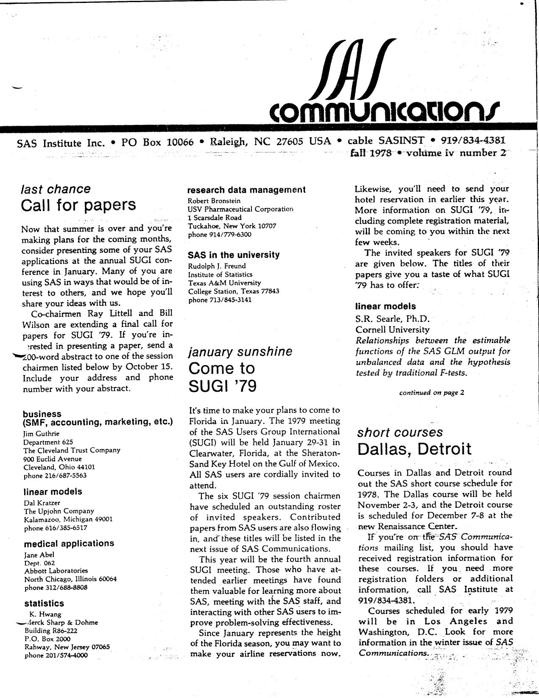
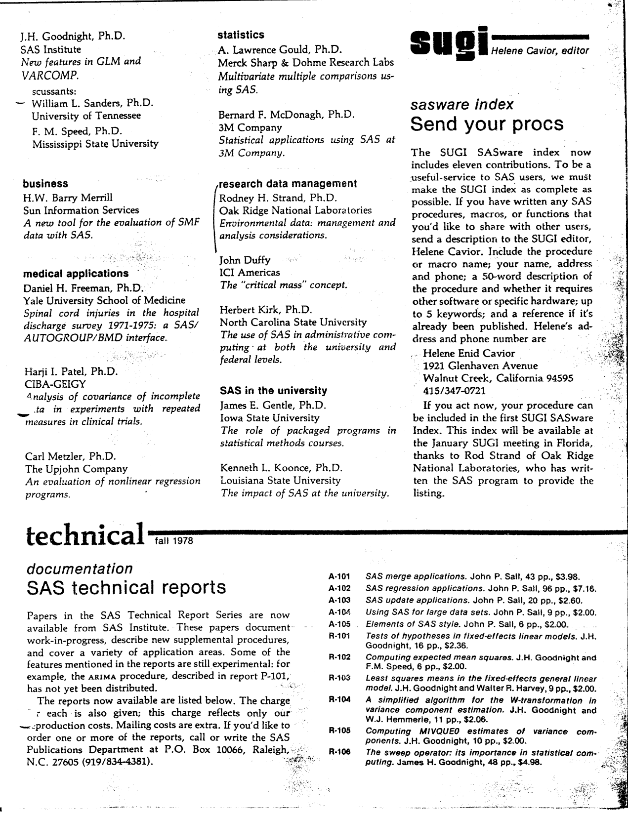
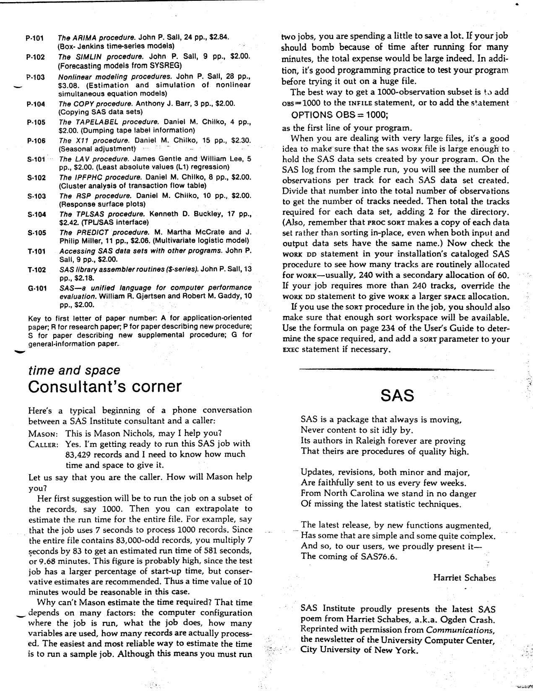
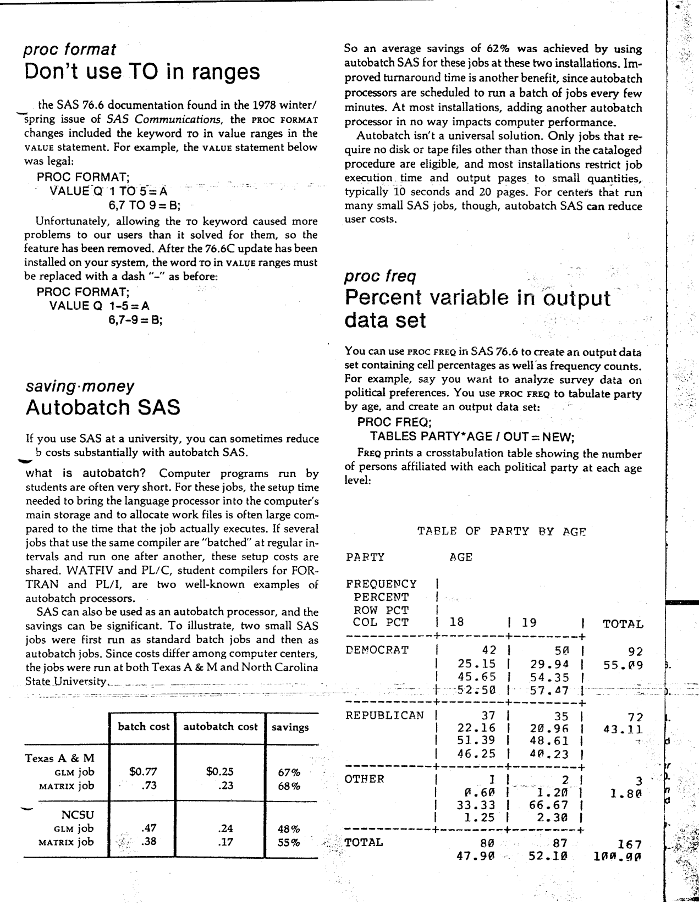
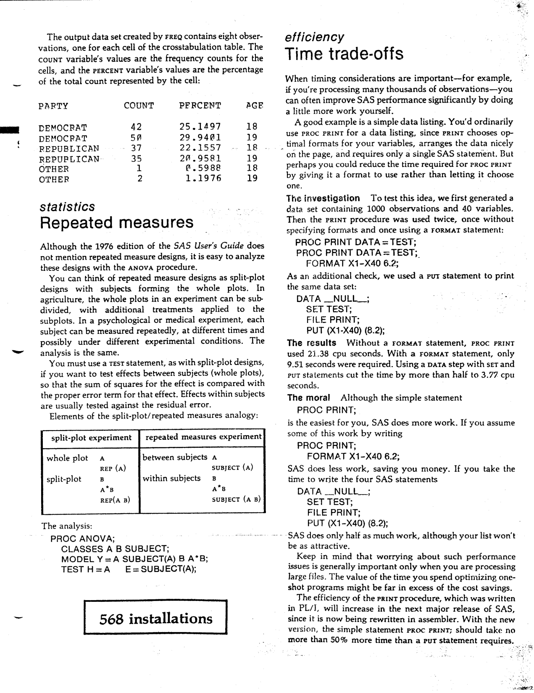
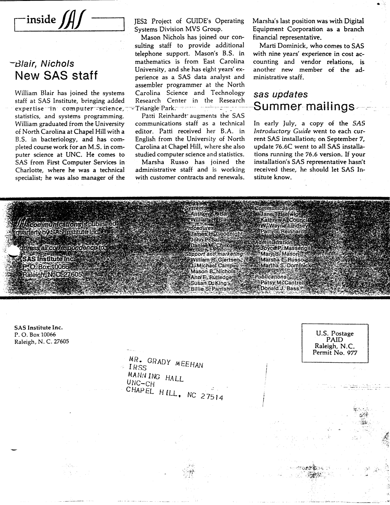

The second issue of Volume IV of "SAS Communications" was published in Fall 1978, as SUGI '79 took shape and SAS 76.6 settled in. Highlights include the final call for papers for SUGI '79 with all six session chairmen, the full list of invited speakers, the first published index of the SAS Technical Report Series (P-101 through T-102), a request for contributions to the SUGI SASware index, a consultant's corner on estimating the time and space for a large job, a poem from Harriet Schabes (a.k.a. Ogden Crash), the removal of the TO keyword from PROC FORMAT value ranges, a study of autobatch SAS that cut university job costs by an average of 62%, the PERCENT variable that PROC FREQ can now write to an output data set, repeated measures treated as split-plot designs in PROC ANOVA, and a benchmark showing how much work PROC PRINT really does. The original is <a href="../resources/SAS_Communications_issue_14.pdf" target="_blank">here</a>.

<hr/>



# **SAS Communications**

**Vol. IV, No. 2**  
**Fall 1978**

---

## **Call For Papers**

*Last chance*

Now that summer is over and you're making plans for the coming months, consider presenting some of your SAS applications at the annual SUGI conference in January. Many of you are using SAS in ways that would be of interest to others, and we hope you'll share your ideas with us.

Co-chairmen Ray Littell and Bill Wilson are extending a final call for papers for SUGI '79. If you're interested in presenting a paper, send a 200-word abstract to one of the session chairmen listed below by October 15. Include your address and phone number with your abstract.

- **business** (SMF, accounting, marketing, etc.) - Jim Guthrie, Department 625, The Cleveland Trust Company, 900 Euclid Avenue, Cleveland, Ohio 44101, phone 216/687-5563
- **linear models** - Dal Kratzer, The Upjohn Company, Kalamazoo, Michigan 49001, phone 616/385-6517
- **medical applications** - Jane Abel, Dept. 062, Abbott Laboratories, North Chicago, Illinois 60064, phone 312/688-8808
- **statistics** - K. Hwang, Merck Sharp & Dohme, Building R86-222, P.O. Box 2000, Rahway, New Jersey 07065, phone 201/574-4000
- **research data management** - Robert Bronstein, USV Pharmaceutical Corporation, 1 Scarsdale Road, Tuckahoe, New York 10707, phone 914/779-6300
- **SAS in the university** - Rudolph J. Freund, Institute of Statistics, Texas A&M University, College Station, Texas 77843, phone 713/845-3141

## **Come To SUGI '79**

*January sunshine*

It's time to make your plans to come to Florida in January. The 1979 meeting of the SAS Users Group International (SUGI) will be held January 29-31 in Clearwater, Florida, at the Sheraton-Sand Key Hotel on the Gulf of Mexico. All SAS users are cordially invited to attend.

The six SUGI '79 session chairmen have scheduled an outstanding roster of invited speakers. Contributed papers from SAS users are also flowing in, and these titles will be listed in the next issue of SAS Communications.

This year will be the fourth annual SUGI meeting. Those who have attended earlier meetings have found them valuable for learning more about SAS, meeting with the SAS staff, and interacting with other SAS users to improve problem-solving effectiveness.

Since January represents the height of the Florida season, you may want to make your airline reservations now. Likewise, you'll need to send your hotel reservation in earlier this year. More information on SUGI '79, including complete registration material, will be coming to you within the next few weeks.

The invited speakers for SUGI '79 are given below. The titles of their papers give you a taste of what SUGI '79 has to offer:

**linear models**

S.R. Searle, Ph.D., Cornell University  
*Relationships between the estimable functions of the SAS GLM output for unbalanced data and the hypothesis tested by traditional F-tests*

J.H. Goodnight, Ph.D., SAS Institute  
*New features in GLM and VARCOMP*

Discussants: William L. Sanders, Ph.D., University of Tennessee; F. M. Speed, Ph.D., Mississippi State University

**business**

H.W. Barry Merrill, Sun Information Services  
*A new tool for the evaluation of SMF data with SAS*

**medical applications**

Daniel H. Freeman, Ph.D., Yale University School of Medicine  
*Spinal cord injuries in the hospital discharge survey 1971-1975: a SAS/AUTOGROUP/BMD interface*

Harji I. Patel, Ph.D., CIBA-GEIGY  
*Analysis of covariance of incomplete data in experiments with repeated measures in clinical trials*

Carl Metzler, Ph.D., The Upjohn Company  
*An evaluation of nonlinear regression programs*

**statistics**

A. Lawrence Gould, Ph.D., Merck Sharp & Dohme Research Labs  
*Multivariate multiple comparisons using SAS*

Bernard F. McDonagh, Ph.D., 3M Company  
*Statistical applications using SAS at 3M Company*

**research data management**

Rodney H. Strand, Ph.D., Oak Ridge National Laboratories  
*Environmental data: management and analysis considerations*

John Duffy, ICI Americas  
*The "critical mass" concept*

Herbert Kirk, Ph.D., North Carolina State University  
*The use of SAS in administrative computing: at both the university and federal levels*

**SAS in the university**

James E. Gentle, Ph.D., Iowa State University  
*The role of packaged programs in statistical methods courses*

Kenneth L. Koonce, Ph.D., Louisiana State University  
*The impact of SAS at the university*

## **Dallas, Detroit**

*Short courses*

Courses in Dallas and Detroit round out the SAS short course schedule for 1978. The Dallas course will be held November 2-3, and the Detroit course is scheduled for December 7-8 at the new Renaissance Center.

If you're on the SAS Communications mailing list, you should have received registration information for these courses. If you need more registration folders or additional information, call SAS Institute at 919/834-4381.

Courses scheduled for early 1979 will be in Los Angeles and Washington, D.C. Look for more information in the winter issue of SAS Communications.



## **SAS Technical Reports**

*Technical documentation - fall 1978*

Papers in the SAS Technical Report Series are now available from SAS Institute. These papers document work-in-progress, describe new supplemental procedures, and cover a variety of application areas. Some of the features mentioned in the reports are still experimental: for example, the ARIMA procedure, described in report P-101, has not yet been distributed.

The reports now available are listed below. The charge for each is also given; this charge reflects only our production costs. Mailing costs are extra. If you'd like to order one or more of the reports, call or write the SAS Publications Department at P.O. Box 10066, Raleigh, N.C. 27605 (919/834-4381).

**application-oriented papers**

A-101 *SAS merge applications.* John P. Sall, 43 pp., $3.98.

A-102 *SAS regression applications.* John P. Sall, 96 pp., $7.18.

A-103 *SAS update applications.* John P. Sall, 20 pp., $2.60.

A-104 *Using SAS for large data sets.* John P. Sall, 9 pp., $2.00.

A-105 *Elements of SAS style.* John P. Sall, 6 pp., $2.00.

**research papers**

R-101 *Tests of hypotheses in fixed-effects linear models.* J.H. Goodnight, 16 pp., $2.36.

R-102 *Computing expected mean squares.* J.H. Goodnight and F.M. Speed, 6 pp., $2.00.

R-103 *Least squares means in the fixed-effects general linear model.* J.H. Goodnight and Walter R. Harvey, 9 pp., $2.00.

R-104 *A simplified algorithm for the W-transformation in variance component estimation.* J.H. Goodnight and W.J. Hemmerle, 11 pp., $2.06.

R-105 *Computing MIVQUE0 estimates of variance components.* J.H. Goodnight, 10 pp., $2.00.

R-106 *The sweep operator: its importance in statistical computing.* James H. Goodnight, 48 pp., $4.98.

**papers describing new procedures**

P-101 *The ARIMA procedure.* John P. Sall, 24 pp., $2.84. *(Box-Jenkins time-series models)*

P-102 *The SIMLIN procedure.* John P. Sall, 9 pp., $2.00. *(Forecasting models from SYSREG)*

P-103 *Nonlinear modeling procedures.* John P. Sall, 28 pp., $3.08. *(Estimation and simulation of nonlinear simultaneous equation models)*

P-104 *The COPY procedure.* Anthony J. Barr, 3 pp., $2.00. *(Copying SAS data sets)*

P-105 *The TAPELABEL procedure.* Daniel M. Chilko, 4 pp., $2.00. *(Dumping tape label information)*

P-106 *The X11 procedure.* Daniel M. Chilko, 15 pp., $2.90. *(Seasonal adjustment)*

**papers describing new supplemental procedures**

S-101 *The LAV procedure.* James Gentle and William Lee, 5 pp., $2.00. *(Least absolute values (L1) regression)*

S-102 *The IPFPHC procedure.* Daniel M. Chilko, 8 pp., $2.00. *(Cluster analysis of transaction flow table)*

S-103 *The RSP procedure.* Daniel M. Chilko, 10 pp., $2.00. *(Response surface plots)*

S-104 *The TPLSAS procedure.* Kenneth D. Buckley, 17 pp., $2.42. *(TPL/SAS interface)*

S-105 *The PREDICT procedure.* M. Martha McCrate and J. Philip Miller, 11 pp., $2.06. *(Multivariate logistic model)*

**general-information papers**

T-101 *Accessing SAS data sets with other programs.* John P. Sall, 9 pp., $2.00.

T-102 *SAS library assembler routines (S-series).* John P. Sall, 13 pp., $2.18.

G-01 *SAS - a unified language for computer performance evaluation.* William R. Gjertsen and Robert M. Gaddy, 10 pp., $2.00.

Key to first letter of paper number: A for application-oriented paper; R for research paper; P for paper describing new procedure; S for paper describing new supplemental procedure; G for general-information paper.

## **SASware Index**

*Send your procs*

The SUGI SASware index now includes eleven contributions. To be a useful service to SAS users, we must make the SUGI index as complete as possible. If you have written any SAS procedures, macros, or functions that you'd like to share with other users, send a description to the SUGI editor, Helene Cavior. Include the procedure or macro name; your name, address and phone; a 50-word description of the procedure and whether it requires other software or specific hardware; up to 5 keywords; and a reference if it's already been published. Helene's address and phone number are

Helene Enid Cavior  
1921 Glenhaven Avenue  
Walnut Creek, California 94595  
415/347-0721

If you act now, your procedure can be included in the first SUGI SASware Index. This index will be available at the January SUGI meeting in Florida, thanks to Rod Strand of Oak Ridge National Laboratories, who has written the SAS program to provide the listing.



## **Consultant's Corner**

*Time and space*

Here's a typical beginning of a phone conversation between a SAS Institute consultant and a caller:

**Mason:** This is Mason Nichols, may I help you?

**Caller:** Yes. I'm getting ready to run this SAS job with 83,429 records and I need to know how much time and space to give it.

Let us say that you are the caller. How will Mason help you?

Her first suggestion will be to run the job on a subset of the records, say 1000. Then you can extrapolate to estimate the run time for the entire file. For example, say that the job uses 7 seconds to process 1000 records. Since the entire file contains 83,000-odd records, you multiply 7 seconds by 83 to get an estimated run time of 581 seconds, or 9.68 minutes. This figure is probably high, since the test job has a larger percentage of start-up time, but conservative estimates are recommended. Thus a time value of 10 minutes would be reasonable in this case.

Why can't Mason estimate the time required? That time depends on many factors: the computer configuration where the job is run, what the job does, how many variables are used, how many records are actually processed. The easiest and most reliable way to estimate the time is to run a sample job. Although this means you must run two jobs, you are spending a little to save a lot. If your job should bomb because of time after running for many minutes, the total expense would be large indeed. In addition, it's good programming practice to test your program before trying it out on a huge file.

The best way to get a 1000-observation subset is to add OBS=1000 to the INFILE statement, or to add the statement

```
OPTIONS OBS = 1000;
```

as the first line of your program.

When you are dealing with very large files, it's a good idea to make sure that the SAS WORK file is large enough to hold the SAS data sets created by your program. On the SAS log from the sample run, you will see the number of observations per track for each SAS data set created. Divide that number into the total number of observations to get the number of tracks needed. Then total the tracks required for each data set, adding 2 for the directory. (Also, remember that PROC SORT makes a copy of each data set rather than sorting in-place, even when both input and output data sets have the same name.) Now check the WORK DD statement in your installation's cataloged SAS procedure to see how many tracks are routinely allocated for WORK - usually, 240 with a secondary allocation of 60. If your job requires more than 240 tracks, override the WORK DD statement to give WORK a larger space allocation.

If you use the SORT procedure in the job, you should also make sure that enough sort workspace will be available. Use the formula on page 234 of the User's Guide to determine the space required, and add a sort parameter to your EXEC statement if necessary.

## **SAS**

By Harriet Schabes

SAS is a package that always is moving,  
Never content to sit idly by.  
Its authors in Raleigh forever are proving  
That theirs are procedures of quality high.

Updates, revisions, both minor and major,  
Are faithfully sent to us every few weeks.  
From North Carolina we stand in no danger  
Of missing the latest statistic techniques.

The latest release, by new functions augmented,  
Has some that are simple and some quite complex.  
And so, to our users, we proudly present it -  
The coming of SAS 76.6.

SAS Institute proudly presents the latest SAS poem from Harriet Schabes, a.k.a. Ogden Crash. Reprinted with permission from Communications, the newsletter of the University Computer Center, City University of New York.



## **Don't Use TO In Ranges**

*PROC FORMAT*

The SAS 76.6 documentation found in the 1978 winter/spring issue of SAS Communications, the PROC FORMAT changes included the keyword TO in value ranges in the VALUE statement. For example, the VALUE statement below was legal:

```
PROC FORMAT;
VALUE Q 1 TO 5 = A
6,7 TO 9 = B;
```

Unfortunately, allowing the TO keyword caused more problems to our users than it solved for them, so the feature has been removed. After the 76.6C update has been installed on your system, the word TO in VALUE ranges must be replaced with a dash "-" as before:

```
PROC FORMAT;
VALUE Q 1-5 = A
6,7-9 = B;
```

## **Autobatch SAS**

*Saving money*

If you use SAS at a university, you can sometimes reduce costs substantially with autobatch SAS.

What is autobatch? Computer programs run by students are often very short. For these jobs, the setup time needed to bring the language processor into the computer's main storage and to allocate work files is often large compared to the time that the job actually executes. If several jobs that use the same compiler are "batched" at regular intervals and run one after another, these setup costs are shared. WATFIV and PL/C, student compilers for FORTRAN and PL/I, are two well-known examples of autobatch processors.

SAS can also be used as an autobatch processor, and the savings can be significant. To illustrate, two small SAS jobs were first run as standard batch jobs and then as autobatch jobs. Since costs differ among computer centers, the jobs were run at both Texas A & M and North Carolina State University.

| | batch cost | autobatch cost |
| --- | --- | --- |
| **Texas A & M** | | |
| GLM job | $0.77 | $0.25 |
| MATRIX job | .73 | .23 |
| **NCSU** | | |
| GLM job | .47 | .24 |
| MATRIX job | .38 | .17 |

So an average savings of 62% was achieved by using autobatch SAS for these jobs at these two installations. Improved turnaround time is another benefit, since autobatch processors are scheduled to run a batch of jobs every few minutes. At most installations, adding another autobatch processor in no way impacts computer performance.

Autobatch isn't a universal solution. Only jobs that require no disk or tape files other than those in the cataloged procedure are eligible, and most installations restrict job execution time and output pages to small quantities, typically 10 seconds and 20 pages. For centers that run many small SAS jobs, though, autobatch SAS can reduce user costs.

## **Percent Variable In Output Data Set**

*PROC FREQ*

You can use PROC FREQ in SAS 76.6 to create an output data set containing cell percentages as well as frequency counts. For example, say you want to analyze survey data on political preferences. You use PROC FREQ to tabulate party by age, and create an output data set:

```
PROC FREQ;
TABLES PARTY*AGE / OUT=NEW;
```

FREQ prints a crosstabulation table showing the number of persons affiliated with each political party at each age level:

| PARTY | Statistic | 18 | 19 | TOTAL |
| --- | --- | --- | --- | --- |
| DEMOCRAT | Frequency | 42 | 50 | 92 |
| | Percent | 25.15 | 29.94 | 55.09 |
| | Row Pct | 45.65 | 54.35 | |
| | Col Pct | 52.50 | 57.47 | |
| REPUBLICAN | Frequency | 37 | 35 | 72 |
| | Percent | 22.16 | 20.96 | 43.11 |
| | Row Pct | 51.39 | 48.61 | |
| | Col Pct | 46.25 | 40.23 | |
| OTHER | Frequency | 1 | 2 | 3 |
| | Percent | 0.60 | 1.20 | 1.80 |
| | Row Pct | 33.33 | 66.67 | |
| | Col Pct | 1.25 | 2.30 | |
| TOTAL | Frequency | 80 | 87 | 167 |
| | Percent | 47.90 | 52.10 | 100.00 |

The output data set created by FREQ contains eight observations, one for each cell of the crosstabulation table. The COUNT variable's values are the frequency counts for the cells, and the PERCENT variable's values are the percentage of the total count represented by the cell:

| PARTY | COUNT | PERCENT | AGE |
| --- | --- | --- | --- |
| DEMOCRAT | 42 | 25.1497 | 18 |
| DEMOCRAT | 50 | 29.9401 | 19 |
| REPUBLICAN | 37 | 22.1557 | 18 |
| REPUBLICAN | 35 | 20.9581 | 19 |
| OTHER | 1 | 0.5988 | 18 |
| OTHER | 2 | 1.1976 | 19 |

## **Repeated Measures**

*Statistics*

Although the 1976 edition of the SAS User's Guide does not mention repeated measure designs, it is easy to analyze these designs with the ANOVA procedure.

You can think of repeated measure designs as split-plot designs with subjects forming the whole plots. In agriculture, the whole plots in an experiment can be subdivided, with additional treatments applied to the subplots. In a psychological or medical experiment, each subject can be measured repeatedly, at different times and possibly under different experimental conditions. The analysis is the same.

You must use a TEST statement, as with split-plot designs, if you want to test effects between subjects (whole plots), so that the sum of squares for the effect is compared with the proper error term for that effect. Effects within subjects are usually tested against the residual error.

Elements of the split-plot/repeated measures analogy:

| split-plot experiment | repeated measures experiment |
| --- | --- |
| whole plot A | between subjects A |
| REP (A) | SUBJECT (A) |
| split-plot B | within subjects B |
| A*B | A*B |
| REP (A B) | SUBJECT (A B) |

The analysis:

```
PROC ANOVA;
CLASSES A B SUBJECT;
MODEL Y = A SUBJECT(A) B A*B;
TEST H=A  E=SUBJECT(A);
```



## **Time Trade-offs**

*Efficiency*

When timing considerations are important - for example, if you're processing many thousands of observations - you can often improve SAS performance significantly by doing a little more work yourself.

A good example is a simple data listing. You'd ordinarily use PROC PRINT for a data listing, since PRINT chooses optimal formats for your variables, arranges the data nicely on the page, and requires only a single SAS statement. But perhaps you could reduce the time required for PROC PRINT by giving it a format to use rather than letting it choose one.

**The investigation.** To test this idea, we first generated a data set containing 1000 observations and 40 variables. Then the PRINT procedure was used twice, once without specifying formats and once using a FORMAT statement:

```
PROC PRINT DATA=TEST;
PROC PRINT DATA=TEST;
FORMAT X1-X40 6.2;
```

As an additional check, we used a PUT statement to print the same data set:

```
DATA _NULL_;
SET TEST;
FILE PRINT;
PUT (X1-X40) (8.2);
```

**The results.** Without a FORMAT statement, PROC PRINT used 21.38 CPU seconds. With a FORMAT statement, only 9.51 seconds were required. Using a DATA step with SET and PUT statements cut the time by more than half to 3.77 CPU seconds.

**The moral.** Although the simple statement

```
PROC PRINT;
```

is the easiest for you, SAS does more work. If you assume some of this work by writing

```
PROC PRINT;
FORMAT X1-X40 6.2;
```

SAS does less work, saving you money. If you take the time to write the four SAS statements

```
DATA _NULL_;
SET TEST;
FILE PRINT;
PUT (X1-X40) (8.2);
```

SAS does only half as much work, although your list won't be as attractive.

Keep in mind that worrying about such performance issues is generally important only when you are processing large files. The value of the time you spend optimizing one-shot programs might be far in excess of the cost savings.

The efficiency of the PRINT procedure, which was written in PL/I, will increase in the next major release of SAS, since it is now being rewritten in assembler. With the new version, the simple statement PROC PRINT; should take no more than 50% more time than a PUT statement requires.



## **Blair, Nichols New SAS Staff**

*Inside SAS*

William Blair has joined the systems staff at SAS Institute, bringing added expertise in computer science, statistics, and systems programming. William graduated from the University of North Carolina at Chapel Hill with a B.S. in bacteriology, and has completed course work for an M.S. in computer science at UNC. He comes to SAS from First Computer Services in Charlotte, where he was a technical specialist; he was also manager of the JES2 Project of GUIDE's Operating Systems Division MVS Group.

Mason Nichols has joined our consulting staff to provide additional telephone support. Mason's B.S. in mathematics is from East Carolina University, and she has eight years' experience as a SAS data analyst and assembler programmer at the North Carolina Science and Technology Research Center in the Research Triangle Park.

Patti Reinhardt augments the SAS communications staff as a technical editor. Patti received her B.A. in English from the University of North Carolina at Chapel Hill, where she also studied computer science and statistics.

Marsha Russo has joined the administrative staff and is working with customer contracts and renewals. Marsha's last position was with Digital Equipment Corporation as a branch financial representative.

Marti Dominick, who comes to SAS with nine years' experience in cost accounting and vendor relations, is another new member of the administrative staff.

## **Summer Mailings**

*SAS updates*

In early July, a copy of the SAS Introductory Guide went to each current SAS installation; on September 7, update 76.6C went to all SAS installations running the 76.6 version. If your installation's SAS representative hasn't received these, he should let SAS Institute know.

**568 installations**

---

SAS Communications is published quarterly by SAS Institute Inc.

Anthony J. Barr, Systems  
William H. Blair, Systems  
James H. Goodnight, Procedures  
John P. Sall, Procedures  
Daniel M. Chilko, Procedures  
William R. Gjertsen, Support and marketing  
J. Michael Camp, Support and marketing  
Mason E. Nichols, Support and marketing  
Ann F. Rutledge, Support and marketing  
Susan D. King, Support and marketing  
Billie S. Parrish, Support and marketing  
Jane T. Helwig, Communications  
Kathryn A. Council, Communications  
W. Wayne Lindsey, Communications  
Patti S. Reinhardt, Communications  
Joyce P. Massengill, Administration  
Mary B. Mason, Administration  
Marsha E. Russo, Administration  
Martha S. Dominick, Administration  
Patsy M. Cantrell, Publications  
Donald J. Bass, Publications

Address all correspondence to SAS Institute Inc., Post Office Box 10066, Raleigh, NC 27605.

---

SAS Institute Inc. - Post Office Box 10066 - Raleigh, North Carolina 27605 - (919) 834-4381

<!--
Fall 1978 - SAS 76.6 is out, SUGI '79 is coming, and the SAS Technical Report Series gets its first published index.

→ The final call for papers for SUGI '79, with all six session chairmen and their contact details
→ The full invited-speaker line-up, from S.R. Searle on unbalanced GLM output to J.H. Goodnight on GLM and VARCOMP
→ The first published index of the SAS Technical Report Series: P-101 (ARIMA) through T-102, from $2.00 to $4.98
→ A consultant's corner on sizing time and space for an 83,429-record job - test on 1,000 first, then multiply
→ The TO keyword is out of PROC FORMAT value ranges: write 1-5, not 1 TO 5
→ Autobatch SAS cut university job costs by an average of 62% at Texas A&M and NCSU
→ PROC FREQ can now write cell PERCENTs to an output data set
→ Repeated measures treated as split-plot designs in PROC ANOVA
→ A benchmark on PROC PRINT: 21.38s unformatted, 9.51s formatted, 3.77s via a PUT statement

A snapshot of SAS as it grew up, transcribed from the original newsletter and shared for historical interest. © SAS Institute Inc.

📖 Full issue in the comments 👇

#sas #sugi #sas76 #procformat #procprint #statisticalsoftware #techhistory #retrocomputing #sasinstitute
-->
